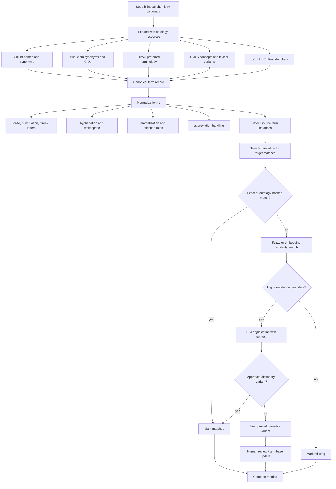

# LLM-Based Terminology Matching and Verification for Translation Benchmarks with Chemistry Emphasis

## Executive summary

The recent literature clusters into a few recurring design patterns for terminology-aware translation and terminology verification with LLMs. The strongest families are: direct glossary prompting or code-switched prompting at inference time; translate-then-revise pipelines where an LLM post-edits an existing translation to enforce terms; retrieval-augmented prompting with glossaries, translation memories, or domain exemplars; and hybrid systems that fine-tune a base MT/LLM on terminology-augmented data and then rerank or review outputs with quality-estimation signals. Across these papers, explicit terminology injection usually improves term usage, but hard enforcement can hurt fluency or morphology unless paired with context-aware revision, reranking, or review. Few-shot prompting often helps, and several recent papers report that reasoning-enabled review or structured self-refinement can further improve terminology adherence. citeturn25view0turn26view0turn22view1turn28view0turn27view0turn7view1turn10view0turn6view4

Direct chemistry-specific bilingual terminology-verification benchmarks remain comparatively sparse in the translation literature retrieved for this review. The chemistry-adjacent best practice therefore comes from combining terminology-aware translation methods with chemistry knowledge infrastructure: ChEBI for curated chemical entities and synonyms, PubChem for large-scale synonyms and chemical records, IUPAC Gold Book and InChI for standardized terminology and identifiers, UMLS for biomedical synonymy and lexical tools, and chemical/entity-linking resources such as NLM-Chem, BELB, and tmChem. In practice, chemistry terminology verification is most robust when lexical checks are anchored to ontology or identifier normalization rather than string matching alone. citeturn13search0turn13search1turn13search6turn14search3turn13search3turn18search0turn18search1turn18search17turn36view0

For evaluation, the literature consistently shows that generic MT metrics alone are not enough. Stronger studies add terminology-specific metrics such as term accuracy, term success rate, term recall, constraint completion rate, or terminology consistency, then complement them with general MT metrics such as chrF++, BLEU, COMET, or COMETQE. The most reliable human protocols are MQM-style error annotation, direct assessment, or targeted pairwise preference studies; recent work also shows that LLM judges benefit from explicit references, guidelines, and structured prompts, but should not be the only signal for high-stakes terminology verification. citeturn20view1turn20view4turn19view7turn19view4turn31view0turn21view0turn30view0turn6view3

## Research landscape and comparison of key papers

A useful way to read the field is to separate **generation-time term control** from **verification-time auditing**. Generation-time work includes prompting, RAG, fine-tuning, and constrained decoding. Verification-time work includes LLM judging, alignment-based checks, glossary compliance review, variant mining, and preference-based disambiguation. The best current systems usually combine both. citeturn25view0turn26view0turn28view0turn7view1turn32view0

| Citation | Task | Model type | Method | Dataset | Metrics | Main findings |
|---|---|---|---|---|---|---|
| Moslem et al. 2023, *Domain Terminology Integration into Machine Translation* citeturn25view0 | Terminology-constrained MT and post-editing | OPUS MT + ChatGPT | Generate terminology-rich synthetic data, fine-tune MT, then LLM post-edit only segments missing required terms | WMT23 terminology task | term usage %, BLEU, chrF++, COMET | LLM post-editing raised required-term usage on the blind set from 36.67% to 72.88% on average, while automatic MT quality also improved. citeturn25view0 |
| Bogoychev and Chen 2023, *Terminology-Aware Translation with Constrained Decoding and LLM Prompting* citeturn26view0 | Terminology-aware MT | Marian NMT + GPT-3.5 | Train with pseudo-terminology from word alignments; refine with negative constraints or LLM prompting | WMT23 terminology task | recall against terminology constraints, COMETQE | Terminology-aware training plus LLM refinement improved terminology recall; LLM refinement often beat constrained re-decoding on some directions while maintaining or improving reference-free quality. citeturn26view0 |
| Kim et al. 2024, *Efficient Terminology Integration for LLM-based Translation Systems* citeturn7view0turn5view3 | Specialized translation with glossary construction | Mistral Nemo-based terminology aligner + LLM/sLLM MT | LLM term-pair extraction, glossary creation, trie-based identification, prompt/fine-tune-based term integration | WMT24 patent task | BLEU, RIBES | ChatGPT with a glossary outperformed the same model without a glossary in the patent domain, illustrating the value of explicit glossary injection. citeturn7view0turn5view1turn5view3 |
| Li et al. 2025, *Leveraging Domain Knowledge at Inference Time for LLM Translation* citeturn22view1 | Domain-adapted LLM MT | General LLMs | Compare retrieval vs generation of demonstrations and terminologies | Medical/law domain-adaptation benchmarks | COMET22 and MT task scores | Retrieved demonstrations consistently outperformed generated knowledge; demonstrations outperformed terminology hints overall; domain specificity mattered more than generic prompt cleverness. citeturn22view1 |
| Guttmann et al. 2025, *Laniqo at WMT25 Terminology Translation Task* citeturn28view0 | Terminology-aware MT with reranking | EuroLLM-9B-Instruct + LoRA | Source-side replacement, glossary-augmented fine-tuning, structured prompt, two-shot examples, Pareto-optimal reranking over QE metrics + TSR | WMT25 terminology task | TSR, xCOMET/COMET, BLEU, chrF | Pareto-optimal decoding achieved TSR above 0.99 on the shared task test set and showed that single-metric selection can miss required terminology entirely. citeturn28view0 |
| Jaswal 2025, *It Takes Two* | Terminology-aware translation | NLLB-200 3.3B + GPT-4o | Tag-marked synthetic data, COMETQE filtering, multilingual fine-tuning, then prompt-based LLM post-editing | WMT25 terminology task | BLEU, chrF2++, proper/random success rates | Flexible, context-driven LLM post-editing improved quality while maintaining high term success, highlighting the trade-off between strict enforcement and naturalness. citeturn27view0 |
| Feng et al. 2025, *TEaR* citeturn10view0 | Translation quality estimation and self-refinement | Single-LLM translate-estimate-refine | LLM first translates, then estimates MQM-style errors, then refines only if errors are detected | WMT23-derived MT settings | COMET, XCOMET, MQM | A single LLM can serve as both translator and error estimator; iterative self-refinement reduced MQM errors and improved system quality, though domain-specific terminology remains an open challenge. citeturn10view0 |
| Salim et al. 2025, *MedCOD* citeturn34view0 | Medical translation with structured terminology knowledge | Open-source LLMs + GPT-family baselines | UMLS- and LLM-KB-enriched “chain-of-dictionary” prompts with multilingual translations, synonyms, and domain metadata | English–Spanish MedlinePlus corpus + structured test set | sacreBLEU, chrF++, COMET | Structured prompts using UMLS and multilingual concept metadata improved medical translation and provide a directly portable design pattern for chemistry/biomedical terminology checking. citeturn34view0 |
| Di Rosa 2026, *AIDAterm* citeturn4view3turn7view1 | Industrial terminology-constrained MT | Multi-agent LLM pipeline | Analysis, Translation, Post-editing, Review agents; glossary filtering/cleaning; reasoning-enabled review | WMT25 Track 1 and production localization | terminology accuracy, consistency, ChrF2++, BLEU | Best configuration reached 99.4% average terminology accuracy and topped all WMT25 submitted systems; the review agent and stern prompt directives were major contributors. citeturn4view3turn6view2 |
| Gebeşçe et al. 2026, *SIGTURK Shared Task on Terminology-Aware MT for Scientific Texts* citeturn4view5 | Term detection, correction, post-editing in scientific text | General LLMs + participant systems | Separate subtasks for term detection, expert-guided correction, and end-to-end post-editing; compares CoT and RAG | English–Turkish scientific corpus with 10,157 expert-validated term pairs | token precision/recall/micro/macro F1, Exact Match, BLEU, agreement kappas | Massive generalist models led zero-shot detection; CoT beat a modular RAG pipeline on post-editing, suggesting that hard injection of retrieved terms can degrade fluency. citeturn4view5turn6view4turn19view4turn19view5 |
| Semenov et al. 2025, *Findings of the WMT25 Terminology Translation Task* citeturn4view4 | Benchmark and shared-task evaluation | Shared-task methods | Proper/random/no-term benchmark; term accuracy and consistency analysis; LLM-based MQM prompt for analysis | WMT25 IT and finance tracks | chrF++, term accuracy, terminology consistency, Pareto ranking | Proper terminology improves both quality and term accuracy; term-specific metrics reveal differences hidden by generic MT scores; document-level finance remains harder than sentence-level IT. citeturn20view1turn20view4turn19view1turn19view2 |

## Methods and algorithms

### Prompting, few-shot learning, and translate-then-revise

The simplest and still highly competitive pattern is **explicit glossary prompting**: provide the source segment, a source→target term dictionary, and an instruction to preserve meaning while using the target terms verbatim. Moslem et al. showed that this can be used both for direct translation and for post-editing only the segments that miss required terms. Bogoychev and Chen similarly used an LLM refinement prompt that takes the source, an existing translation, and natural-language term constraints; their results show that LLM refinement can improve terminology recall with less brittleness than pure decoding constraints. citeturn25view0turn26view0

Recent work suggests that **few-shot examples are often more helpful than zero-shot wording tricks**. Laniqo reported better average translation quality from prompt engineering with two-shot examples, and Li et al. found that retrieved demonstrations consistently outperformed raw terminology-only prompting in specialist domains. TULUN operationalizes the same idea in a practical platform by injecting both glossary entries and retrieved translation memories into a prompt that includes few-shot examples and chain-of-thought reasoning. citeturn28view0turn22view1turn6view1

A particularly effective operational pattern is **translate-then-revise**. TEaR formalizes this into Translate → Estimate → Refine, with the same LLM acting as translator and MQM-style evaluator. AIDAterm extends the pattern into a multi-agent industrial pipeline with a dedicated Review agent that explicitly checks glossary compliance and, in its best variant, uses high-effort reasoning before accepting the translation. The practical lesson is that a second LLM pass is often more reliable for terminology auditing than asking the first pass to get everything right in one shot. citeturn10view0turn7view1

### Retrieval, RAG, alignment, similarity, and confidence scoring

For domain-heavy use cases, **retrieval** is repeatedly useful, but the literature shows that *how* retrieval is used matters. TULUN retrieves glossary entries with 1–2 gram overlap and translation memories with BM25; MedCOD constructs structured prompts by retrieving UMLS-backed translations, auxiliary-language synonyms, and concept metadata; Li et al. show that retrieved demonstrations are stronger than generated “internal knowledge” for domain adaptation. In contrast, SIGTURK’s comparison between Koç-CoT and KU-RAG suggests that treating retrieved terms as hard constraints can harm fluency if the model is not allowed to reason about inflection and context. citeturn6view1turn34view0turn22view1turn6view4

For **matching and verification**, the most common concrete algorithms are alignment and fuzzy matching, with embeddings used more often in adjacent biomedical/chemical normalization than in translation papers themselves. Bogoychev and Chen use word alignment to detect missed terminology. WMT25’s organizers use explicit term-accuracy and consistency frameworks and even include an LLM prompt to map source words to target correspondences for evaluation support. Berger’s ambiguous-terminology work uses RapidFuzz partial-ratio alignment with a 0.95 threshold, overlap resolution, and term-focused masking in the optimization objective. In biomedical chemistry, encoder-based normalization pipelines use language models such as PubMedBERT together with ChEBI and PubChem to link mentions to ontology terms; BELB provides a standardized entity-linking benchmark that includes chemicals. citeturn26view0turn20view1turn6view3turn32view0turn17search5turn18search1

For **confidence scoring**, terminology-aware translation papers usually use practical surrogates rather than fully calibrated probabilities. Laniqo uses multi-objective reranking with QE scores plus TSR. DuTerm filters synthetic training data with COMETQE before fine-tuning. More broadly, the LLM-calibration literature recommends prompt-agreement or log-probability-derived confidence, then evaluating calibration with ECE or Brier score on a development set. For a chemistry terminology verifier, the most useful confidence signal is usually a composite of exact-match evidence, ontology-ID agreement, fuzzy/semantic similarity, back-translation agreement, and LLM adjudication. citeturn28view0turn27view0turn12search2turn12search14turn12search17

### Chemistry-specific adaptation of these methods

Chemistry is unusually unforgiving because many “near matches” are chemically wrong. A string that differs only by a locant, oxidation state, stereochemistry marker, salt form, hydration state, or isotope notation may denote a different substance. The chemistry-LLM survey explicitly argues that LLMs should be integrated with external chemistry tools rather than left to rely on internal parametric memory alone; official chemistry infrastructure such as ChEBI, PubChem, IUPAC terminology, and InChI gives exactly the kind of structured grounding that terminology auditors need. In other words: for chemistry, use the LLM for context and explanation, but use ontologies and identifiers for canonical matching. citeturn36view0turn13search0turn13search1turn13search6turn14search3turn14search9

## Benchmarks and evaluation

### Metrics that actually measure terminology behavior

The most mature recent benchmark is WMT25. In the sentence track, term accuracy is computed by checking whether the corresponding target term appears for each source term in the input; in the document track, the metric is adapted to repeated term occurrences and one-to-many mappings. WMT25 also reports terminology consistency using the framework of Semenov and Bojar, and ranks systems using a Pareto view over chrF++ and term accuracy. The organizers explicitly note that term-specific metrics capture behavior that general MT metrics miss. citeturn20view1turn20view4turn19view1turn19view2

A useful complementary setting is Oncevay et al.’s financial benchmark, which introduces **weighted terminology accuracy** and reports accuracy, precision, and recall for financial terms, then analyzes how weighted term accuracy correlates with chrF++ and COMET. This is a good template for chemistry because it separates terminology behavior from global translation fluency. SIGTURK pushes even closer to a terminology-audit workflow by splitting the task into term detection, term correction, and end-to-end post-editing, using token-level precision/recall/F1 for span/term detection and Exact Match for corrected forms. citeturn19view7turn6view5turn19view5turn19view6turn19view4

For constrained translation specifically, several papers use bespoke compliance metrics. Translate-and-Revise reports **CCR** for constraint completion, and WMT terminology systems often report **TSR** or proper/random term success rates. These metrics are highly operational: they answer “did the required term show up?”—but they can over-credit grammatically wrong or chemically wrong strings if the accepted variant set is too loose. For chemistry, exact-string compliance should therefore be paired with structure- or ontology-grounded validation. citeturn31view0turn28view0turn27view0

### Human evaluation protocols that matter in high-stakes domains

MQM remains the most useful human evaluation framework for terminology verification because it explicitly distinguishes terminology errors from other error types and grades severity as minor, major, or critical. TEaR uses MQM as the typology for its Estimate step, and Qian et al. show that LLM-based MT evaluation benefits from references, guidelines, and careful prompting, while also warning that models sometimes fail to provide a usable numeric score at all. WMT25’s findings paper itself notes that terminology consistency metrics can be more interpretable than simply using an LLM-as-judge. citeturn10view0turn30view0turn20view4

For robust human protocols, Tan et al. provide a strong blueprint: professional translators perform large-scale MQM and direct assessment over full systems, followed by randomized pairwise preference studies over accuracy, fluency, and style+terminology. Their main result is highly relevant here: LLM refinement gains are driven mainly by fluency and terminology, while adequacy gains are weaker and less reliable. SIGTURK is also notable for documenting annotation guidelines, special-case handling, webinar-based annotator onboarding, quiz-based screening, and inter-annotator agreement with Cohen’s and Fleiss’ κ. citeturn21view0turn7view2turn19view4

For scientific translation specifically, Science Across Languages introduces a QA-based benchmark and a user study with 15 researchers; it found high question-answering preservation overall, but also that about one-third of authors felt technical terms were “overtranslated” and preferred some English terminology to remain untranslated. That finding matters for chemistry: “correctness” is sometimes not exact localization, but stable use of already-internationalized chemical language. citeturn4view6

### Recommended evaluation bundle for chemistry terminology verification

For a chemistry-focused benchmark or production audit, the most defensible evaluation bundle is:

- **Term recall or target coverage**: required source-term instances that receive any accepted target realization.  
- **Term precision**: accepted target chemical mentions that are actually correct for the source context.  
- **Term F1**: to balance the previous two.  
- **Preferred-label accuracy**: cases where the translation uses the preferred dictionary/IUPAC/UMLS target rather than only an allowed variant.  
- **Ontology/identifier agreement**: whether source and target normalize to the same ChEBI/PubChem/UMLS/InChI-linked concept.  
- **Global MT quality**: chrF++, COMET, BLEU only as secondary context.  
- **Human MQM terminology score** on a carefully sampled subset. citeturn19view7turn20view1turn19view4turn13search0turn13search1turn13search3turn14search3

## Chemistry-focused workflow and implementation resources

### Recommended workflow

For chemistry and chemical terminology, the most reliable workflow is: start from a canonical bilingual term list; expand it with ontology-backed synonyms and identifiers; detect source-side term mentions; search target translations for exact and normalized variants; escalate residual ambiguity to fuzzy/semantic matching and LLM adjudication; and keep a separate bucket for **unapproved but plausible variants not yet in the dictionary** so they can be reviewed and either added or rejected. This layered design matches the strongest patterns in the terminology-translation literature while adding the chemistry-specific grounding recommended by ontology and chemistry-LLM resources. citeturn25view0turn28view0turn34view0turn36view0turn13search0turn14search1turn14search3



The chemistry resources most worth wiring into this pipeline are official and mature. ChEBI is an open-access ontology and database of chemical entities, with curated nomenclature and synonym types including IUPAC-recommended names and other synonyms; PubChem is the largest public chemical information resource and exposes synonym retrieval through PUG-REST; InChI and InChIKey provide standard identifiers for chemical substances; and UMLS contributes cross-vocabulary synonymy plus lexical tools that are particularly useful for biomedical chemistry and pharmaceutical naming. citeturn13search0turn14search8turn13search1turn14search1turn14search3turn13search3

### Example prompt for sentence-level terminology audit

The best prompts in this area are structured, ask for JSON only, and give the model both the **dictionary** and the **translation under review**. That pattern is consistent with WMT25’s evaluation prompts, TULUN’s post-editing prompt design, MedCOD’s structured prompts, and AIDAterm’s review stage. citeturn6view3turn6view1turn34view0turn7view1

**Example prompt**

```text
System:
You are a bilingual terminology auditor for chemistry translation quality.
Return valid JSON only.
Your job is to verify whether each source-side chemical term is rendered in the target translation
with the approved preferred term, an allowed variant, an unapproved plausible variant, or is missing.

Rules:
1. Use the provided dictionary and ontology notes first.
2. Accept inflected or orthographic variants only if they preserve the same chemical concept.
3. Distinguish chemical synonyms from different compounds, salts, hydrates, stereoisomers, or abbreviations.
4. If the translation uses a plausible variant not listed in the dictionary, mark it as UNAPPROVED_VARIANT.
5. Keep explanations very short.

User:
source_language: English
target_language: Spanish

source_sentence:
"The solution contains sodium bicarbonate and dimethyl sulfoxide, followed by washing with sodium chloride."

translation_sentence:
"La solución contiene bicarbonato de sodio y DMSO, seguido de un lavado con cloruro sódico."

terminology_dictionary:
[
  {
    "source_term": "sodium bicarbonate",
    "preferred_target": "bicarbonato de sodio",
    "allowed_variants": ["hidrogenocarbonato de sodio"],
    "ontology_id": "CHEBI:32139"
  },
  {
    "source_term": "dimethyl sulfoxide",
    "preferred_target": "dimetilsulfóxido",
    "allowed_variants": ["DMSO"],
    "ontology_id": "CHEBI:28262"
  },
  {
    "source_term": "sodium chloride",
    "preferred_target": "cloruro de sodio",
    "allowed_variants": ["cloruro sódico"],
    "ontology_id": "CHEBI:26710"
  }
]

Output schema:
{
  "sentence_status": "PASS|FAIL|REVIEW",
  "items": [
    {
      "source_term": "...",
      "status": "PREFERRED|ALLOWED_VARIANT|UNAPPROVED_VARIANT|MISSING|AMBIGUOUS",
      "matched_target_span": "...",
      "canonical_target": "...",
      "ontology_id": "...",
      "confidence": 0.0,
      "note": "..."
    }
  ],
  "summary": {
    "preferred_count": 0,
    "allowed_count": 0,
    "unapproved_variant_count": 0,
    "missing_count": 0
  }
}
```

**Expected output**

```json
{
  "sentence_status": "PASS",
  "items": [
    {
      "source_term": "sodium bicarbonate",
      "status": "PREFERRED",
      "matched_target_span": "bicarbonato de sodio",
      "canonical_target": "bicarbonato de sodio",
      "ontology_id": "CHEBI:32139",
      "confidence": 0.99,
      "note": "Exact preferred term."
    },
    {
      "source_term": "dimethyl sulfoxide",
      "status": "ALLOWED_VARIANT",
      "matched_target_span": "DMSO",
      "canonical_target": "dimetilsulfóxido",
      "ontology_id": "CHEBI:28262",
      "confidence": 0.95,
      "note": "Allowed abbreviation."
    },
    {
      "source_term": "sodium chloride",
      "status": "ALLOWED_VARIANT",
      "matched_target_span": "cloruro sódico",
      "canonical_target": "cloruro de sodio",
      "ontology_id": "CHEBI:26710",
      "confidence": 0.93,
      "note": "Allowed lexical variant."
    }
  ],
  "summary": {
    "preferred_count": 1,
    "allowed_count": 2,
    "unapproved_variant_count": 0,
    "missing_count": 0
  }
}
```

### Example prompt for mining variants not already in the dataset

A second pass should ask the model to **surface unseen target-side variants** rather than only to accept or reject dictionary entries. This is how you keep the benchmark honest when real translations contain legitimate chemical variants absent from the dataset. Berger’s post-edit matching work, WMT25’s correspondence prompts, and chemical normalization practice all support this “discover then verify” pattern. citeturn32view0turn6view3turn18search0turn18search1

**Example prompt**

```text
System:
You are mining target-language chemical term variants from translations.
Return JSON only.

User:
Canonical dictionary:
- dimethyl sulfoxide -> dimetilsulfóxido
- sodium chloride -> cloruro de sodio

Task:
1. Read the translation corpus snippets.
2. Find target-language strings that appear to denote the same chemical concept even if not listed.
3. Group them under the most likely canonical target.
4. Flag cases that may instead denote a different substance or a non-equivalent abbreviation.

Target-language snippets:
1. "...mezclado en DMSO..."
2. "...lavado con cloruro sódico..."
3. "...solubilizado en sulfóxido de dimetilo..."
4. "...lavado con sal de mesa..."

Return:
{
  "canonical_target": "...",
  "new_variants": [{"variant": "...", "status": "LIKELY_VALID|REVIEW|REJECT", "reason": "..."}]
}
```

**Expected output**

```json
[
  {
    "canonical_target": "dimetilsulfóxido",
    "new_variants": [
      {"variant": "DMSO", "status": "LIKELY_VALID", "reason": "Established abbreviation."},
      {"variant": "sulfóxido de dimetilo", "status": "LIKELY_VALID", "reason": "Word-order variant preserving concept."}
    ]
  },
  {
    "canonical_target": "cloruro de sodio",
    "new_variants": [
      {"variant": "cloruro sódico", "status": "LIKELY_VALID", "reason": "Accepted lexical variant."},
      {"variant": "sal de mesa", "status": "REVIEW", "reason": "Common-language paraphrase; context-dependent and often too informal for technical translation."}
    ]
  }
]
```

### Sample evaluation script pseudocode

The pseudocode below follows the literature’s strongest pattern: exact and glossary-backed checks first, then fuzzy/semantic matching, then LLM adjudication only for ambiguous cases. In chemistry, the dictionary should already be expanded with ontology-backed synonyms and identifiers before scoring. citeturn32view0turn34view0turn13search0turn14search1turn14search3turn17search5

```python
from typing import List, Dict, Any, Tuple

def normalize_text(s: str) -> str:
    """
    Lowercase, normalize Unicode, harmonize Greek letters, hyphens, whitespace,
    and strip punctuation that should not affect matching.
    """
    # pseudocode only
    return s

def build_variant_index(term_records: List[Dict[str, Any]]) -> Dict[str, Dict[str, Any]]:
    """
    Inputs should already include:
      - preferred_target
      - allowed_variants
      - ontology_id / CID / CUI / InChIKey when available
      - ontology-expanded synonyms retrieved from ChEBI / PubChem / UMLS
    """
    variant_index = {}
    for rec in term_records:
        variants = {rec["preferred_target"], *rec.get("allowed_variants", []), *rec.get("ontology_variants", [])}
        for v in variants:
            variant_index[normalize_text(v)] = {
                "canonical_target": rec["preferred_target"],
                "source_term": rec["source_term"],
                "ontology_id": rec.get("ontology_id"),
                "match_type": "preferred" if v == rec["preferred_target"] else "allowed"
            }
    return variant_index

def detect_source_terms(source_text: str, term_records: List[Dict[str, Any]]) -> List[Dict[str, Any]]:
    """
    Use exact + lemmatized + longest-match-first source detection.
    """
    hits = []
    # pseudocode: detect source terms in source_text
    return hits

def detect_target_candidates(target_text: str, variant_index: Dict[str, Dict[str, Any]]) -> List[Dict[str, Any]]:
    """
    Exact / normalized detection on target text.
    """
    candidates = []
    # pseudocode: scan target_text for any indexed variants
    return candidates

def fuzzy_or_embedding_candidates(
    target_text: str,
    canonical_target: str,
    target_ngrams: List[str]
) -> List[Tuple[str, float, str]]:
    """
    Return candidate variant strings with scores and method tags:
      - fuzzy score (e.g., RapidFuzz / normalized Levenshtein)
      - embedding cosine similarity for semantically plausible paraphrases
    """
    # pseudocode
    return []

def llm_adjudicate(
    source_sentence: str,
    translation_sentence: str,
    source_term: str,
    canonical_target: str,
    candidate_variants: List[str],
    ontology_notes: Dict[str, Any]
) -> Dict[str, Any]:
    """
    Ask an LLM for a JSON decision:
      PREFERRED / ALLOWED_VARIANT / UNAPPROVED_VARIANT / MISSING / AMBIGUOUS
    """
    # pseudocode
    return {
        "status": "AMBIGUOUS",
        "chosen_variant": None,
        "confidence": 0.50,
        "note": "manual review"
    }

def score_instance(source_hit: Dict[str, Any], target_text: str, variant_index: Dict[str, Dict[str, Any]]) -> Dict[str, Any]:
    source_term = source_hit["source_term"]
    canonical_target = source_hit["preferred_target"]

    # pass 1: exact / ontology-backed variant hit
    exact_hits = detect_target_candidates(target_text, variant_index)
    for hit in exact_hits:
        if hit["source_term"] == source_term:
            return {
                "source_term": source_term,
                "status": "MATCHED",
                "label": hit["match_type"],  # preferred or allowed
                "confidence": 0.99 if hit["match_type"] == "preferred" else 0.95
            }

    # pass 2: fuzzy / semantic search over target substrings
    target_ngrams = []  # pseudocode
    candidates = fuzzy_or_embedding_candidates(target_text, canonical_target, target_ngrams)

    # pass 3: LLM adjudication for unresolved cases
    llm_result = llm_adjudicate(
        source_sentence=source_hit["source_sentence"],
        translation_sentence=target_text,
        source_term=source_term,
        canonical_target=canonical_target,
        candidate_variants=[c[0] for c in candidates],
        ontology_notes=source_hit.get("ontology_notes", {})
    )

    return {
        "source_term": source_term,
        "status": llm_result["status"],
        "label": "unapproved_variant" if llm_result["status"] == "UNAPPROVED_VARIANT" else "missing",
        "confidence": llm_result["confidence"]
    }

def evaluate_corpus(examples: List[Dict[str, Any]], term_records: List[Dict[str, Any]]) -> Dict[str, float]:
    variant_index = build_variant_index(term_records)

    total_required = 0
    matched = 0
    preferred = 0
    allowed = 0
    unapproved = 0
    missing = 0

    for ex in examples:
        source_hits = detect_source_terms(ex["source"], term_records)
        total_required += len(source_hits)
        for hit in source_hits:
            hit["source_sentence"] = ex["source"]
            result = score_instance(hit, ex["translation"], variant_index)
            if result["status"] == "MATCHED":
                matched += 1
                if result["label"] == "preferred":
                    preferred += 1
                else:
                    allowed += 1
            elif result["status"] == "UNAPPROVED_VARIANT":
                unapproved += 1
            else:
                missing += 1

    recall_or_coverage = matched / total_required if total_required else 0.0
    preferred_accuracy = preferred / total_required if total_required else 0.0
    variant_rate = unapproved / total_required if total_required else 0.0
    missing_rate = missing / total_required if total_required else 0.0

    return {
        "term_recall_or_coverage": recall_or_coverage,
        "preferred_label_accuracy": preferred_accuracy,
        "unapproved_variant_rate": variant_rate,
        "missing_rate": missing_rate
    }
```

### Implementation resources, code, tools, and datasets

Several immediately usable resources exist. For terminology-aware translation and post-editing, the most practical open resources are **TEaR** (authors release code and data), **TULUN** (open-source web platform with glossary and BM25 translation-memory retrieval), the **WMT25 terminology shared-task repository** (references, submissions, rankings, and metric code), and **MedCOD**’s released source code. For terminology datasets, **GIST** provides a multilingual terminology dataset and repository, while WMT25 and SIGTURK provide benchmark-style terminology tasks. citeturn10view0turn15search0turn6view1turn15search14turn15search3turn34view0turn29view0turn16search1turn16search9turn4view5

For chemistry/biomedical terminology normalization and variant expansion, the most important resources are **ChEBI** and its API, **PubChem** and PUG-REST for synonyms, **IUPAC Gold Book** for authoritative terminology, **InChI** and the open-source InChI repository, **UMLS** and its lexical tools, **NLM-Chem** for chemical entity recognition and MeSH-linked normalization data, **BELB** for standardized chemical entity-linking evaluation, and **tmChem** as an open-source baseline tool for chemical named entity recognition and normalization. These are exactly the resources I would prioritize for chemistry terminology benchmarking. citeturn13search0turn14search2turn13search1turn14search1turn13search6turn14search3turn14search9turn13search3turn18search0turn18search1turn18search17

## Limitations, failure modes, and recommended mitigations

The most common failure mode in terminology-aware LLM translation is **reversion to familiar wording**. Translate-and-Revise documents cases where a model prefers a common but non-required translation of a technical term; SIGTURK reports that models often revert to familiar terminology despite explicit expert hints; Science Across Languages shows the opposite problem, where models overtranslate technical terms that domain users would rather leave closer to English. These are not isolated issues: they are a structural tension between term compliance, fluency, and user preference. citeturn31view0turn6view4turn4view6

A second problem is **string-based overconfidence**. Exact-match metrics can miss valid inflected or reordered variants, while fuzzy matching can accept chemically incorrect near matches. Berger’s work shows the need for overlap handling and controlled fuzzy thresholds; WMT25’s findings warn that some terminology metrics are only approximations; and MedCOD notes that structured prompt knowledge can still be incomplete for emerging concepts and context-dependent expressions. In chemistry, this risk is amplified because small lexical changes can denote different compounds, substances, or formulations. citeturn32view0turn20view4turn34view0turn13search6turn14search3

A third problem is **noisy or contradictory terminology resources**. AIDAterm explicitly discusses duplicates, conflicts, stale entries, and out-of-domain termbase noise in production localization. PubChem’s synonym-filtering work shows that even a premier chemical database must actively manage inter- and intra-source synonym discrepancies. In chemistry, a termbase should therefore distinguish preferred labels, allowed variants, deprecated variants, abbreviations, and ambiguous lay terms rather than flattening everything into one synonym bucket. citeturn7view1turn13search5

For chemistry specifically, the hardest cases are **ambiguous common names, abbreviations, salts/hydrates, stereochemistry, isotope notation, and cross-register variation** between formal nomenclature and laboratory shorthand. ChEBI’s nomenclature model, PubChem’s synonym breadth, IUPAC terminology, InChI identifiers, and UMLS lexical resources strongly suggest the right mitigation: verify strings against canonical concepts and identifiers first, then let the LLM explain or disambiguate context, not the other way around. This is also consistent with the chemistry-LLM survey’s recommendation to integrate external chemistry tools rather than rely on parametric memory alone. citeturn14search8turn13search1turn13search6turn14search3turn13search3turn36view0

The most effective mitigation bundle is therefore straightforward. Use ontology-backed expansion and normalization before prompting. Use longest-match-first term detection and explicit handling of overlapping terms. Treat abbreviations separately from full names. Ask the LLM for structured JSON decisions rather than prose. Calibrate confidence on a held-out set, and route low-confidence or identifier-mismatched cases to human review. For evaluations, report both preferred-label accuracy and allowed-variant coverage so that you can distinguish “chemically acceptable but non-preferred” from “chemically wrong.” citeturn32view0turn28view0turn10view0turn12search14turn13search0turn18search1

## Citation-ready references

Bogoychev, N., & Chen, P. 2023. *Terminology-Aware Translation with Constrained Decoding and Large Language Model Prompting.* WMT 2023. citeturn26view0

Degtyarenko, K., et al. 2007. *ChEBI: a database and ontology for chemical entities of biological interest.* Nucleic Acids Research. Also see the official ChEBI resource and API. citeturn13search8turn13search0turn14search2

Di Rosa, E. 2026. *Multi-Agent Orchestration for Terminology-Constrained Machine Translation in Industrial Localization.* ACL 2026 Industry Track. citeturn4view3

Feng, Z., et al. 2025. *TEaR: Improving LLM-based Machine Translation with Systematic Self-Refinement.* Findings of NAACL 2025. Code released by the authors. citeturn10view0turn15search0

Garda, S., et al. 2023. *BELB: a biomedical entity linking benchmark.* Bioinformatics. Chemical entities are included; code and experiments are released. citeturn18search1

Gebeşçe, A., et al. 2026. *Overview of the SIGTURK 2026 Shared Task: Terminology-Aware Machine Translation for English–Turkish Scientific Texts.* SIGTURK 2026. citeturn4view5

Guttmann, K., et al. 2025. *Laniqo at WMT25 Terminology Translation Task: A Multi-Objective Reranking Strategy for Terminology-Aware Translation via Pareto-Optimal Decoding.* WMT 2025. citeturn28view0

Heller, S. R., et al. 2013. *InChI—the worldwide chemical structure identifier standard.* Journal of Cheminformatics. Also see IUPAC and the InChI Trust pages, plus the open-source repository. citeturn14search6turn14search3turn14search0turn14search9

Islamaj, R., et al. 2021. *NLM-Chem, a new resource for chemical entity recognition and indexing in full text biomedical articles.* Scientific Data. Dataset also available through Dryad. citeturn18search0turn18search15

Jaswal, A. S. 2025. *It Takes Two: A Dual Stage Approach for Terminology-Aware Translation.* WMT 2025. citeturn27view0

Kim, S., et al. 2024. *Efficient Terminology Integration for LLM-based Translation Systems.* WMT 2024. citeturn8search8turn7view0

Kleidermacher, H. C., & Zou, J. 2026. *Science Across Languages: Assessing LLM Multilingual Translation of Scientific Papers.* Findings of EACL 2026. citeturn4view6

Leaman, R., Wei, C.-H., & Lu, Z. 2015. *tmChem: a high performance approach for chemical named entity recognition and normalization.* Journal of Cheminformatics. Also see the official tmChem tool page. citeturn18search2turn18search17

Li, B., et al. 2025. *Leveraging Domain Knowledge at Inference Time for LLM Translation: Retrieval versus Generation.* KnowledgeNLP 2025. citeturn22view1

Liu, J., et al. 2025. *Towards Global AI Inclusivity: A Large-Scale Multilingual Terminology Dataset.* Findings of ACL 2025. Dataset and repository are public. citeturn29view0turn16search1turn16search9

Malik, A., et al. 2026. *ChEBI: re-engineered for a sustainable future.* Nucleic Acids Research. citeturn14search14

Moslem, Y., et al. 2023. *Domain Terminology Integration into Machine Translation: Leveraging Large Language Models.* WMT 2023. citeturn25view0

PubChem. Official site and documentation, including PUG-REST synonym retrieval. citeturn13search1turn13search9turn14search1

Qian, S., et al. 2024. *What do Large Language Models Need for Machine Translation Evaluation?* EMNLP 2024. Prompt templates and code are released by the authors. citeturn30view0

Salim, M. S., et al. 2025. *MedCOD: Enhancing English-to-Spanish Medical Translation of Large Language Models Using Enriched Chain-of-Dictionary Framework.* Findings of EMNLP 2025. Code released by the authors. citeturn34view0

Semenov, K., et al. 2025. *Findings of the WMT25 Terminology Translation Task: Terminology is Useful Especially for Good MTs.* WMT 2025. Shared-task repository is public. citeturn4view4turn15search3

UMLS. Official National Library of Medicine resource, including the Metathesaurus and SPECIALIST Lexicon / Lexical Tools. citeturn13search3turn13search19

Wightman, G. P., et al. 2023. *Estimating Confidence of Large Language Models by Prompt Agreement in Multiple Answers.* TrustNLP 2023. Useful for post-hoc confidence estimation. citeturn12search2

Han, Y., et al. 2025. *From Generalist to Specialist: A Survey of Large Language Models for Chemistry.* COLING 2025. Useful for chemistry-specific tool integration and benchmark context. citeturn36view0