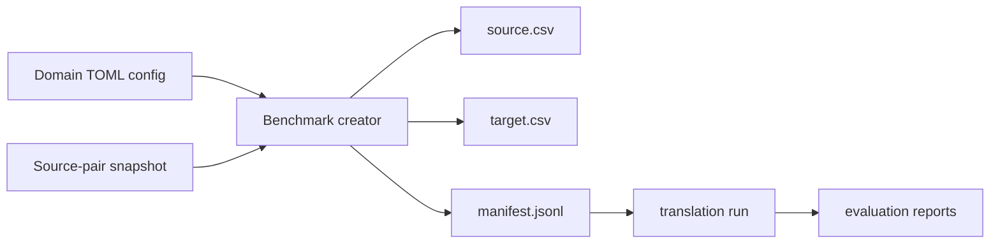
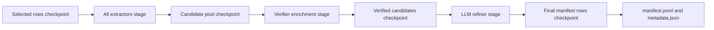
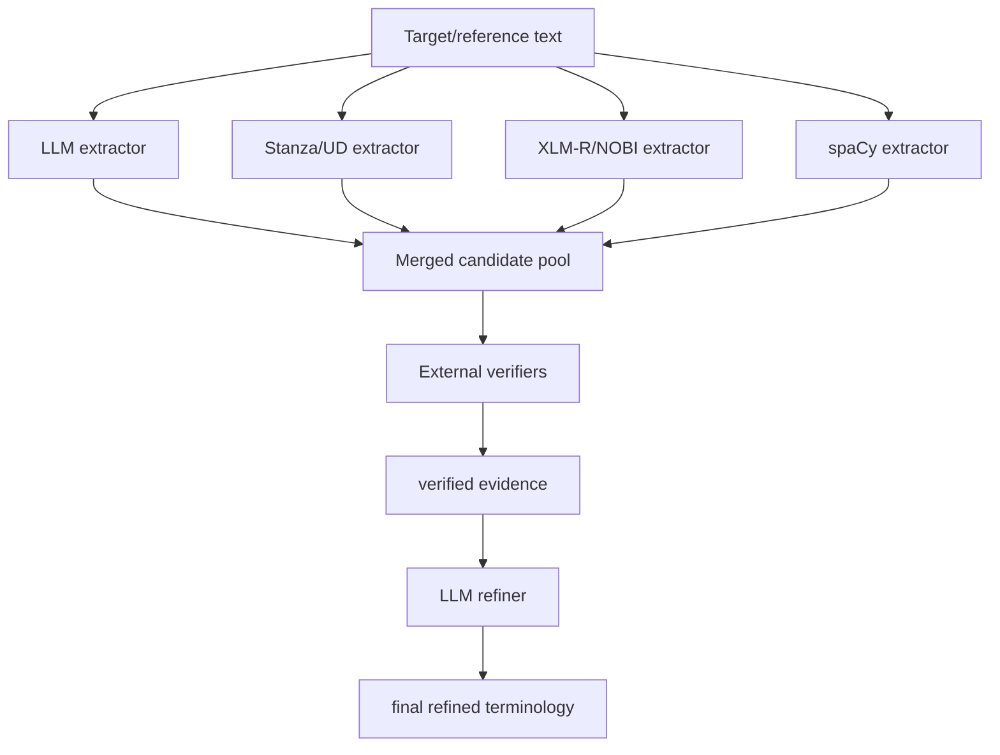

# Benchmark Generation Pipeline

This document describes the full benchmark generation pipeline: source-pair creation, dataset
manifest writing, terminology candidate extraction, verifier enrichment, LLM refinement, and
evaluation-time terminology groups.

The short command reference is in `benchmark_datasets/README.md`. Standard runs now use
config-driven wrappers:

```powershell
uv run python scripts/generate_chemistry_benchmark.py
uv run python scripts/generate_legal_benchmark.py
```

Those scripts load `config/benchmark_generation/chemistry.toml` and
`config/benchmark_generation/legal.toml`. This document explains what those configs drive and how
terminology objects move through the system.

## High-Level Flow

Benchmark generation has three top-level stages.

1. Create or reuse a source-pair snapshot in `benchmark_sources/`.
2. Run the config-driven benchmark creator. This writes benchmark-ready direction folders in
   `benchmark_datasets/` and builds the terminology manifest for each target/reference segment.
3. Run translation and evaluation against those manifests.

Inside stage 2, terminology creation is stage-based:

1. Select all benchmark rows for the build and write a checkpoint.
2. Run all configured candidate extractors across the selected rows.
3. Deduplicate and cap the broad candidate pool, normally at `40` terms per row.
4. Run verifier/enrichment sources across the candidate pool.
5. Rank and store candidate or `verified` terms.
6. Run the final LLM refiner across the verified/enriched row records when enabled in config,
   normally capped at `8` terms per row.
7. Write final manifests and benchmark metadata.

The pipeline is target-side for benchmark terminology. Candidate extractors read the target/reference
text and return exact spans that appear in that text. They do not translate source terms during
benchmark generation.

The standard terminology setup is:

- Broad candidate pool: up to `40` terms per segment.
- Final refined pool: up to `8` terms per segment.
- Default LLM: `gpt-4.1-mini`.
- Default API mode: `responses`.
- Default max output tokens for terminology calls: `1024`.
- Temperature: `0.0` in the LLM call code.

## Flow Figures

### Benchmark Creator



### Terminology Manifest Builder



### Candidate Extractors To Refiner



## Source-Pair Snapshots

Source-pair snapshots are portable JSONL files under `benchmark_sources/`. They are the stable input
to benchmark dataset builders.

Google Patents uses `scripts/create_google_patents_source_pairs.py` to create source-target patent
pairs, usually from title and abstract text within the same patent family or document context.

JRC-Acquis uses `scripts/create_jrc_acquis_source_pairs.py`. That script downloads or reuses OPUS
JRC-Acquis data, aligns document segments, chunks them within document boundaries, and writes
language-pair JSONL rows. It supports:

- `--section-type article` for operative legal provisions.
- `--section-type definition` for definition-heavy passages.
- `--selection-mode anchored` for shared document anchors and exact reverse rows.
- `--clean-legacy-markup` to remove legacy markup noise.
- `--quality-mode strict` to keep cleaner aligned chunks.

The current JRC source snapshots are:

- `benchmark_sources/jrc_acquis_anchored_articles_250_per_language_pair.jsonl`
- `benchmark_sources/jrc_acquis_anchored_definitions_250_per_language_pair.jsonl`

## Config-Driven Builder

Standard benchmark generation is configured in TOML:

- `config/benchmark_generation/chemistry.toml` points at the Google Patents source snapshot, uses
  `mode = "per_direction"` with `bidirectional = true`, and enables the chemistry
  extractor/verifier/refiner stack.
- `config/benchmark_generation/legal.toml` points at both JRC source snapshots, sets
  `mode = "anchored"` with `anchor_limit = 250`, and enables the legal extractor/verifier/refiner
  stack.

Both configs are loaded by `src/chem_machine_translation/benchmark_generation/config.py` and
executed by `src/chem_machine_translation/benchmark_generation/pipeline.py`. The old builder scripts
remain useful for manual experiments, but the two wrapper commands are the canonical standard path.

## Checkpoint And Resume

Config-driven benchmark generation writes resumable intermediate files under `benchmark_work/` by
default. This directory is ignored by Git and is separate from final benchmark outputs in
`benchmark_datasets/`.

The standard configs include:

```toml
[checkpoint]
enabled = true
work_dir = "benchmark_work"
resume = true
run_id = "auto"

[checkpoint.reuse]
selection = true
extractors = true
verifiers = true
refiner = true
manifest = true
```

With `run_id = "auto"`, checkpoints are stored by benchmark name and build name. A rerun reuses a
stage when its checkpoint file exists and the stage-specific hash still matches. The hash includes
the inputs and config values relevant to that stage, so a refiner-only config change can reuse
selection, extractor, and verifier checkpoints while rerunning refinement and final manifest writing.

Each build uses this layout:

```text
benchmark_work/
  <benchmark_name>/
    <build_name>/
      stage_status.json
      01_selected_rows.jsonl
      directions/
        <language-direction>/
          02_extractor_candidates.jsonl
          03_verified_candidates.jsonl
          04_refined_terms.jsonl
          05_manifest_rows.jsonl
```

The checkpoint files are implementation artifacts. The supported benchmark outputs remain the CSV
files, manifests, combined manifest, and `metadata.json` written under `benchmark_datasets/`.

## Local IATE

The standard benchmark configs use `local_iate` instead of the online IATE verifier. Place official
IATE CSV exports under `data/iate/`; that directory is ignored by Git. The dropped full export uses
pipe delimiters and columns such as `E_ID`, `L_CODE`, and `T_TERM`, which are supported by the local
reader.

Recommended: run the index-building script before benchmark generation:

```powershell
uv run python scripts/build_local_iate_index.py `
  --input data/iate/IATE_export.csv `
  --output data/iate/iate.sqlite
```

When `data/iate/iate.sqlite` exists, `local_iate` uses fast indexed lookups. If the index is missing,
`local_iate` will try to build it automatically the first time it is used. If automatic indexing
fails, it falls back to the raw local CSV export, which is much slower and can use a lot more RAM.

## Dataset Builders

Dataset builders consume a source-pair JSONL snapshot and write benchmark direction folders. Each
direction folder contains:

- `source.csv`
- `target.csv`
- one direction-specific `*-manifest.jsonl`

The builders also write a combined manifest at the output root.

The main dataset-generation entry points are the config-driven wrappers:

- `scripts/generate_chemistry_benchmark.py`
- `scripts/generate_legal_benchmark.py`
- `scripts/generate_benchmark.py --config <path>`

The older low-level builder scripts remain available for advanced/manual experiments:

- `scripts/build_google_patents_eval_subset.py`
- `scripts/build_jrc_acquis_eval_subset.py`

## End-To-End Experiment Pipeline

Benchmark generation can be composed with model runs, evaluation, and aggregation through experiment
configs:

- `config/experiments/*.toml` selects the benchmark config, model-run configs, evaluation config,
  and run output directory.
- `config/model_runs/*.toml` defines the translator, provider, model, temperature, terminology
  injection, and resume behavior.
- `config/evaluation/*.toml` defines metrics, terminology groups, COMET settings, and optional MQM
  judge settings.
- `scripts/run_benchmark_experiment.py` runs the configured stages and writes predictions, scores,
  `summary.json`, and `summary.md`.

The experiment runner separates model prediction from scoring. This keeps expensive model calls
reusable: predictions are written once under `runs/<experiment>/predictions/`, and scores are written
under `runs/<experiment>/scores/`. Aggregation reads the scored JSONL files and summarizes metrics by
model, build, direction, and target language.

Each manifest row stores dataset metadata, source/target language metadata, token counts, row IDs,
and a `terminology` array. During construction the builders keep internal `_source_text` and
`_target_text` fields in memory; those private fields are removed before writing the final manifest.
Each config-driven build also writes `metadata.json` next to the combined manifest. The metadata
summarizes row counts, direction counts, anchor counts, source/target token percentiles, and
candidate/refined/verified-refined term-count distributions overall, by direction, by source
language, and by target language.

Configs choose source-row selection with `mode`. `mode = "per_direction"` selects up to `limit` rows
per observed language direction and can add synthetic reverse examples with `bidirectional = true`.
`mode = "anchored"` is for JRC: it selects shared `anchor_id` values using `anchor_limit` and keeps
the complete set of ordered language directions available for each selected anchor. The standard
legal config uses `anchor_limit = 250` and keeps the full legal extractor, verifier, and refiner
stack enabled.

Length selection happens during source snapshot generation in `benchmark_sources/`. The standard
benchmark configs do not set `min_input_tokens` or `max_input_tokens`; they consume the
already-selected source snapshots. Anchored JRC configs use anchor completeness as the main selection
rule.

## Terminology Object Schema

Terminology entries are represented by `DatasetTerminologyTerm` in
`src/chem_machine_translation/data/terminology.py`.

Important fields:

- `source_term`: source-side term when available. Benchmark target-side extraction usually leaves
  this empty.
- `target_terms`: exact target/reference spans selected as terminology.
- `reference_candidates`: fallback reference-side candidates.
- `category`: coarse domain category such as `chemical`, `material`, `legal_act`, or
  `defined_term`.
- `source`: provenance string. Multiple sources are joined with `+`, for example
  `stanza_ud_dependency+xlmr_nobi+local_iate`.
- `term_group`: evaluation group, usually `llm`, `algorithmic`, `verified`, or `refined`.
- `verified_by`: external evidence sources that matched the term, such as `local_iate` or
  `pubchem`.
- `confidence`: extractor confidence adjusted by verifier evidence.
- `decision`: preservation/refinement decision such as `preserve`, `translate`, or `keep_refined`.
- `reason`: short human-readable explanation.
- `candidates`: external synonym or label evidence collected from verifier APIs.

The code deduplicates terms by normalized target surface. When duplicates are merged, provenance and
verifier evidence are unioned rather than discarded.

## Candidate Extractor Families

The standard candidate stage combines four extractor families.

### LLM Chemistry Extractor

Class: `LLMTargetCandidateExtractor`

Used by Google Patents when `llm_chemistry` is listed in the benchmark config extractors.

Pipeline:

1. Build a chemistry/patent prompt around the target/reference text.
2. Ask the LLM for exact technical spans only.
3. Parse the JSON response.
4. Check every returned `target_term` against the original target/reference text.
5. Drop terms that do not appear exactly.
6. Convert accepted spans into `DatasetTerminologyTerm` objects.

The extractor looks for chemical names, compounds, materials, formulas, reagents, solvents,
polymers, proteins, process names, assay terms, analytical terms, properties, hazards, identifiers,
and technically meaningful units.

The parser accepts only terms that:

- appear as exact spans in the target/reference text;
- are returned as valid JSON;
- have a recognized category and confidence;
- are not rewritten, lemmatized, translated, or invented.

Output terms use:

- `source`: `llm_target`
- `term_group`: `llm`

### LLM Legal Extractor

Class: `LLMLegalCandidateExtractor`

Used by JRC-Acquis when `llm_legal` is listed in the benchmark config extractors.

Pipeline:

1. Build a legal-domain prompt around the target/reference text.
2. Ask the LLM for exact legal or institutional spans only.
3. Parse the JSON response.
4. Check every returned `target_term` against the original target/reference text.
5. Drop terms that do not appear exactly.
6. Convert accepted spans into `DatasetTerminologyTerm` objects.

The extractor looks for legal instruments, institutions, committees, agencies, programmes, funds,
procedures, rights, obligations, restrictions, sanctions, remedies, legal effects, regulatory
domains, and explicitly defined terms.

It rejects dates, article numbers alone, paragraph references alone, personal names, signatures,
whole clauses, generic single words, and ordinary administrative prose.

Output terms use:

- `source`: `legal_llm`
- `term_group`: `llm`

### Stanza/UD Extractor

Class: `TargetTerminologyExtractor`

Google uses this extractor by default inside `DatasetTerminologyGenerator` unless
`--no-stanza-extractor` is passed. JRC uses it when `--extract-stanza-terms` is passed.

Pipeline:

1. Resolve the target language code.
2. Lazily load or reuse a Stanza pipeline for that language.
3. Parse the target/reference text into tokens, POS tags, lemmas, and dependencies.
4. Generate three separate lists of candidates from the parsed document: dependency spans,
   relaxed n-grams, and proper-name runs.
5. Clean and exact-span check each surface form.
6. Deduplicate and cap the Stanza candidates.

The Stanza pipeline uses:

```text
tokenize,pos,lemma,depparse
```

The extractor then builds three lists of candidate terms before merging them.

Dependency candidates use noun-like Universal Dependencies heads. The extractor expands heads with
dependency relations such as modifiers, compounds, names, appositions, flat names, numeric modifiers,
and selected nominal relations. These candidates use:

- `source`: `stanza_ud_dependency`
- confidence around `0.72`

Relaxed n-gram candidates scan sentence windows of one to six words. They reject windows with verbs,
auxiliaries, punctuation-like dependencies, poor boundaries, and spans without content words. These
candidates use:

- `source`: `stanza_ud_ngram`
- confidence derived from content-word count, capped below the dependency candidates

Proper-name candidates collect runs of proper nouns with at least two tokens. These candidates use:

- `source`: `stanza_ud_proper_name`
- confidence around `0.70`

All Stanza candidates are cleaned and exact-span checked before becoming manifest terms. The
extractor rejects noisy punctuation, malformed separators, citation-like fragments, date fragments,
and many short generic fragments.

### XLM-R/NOBI Extractor

Class: `XLMRNOBITerminologyExtractor`

Enabled when `xlmr_nobi` is listed in the benchmark config extractors.

The default model is:

```text
tthhanh/xlm-ate-nobi-en-nes
```

Pipeline:

1. Load the Hugging Face token-classification model.
2. Run token classification over the target/reference text.
3. Map model labels into BIO-style terminology labels.
4. Join contiguous term tokens, including subword continuations.
5. Reconstruct exact target/reference spans.
6. Drop spans with bad word boundaries or noisy surfaces.
7. Deduplicate and cap accepted terms.

The implementation truncates input to the first `4000` characters. It does not route by target
language; the model is loaded once and applied to the supplied text.

Output terms use:

- `source`: `xlmr_nobi`
- `term_group`: `algorithmic`

### spaCy Extractor

Class: `SpaCyTerminologyExtractor`

Enabled when `spacy` is listed in the benchmark config extractors.

The spaCy extractor is an exact-span extractor. It uses trained spaCy linguistic annotations when a
language model is available, and falls back to a blank spaCy pipeline when possible.

Pipeline:

1. Resolve the target language code.
2. Load the configured `--spacy-model`, or the default small model for the target language.
3. If the language model is unavailable, fall back to `spacy.blank(language_code)` when possible.
4. Parse the first `4000` characters of the target/reference text.
5. Extract named-entity candidates from `doc.ents`.
6. Extract noun-chunk candidates from `doc.noun_chunks` when the pipeline supports noun chunks.
7. Extract token n-gram candidates from sentence-scoped candidate token runs.
8. Clean, trim, exact-span preserve, deduplicate, and cap the combined spaCy candidates.

Default language model mapping:

- German: `de_core_news_sm`
- English: `en_core_web_sm`
- Spanish: `es_core_news_sm`
- French: `fr_core_news_sm`
- Japanese: `ja_core_news_sm`
- Portuguese: `pt_core_news_sm`
- Russian: `ru_core_news_sm`
- Chinese: `zh_core_web_sm`

If `--spacy-model` is provided, that model is loaded instead of the language default. The input is
truncated to the first `4000` characters.

The three spaCy candidate components are:

Named-entity terms read `doc.ents`, trim non-content boundary tokens, clean the surface form, and
keep candidates that have at least one content token. These candidates use:

- `source`: `spacy_entity`
- confidence base around `0.78`

Noun-chunk terms read `doc.noun_chunks` when the loaded pipeline supports noun chunks. Languages or
blank pipelines without noun chunks fail closed and simply return no noun-chunk terms. These
candidates use:

- `source`: `spacy_noun_chunk`
- confidence base around `0.72`

Token n-gram terms use sentence-scoped contiguous runs of candidate tokens. With POS tags, the
extractor considers windows up to five tokens. Without POS tags, it limits windows to three tokens.
It rejects stopword boundaries, punctuation boundaries, windows without content, and POS patterns
that do not look terminology-like. These candidates use:

- `source`: `spacy_ngram`

The spaCy extractor is useful as a broad deterministic recall source, especially when named entities
or noun chunks capture domain phrases missed by the LLM or Stanza paths.

## Verifier And Enrichment Sources

Verifiers do not create the initial span. They check whether an extracted target-side candidate has
external evidence, then append provenance and synonyms or labels.

If a verifier matches:

- its name is appended to `source`;
- its name is added to `verified_by`;
- matching labels or synonyms are stored in `candidates`;
- confidence increases by `0.05` per verifier source, capped at `1.0`;
- `term_group` becomes `verified`.

### Chemistry Verifiers

Google Patents chemistry builds can use these verifier flags:

- `--iate-terminology`: online IATE same-language terminology lookup.
- `--wikidata-terminology`: Wikidata label lookup. Stored as `wikipedia` in term evidence for
  historical naming compatibility.
- `--pubchem-terminology`: PubChem compound synonym lookup.
- `--chebi-terminology`: ChEBI synonym lookup through the EBI API.
- `--chembl-terminology`: ChEMBL molecule and synonym lookup.
- `--mesh-terminology`: MeSH descriptor lookup through the NLM API.
- `--nci-terminology`: NCI Thesaurus lookup through EVS REST.
- `--agrovoc-terminology`: AGROVOC multilingual label lookup through Skosmos.

### Legal Verifiers

JRC legal builds normally use:

- `--iate-terminology`: online IATE same-language legal terminology lookup.
- `--wikipedia-terminology`: Wikidata label lookup, stored as `wikipedia`.
- `--unterm-terminology`: UNTERM public search-page evidence.

There is also EuroVoc descriptor matching support in the legal terminology code. The current JRC
builder passes an empty descriptor map, so EuroVoc is not part of the standard JRC command unless
that metadata is supplied.

## LLM Refiner

Class: `LLMTerminologyRefiner`

The refiner is the final selection stage. It receives the full target/reference text and the existing
candidate pool. It must select from provided candidate IDs only. It cannot invent new terms, rewrite
terms, or repair spans.

Domain routing:

- `chemistry` and `google_patents` use the chemistry refiner prompt and append
  `llm_refiner_chem` to `source`.
- `jrc` and `legal` use the legal refiner prompt and append `llm_refiner_jrc` to `source`.

The standard refiner target is:

```text
max_terms = 8
```

The refiner is allowed to return fewer than eight terms when fewer candidates are truly useful. It
should prefer externally verified terms when quality is comparable, but it can keep an unverified
term when the term is central and translation-sensitive.

The parser validates every refined item:

- the candidate ID must exist;
- the selected target term must match the original candidate term;
- the term must still appear exactly in the target/reference text;
- the returned quality score must pass the prompt threshold.

Accepted refined terms use:

- `term_group`: `refined`
- `decision`: `keep_refined`
- `source`: original provenance plus the refiner tag

The config-driven dataset builders now integrate the final refiner stage directly. When
`refiner = true`, the final manifest contains both the verified/candidate terms and the appended
`refined` terms selected by `LLMTerminologyRefiner`.

## Evaluation Terminology Groups

Terminology metrics support these groups:

- `llm`: target-side LLM extractor candidates.
- `algorithmic`: deterministic candidates from Stanza/UD, XLM-R/NOBI, or spaCy.
- `verified`: candidates with external verifier evidence.
- `refined`: final LLM-refiner-selected terms.

The default terminology metric group is `verified`, which is appropriate for candidate-only
manifests. Final benchmark scoring should use `refined` after the refiner stage has been applied.

For candidate-only manifests:

```powershell
uv run --no-sync python scripts/evaluate_parallel_manifest.py `
  --dataset-dir benchmark_datasets/<dataset>/<direction> `
  --metric target_term_coverage `
  --terminology-term-group verified `
  --max-manifest-terminology-terms 8
```

For finalized refiner manifests:

```powershell
uv run --no-sync python scripts/evaluate_parallel_manifest.py `
  --dataset-dir benchmark_datasets/<dataset>/<direction> `
  --metric target_term_coverage `
  --terminology-term-group refined `
  --max-manifest-terminology-terms 8
```

## Standard Build Commands

The copy-paste commands live in `benchmark_datasets/README.md`.

Use the Google Patents command there for chemistry benchmarks. It enables the LLM chemistry
extractor, Stanza/UD, XLM-R/NOBI, spaCy, and the chemistry verifier set.

Use `config/benchmark_generation/legal.toml` for legal benchmarks. It defines both the article and
definition builds and enables the legal LLM extractor, Stanza/UD, XLM-R/NOBI, spaCy, and the legal
verifier set.

## Benchmark Creator Orchestration

This section is intentionally near the end because it describes how the dataset builders wire
together the extractor, verifier, and refiner pieces described above.

### Google Patents

When `config/benchmark_generation/chemistry.toml` is used, the benchmark creator runs:

1. Build manifest rows from the Google source-pair snapshot.
2. Write or reuse the selected-row checkpoint.
3. Run the chemistry LLM extractor, Stanza/UD, XLM-R/NOBI, and spaCy across the selected rows.
4. Merge extractor outputs and deduplicate by normalized target surface.
5. Write or reuse the extractor-candidate checkpoint.
6. Run chemistry verifiers on the candidate pool.
7. Rank terms through `select_dataset_terms`.
8. Write or reuse the verified-candidate checkpoint.
9. Run the LLM refiner across the verified/enriched row records when `refiner = true`.
10. Write or reuse the manifest-row checkpoint.
11. Write final direction manifests, combined manifest, and `metadata.json`.

The relevant config entries are:

- `extractors = ["llm_chemistry", "stanza_ud", "xlmr_nobi", "spacy"]`
- `verifiers = ["local_iate", "wikidata", "pubchem", "chebi", "chembl", "mesh", "nci", "agrovoc"]`
- `candidate_max_terms = 40`
- `refined_max_terms = 8`
- `refiner = true`

### JRC-Acquis

JRC uses the same stage checkpoints, with legal-specific extraction and ranking:

1. Build manifest rows from the JRC article or definition source-pair snapshot.
2. Write or reuse the selected-row checkpoint.
3. Run the legal LLM extractor when `llm_legal` is configured.
4. Run Stanza/UD, XLM-R/NOBI, and spaCy when the deterministic extractors are configured.
5. Merge all extractor outputs and deduplicate with `deduplicate_terms`.
6. Write or reuse the extractor-candidate checkpoint.
7. Run local IATE, Wikidata, UNTERM, and optional EuroVoc evidence over the candidate pool.
8. Rank legal terms through `select_legal_terms`.
9. Write or reuse the verified-candidate checkpoint.
10. Run the LLM refiner across the verified/enriched row records when `refiner = true`.
11. Write final direction manifests, combined manifest, and `metadata.json`.

The JRC builder also caches deterministic target-term extraction by target language and target text,
which matters because anchored JRC rows can reuse the same target chunk across directions.

The article and definition builds differ only in the source JSONL and output directory. The
terminology pipeline is the same for both.

## Important Implementation Files

- `scripts/create_google_patents_source_pairs.py`: builds Google source-pair snapshots.
- `scripts/create_jrc_acquis_source_pairs.py`: builds JRC article and definition source-pair
  snapshots.
- `scripts/generate_chemistry_benchmark.py`: standard chemistry benchmark runner.
- `scripts/generate_legal_benchmark.py`: standard legal benchmark runner.
- `scripts/generate_benchmark.py`: generic config-driven runner for custom TOML configs.
- `scripts/build_google_patents_eval_subset.py`: advanced manual Google builder.
- `scripts/build_jrc_acquis_eval_subset.py`: advanced manual JRC builder.
- `src/chem_machine_translation/benchmark_generation/config.py`: TOML config schema and loader.
- `src/chem_machine_translation/benchmark_generation/pipeline.py`: shared config-driven benchmark
  orchestration.
- `src/chem_machine_translation/data/terminology.py`: terminology schema, extractors, verifiers,
  generators, deduplication, and LLM refiner.
- `src/chem_machine_translation/evaluation/metrics.py`: terminology group filtering and coverage
  metrics.
- `src/chem_machine_translation/translation/terminology.py`: translation-time terminology injection
  and source-side extraction. This is related, but separate from benchmark manifest generation.

