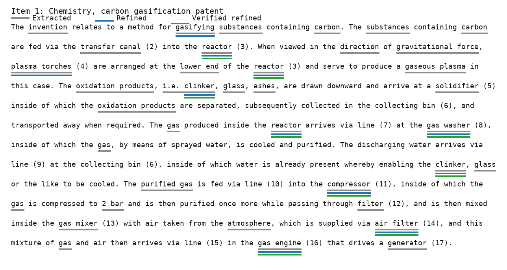
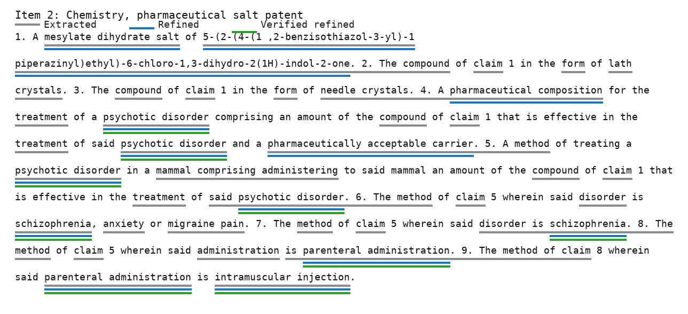
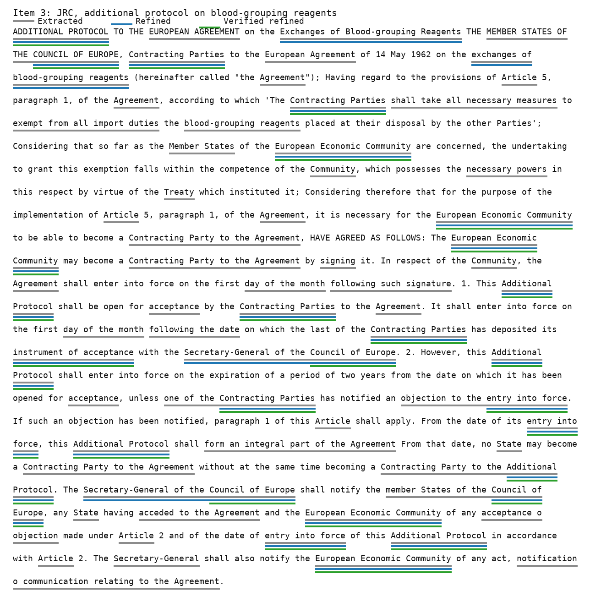
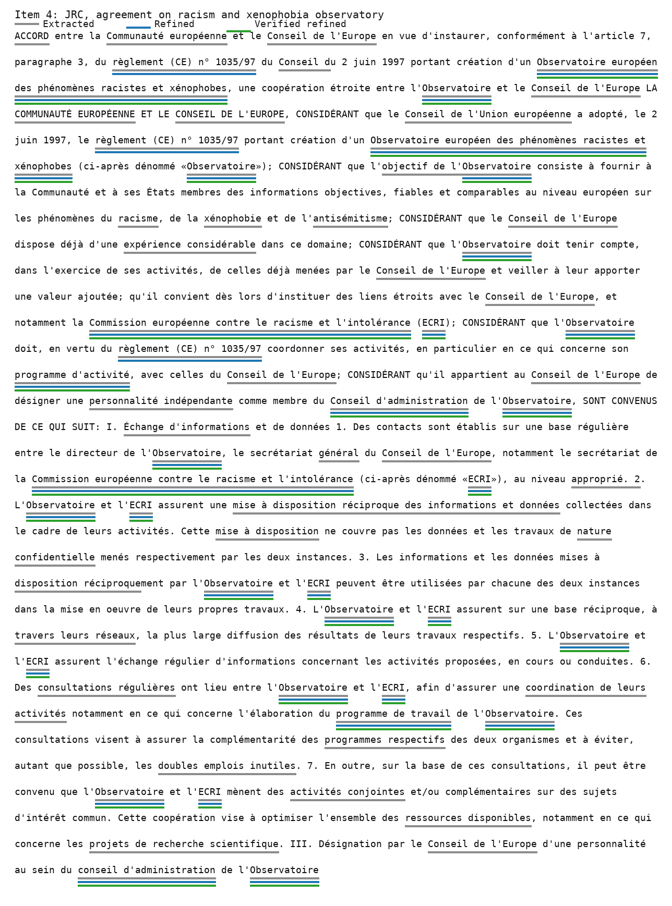

# Final Four-Extractor Pipeline Sample Report

This report reviews four examples using the final candidate-extraction pipeline:

```text
target/reference text
  -> LLM extractor
  -> Stanza/UD extractor
  -> XLM-R/NOBI extractor
  -> trained spaCy extractor
  -> duplicate/provenance merge
  -> external verification evidence
  -> domain-specific LLM refiner
  -> exact-span validation against target/reference text
```

The examples below use existing completed manifests for broad candidate extraction, then rerun a new
LLM refiner on the merged candidate list. The refiner does not generate new candidates. It receives
candidate IDs, target text, source tags, verifier evidence, and a fixed domain rubric. The parser only
keeps returned terms when the candidate ID exists and the candidate term is still an exact span in the
target/reference text, so hallucinated or rewritten terms are discarded.

Two refiner prompts are used:

- Chemistry refiner: keeps complete chemical, material, formulation, equipment, process, dosage,
  disease, and measurement terms that are valuable for patent/chemistry translation evaluation.
- JRC/legal refiner: keeps complete legal acts, institutions, defined terms, procedures, rights,
  obligations, regulatory domains, and official names that are valuable for legal translation
  evaluation.

The run output is saved in `docs/final-four-extractor-refiner-results.json`.

In the figures, gray underlines show all extracted candidates, blue underlines show refined terms, and
green underlines show refined terms that also have verifier evidence.

## Item 1: Chemistry, Carbon Gasification Patent

- Dataset: Google Patents.
- Example: `within-document:abstract:en-de:AT-503517-B1:reverse`.
- Target language: English.
- Text type: patent abstract about gasifying carbon-containing substances with plasma torches,
  reactor output, gas washing, filtering, and gas engine use.

Method counts:

| Method | Terms | Verified | Unverified |
| --- | ---: | ---: | ---: |
| LLM | 16 | 10 | 6 |
| Stanza/UD | 8 | 3 | 5 |
| XLM-R/NOBI | 13 | 12 | 1 |
| spaCy | 20 | 12 | 8 |

Refiner result:

| Candidate terms | Verified candidates | Refined terms | Verified refined |
| ---: | ---: | ---: | ---: |
| 29 | 19 | 8 | 6 |

Selected by refiner:

- `gas washer`, `compressor`, `gas engine`, `air filter`, `reactor`, `clinker`,
  `plasma torches`, `gasifying`.



Good terms:

- `gas washer`, `gas engine`, `air filter`, `reactor`, `carbon`, `plasma`, `compressor`.
- Strong unverified technical candidates: `plasma torches`, `gaseous plasma`, `oxidation products`,
  `gas mixer`, `solidifier`.

Performance:

The pipeline performs well on this example. XLM-R/NOBI and spaCy provide high verifier coverage for
compact technical nouns, while the LLM and Stanza/UD contribute better multiword equipment phrases.
The main weakness is that some good patent-specific terms are unverified because external sources do
not necessarily contain exact phrases such as `plasma torches` or `oxidation products`.

The refiner improves precision by dropping generic verified items such as `atmosphere`, `generator`,
`filter`, `glass`, `gas`, `carbon`, and `plasma` while preserving the stronger equipment/process terms.
It also keeps the unverified but useful `plasma torches`, showing why verifier evidence should remain
evidence rather than a hard acceptance rule.

Could be better:

- Keep unverified but extractor-agreed technical multiwords instead of relying only on verifier hits.
- Penalize generic verified terms such as `filter` unless they are part of a stronger phrase.
- Prefer equipment/process phrases over broad single words.

## Item 2: Chemistry, Pharmaceutical Salt Patent

- Dataset: Google Patents.
- Example: `within-document:abstract:en-ru:EA-001190-B1:reverse`.
- Target language: English.
- Text type: patent claim-style abstract about a mesylate dihydrate salt, crystal forms,
  pharmaceutical composition, psychotic disorder treatment, and administration routes.

Method counts:

| Method | Terms | Verified | Unverified |
| --- | ---: | ---: | ---: |
| LLM | 12 | 6 | 6 |
| Stanza/UD | 5 | 4 | 1 |
| XLM-R/NOBI | 5 | 3 | 2 |
| spaCy | 20 | 13 | 7 |

Refiner result:

| Candidate terms | Verified candidates | Refined terms | Verified refined |
| ---: | ---: | ---: | ---: |
| 29 | 13 | 8 | 4 |

Selected by refiner:

- `5-(2-(4-(1 ,2-benzisothiazol-3-yl)-1 piperazinyl)ethyl)-6-chloro-1,3-dihydro-2(1H)-indol-2-one`,
  `parenteral administration`, `mesylate dihydrate salt`, `intramuscular injection`,
  `schizophrenia`, `psychotic disorder`, `pharmaceutically acceptable carrier`,
  `pharmaceutical composition`.



Good terms:

- `mesylate dihydrate salt`, `pharmaceutical composition`, `pharmaceutically acceptable carrier`,
  `psychotic disorder`, `schizophrenia`, `anxiety`, `intramuscular injection`,
  `parenteral administration`, `migraine pain`.

Performance:

The LLM gives the best chemistry/pharma phrase quality. Stanza/UD is more selective and catches strong
multiword clinical terms. XLM-R/NOBI catches compact biomedical terms. spaCy has high verifier
coverage, but many verified terms are generic in this context: `treatment`, `compound`, `form`,
`method`, and `claim`.

The refiner correctly favors the long chemical name, salt form, formulation terms, administration
routes, and disease terms. It removes generic or boilerplate candidates like `claim`, `method`,
`treatment`, `compound`, `form`, and `anxiety`.

Could be better:

- Add a generic verified-term penalty for patent boilerplate words like `claim`, `method`,
  `compound`, and `form`.
- Boost exact chemical names, salt forms, dosage/administration phrases, and disease names.
- Use source-target alignment before final acceptance, especially for the long chemical name.

## Item 3: JRC, Additional Protocol On Blood-Grouping Reagents

- Dataset: JRC-Acquis anchored articles.
- Example: `de-en:jrc21987A0207_06:chunk-0135`.
- Target language: English.
- Text type: legal article chunk about an additional protocol, Contracting Parties, import duties,
  blood-grouping reagents, entry into force, and notification procedures.

Method counts:

| Method | Terms | Verified | Unverified |
| --- | ---: | ---: | ---: |
| LLM | 20 | 9 | 11 |
| Stanza/UD | 18 | 8 | 10 |
| XLM-R/NOBI | 4 | 3 | 1 |
| spaCy | 20 | 14 | 6 |

Refiner result:

| Candidate terms | Verified candidates | Refined terms | Verified refined |
| ---: | ---: | ---: | ---: |
| 43 | 22 | 8 | 6 |

Selected by refiner:

- `European Economic Community`, `ADDITIONAL PROTOCOL`, `Contracting Parties`,
  `Council of Europe`, `entry into force`, `instrument of acceptance`,
  `Secretary-General of the Council of Europe`, `exchanges of blood-grouping reagents`.



Good terms:

- `European Economic Community`, `Additional Protocol`, `Contracting Parties`,
  `entry into force`, `instrument of acceptance`, `Council of Europe`, `blood-grouping reagents`,
  `import duties`.

Performance:

The pipeline gets the main legal concepts, but this example shows why verification alone is not
enough. spaCy has high verified coverage, but many verified items are generic legal words such as
`Agreement`, `State`, `Article`, and `Community`. The LLM returns more coherent legal phrases, while
Stanza/UD adds useful noun phrases but also includes malformed or noisy phrases such as
`notification o communication`.

The refiner handles the major legal failure mode: it rejects generic verified single words such as
`Agreement`, `Community`, `State`, `Article`, `States`, and `Party`. It also keeps unverified but
contextually important legal expressions from the LLM candidate list, including
`Secretary-General of the Council of Europe` and `exchanges of blood-grouping reagents`.

Could be better:

- Penalize generic legal single words even when verified.
- Keep coherent legal multiwords such as `entry into force` and `instrument of acceptance`.
- Add document-structure filters for headings and article boilerplate.
- Fix source text artifacts before or during candidate cleanup, e.g. `notification o communication`.

## Item 4: JRC, Agreement On Racism And Xenophobia Observatory

- Dataset: JRC-Acquis anchored articles.
- Example: `de-fr:jrc21999A0218_01:chunk-0453`.
- Target language: French.
- Text type: legal agreement between the European Community and the Council of Europe concerning
  cooperation around the European Monitoring Centre on Racism and Xenophobia.

Method counts:

| Method | Terms | Verified | Unverified |
| --- | ---: | ---: | ---: |
| LLM | 17 | 11 | 6 |
| Stanza/UD | 10 | 5 | 5 |
| XLM-R/NOBI | 13 | 13 | 0 |
| spaCy | 20 | 12 | 8 |

Refiner result:

| Candidate terms | Verified candidates | Refined terms | Verified refined |
| ---: | ---: | ---: | ---: |
| 42 | 26 | 8 | 7 |

Selected by refiner:

- `Observatoire européen des phénomènes racistes et xénophobes`,
  `Commission européenne contre le racisme et l'intolérance`, `règlement (CE) n° 1035/97`,
  `Conseil d'administration`, `Observatoire`, `ECRI`, `programme d'activité`,
  `programme de travail`.



Good terms:

- `Observatoire européen des phénomènes racistes et xénophobes`,
  `Commission européenne contre le racisme et l'intolérance`, `Conseil d'administration`,
  `Communauté européenne`, `Conseil de l'Europe`, `ECRI`, `Conseil de l'Union européenne`,
  `recherche scientifique`.

Performance:

This is the strongest of the four examples. XLM-R/NOBI has perfect verifier coverage on compact legal
and institutional terms. The LLM captures longer official names and legal phrases. spaCy contributes
useful institutional entities and noun chunks, but also returns broad partial phrases such as
`Observatoire européen` and `phénomènes racistes et xénophobes`, which are useful only if the selector
can merge or prefer the full official name.

The refiner chooses the full official names over partial fragments like `Observatoire européen` and
`phénomènes racistes et xénophobes`. It also keeps defined/acronym terms such as `Observatoire` and
`ECRI`, while dropping broader or less translation-critical candidates like `EUROPE`,
`Union européenne`, `ressources disponibles`, and `consultations régulières`.

Could be better:

- Prefer complete official names over partial entity fragments.
- Merge nested variants, e.g. prefer the full observatory name over shorter substrings.
- Keep non-verified but coherent operational phrases such as `consultations régulières` only if they
  are source-target alignable and translation-sensitive.

## Overall Assessment

The four-extractor pipeline is a strong candidate-generation setup, and the LLM refiner is the missing
precision layer. Across the four examples, broad extraction produced 143 merged candidates, including
80 with verifier evidence. The refiner selected 32 final terms, 23 of which also had verifier evidence.
More importantly, the selected terms are much closer to the intended benchmark definition: complete,
domain-specific, contextually important, and translation-sensitive.

Best signals:

- LLM for coherent long phrases and official/technical concepts.
- XLM-R/NOBI for compact biomedical, chemical, legal, and institutional terms.
- Stanza/UD for deterministic noun/dependency spans.
- spaCy for trained entity/noun-chunk evidence, especially in English and French.
- External verifier hits as evidence, not as final acceptance.
- LLM refiner for final termhood, contextual importance, and translation-evaluation usefulness.

What improved:

- Generic verified terms were filtered out: `method`, `claim`, `Article`, `State`, `Agreement`,
  `Community`, `filter`, `gas`, and similar broad words no longer dominate final terms.
- Useful unverified terms can still survive when they are clearly technical or legal, such as
  `plasma torches`, `mesylate dihydrate salt`, and `Secretary-General of the Council of Europe`.
- Nested/partial variants are handled better, especially in the French JRC example where the full
  observatory and ECRI names are preferred over fragments.

Remaining problems:

- The pipeline still lacks explicit `source_term`, so final terminology is target-side only.
- The refiner currently validates existence in the target/reference text, but not source-target
  alignability. A final acceptance stage should still confirm that an aligned source-side term exists.
- Some LLM choices remain debatable, for example selecting `gasifying` instead of a fuller process
  phrase, or keeping `Observatoire` as a defined term alongside the full official name.
- The current sample is small. The selector should be calibrated against manually labelled candidates
  before being used as the final scoring authority.

Recommended next step:

Integrate the refiner as an optional post-extraction stage in benchmark dataset creation: broad
candidates first, verifier evidence second, LLM refiner third, exact-span validation always, and
source-target alignment before final target-term coverage scoring.
