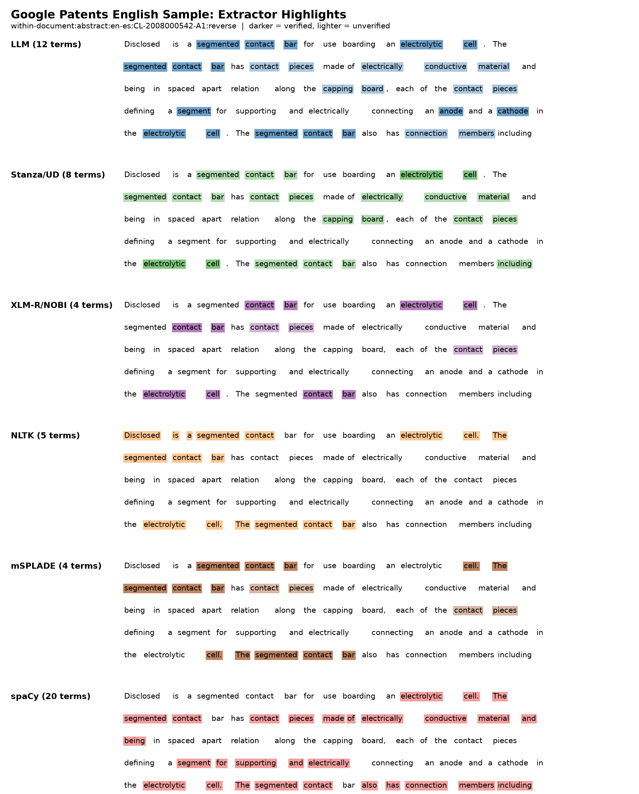

# Google Patents 5-Per-Pair Bidirectional Terminology Evaluation

## Scope

This report evaluates a small Google Patents sample built from
`benchmark_sources/within_document_translation_pairs_250_per_eligible_pair.jsonl`.
The source is within-document pairwise data, not fully multiway anchored data. For
this evaluation, each selected row was also emitted in the reverse direction by
exactly swapping source and target text.

Generated analysis manifest:

- `benchmark_datasets/google_patents_5_bidirectional_all_candidate_terms/google-patents-22-directions-110-analysis-manifest.jsonl`

The primary build produced 20 directions. The `zh-fr` pair was initially filtered
out because the generic token counter undercounts Chinese text, so a supplemental
`zh-fr`/`fr-zh` run with `--min-input-tokens 1` was merged into the analysis
manifest.

## Build Settings

The sample contains 5 examples from each available original language pair plus 5
synthetic reverse examples for each pair.

- Rows: 110.
- Directions: 22.
- Rows per direction: 5.
- Field: `abstract` for all rows.
- Target language distribution: `en` 30, `fr` 30, `de` 10, `es` 10, `ja` 10,
  `ru` 10, `zh` 10.
- Source token range: 1 to 354, mean 124.2. The minimum is a tokenization artifact
  for CJK text, not necessarily a genuinely one-token abstract.

Candidate extractors enabled:

- LLM target-span extractor.
- Stanza/Universal Dependencies.
- XLM-R/NOBI.
- NLTK n-gram extractor.
- mSPLADE sparse-activation extractor.

Verifier sources enabled:

- IATE, Wikipedia/Wikidata, PubChem, ChEBI, ChEMBL, MeSH, NCI Thesaurus, and
  AGROVOC.

## Overall Counts

- Total terminology entries: 2,200.
- Verified entries: 605.
- LLM-only group entries: 996.
- Algorithmic unverified entries: 599.

Verifier hits:

| Source | Hits |
| --- | ---: |
| IATE | 471 |
| AGROVOC | 372 |
| MeSH | 205 |
| NCI Thesaurus | 171 |
| PubChem | 123 |
| Wikipedia/Wikidata | 121 |
| ChEMBL | 91 |
| ChEBI | 13 |

Extractor provenance appearances:

| Extractor/source tag | Appearances |
| --- | ---: |
| `llm_target` | 1,427 |
| `nltk_ngram` | 494 |
| `xlmr_nobi` | 441 |
| `stanza_ud_dependency` | 155 |
| `stanza_ud_ngram` | 147 |
| `msplade_sparse` | 162 |

Extractor target counts:

| Extractor | Targets | Verified | Unverified | Unique targets |
| --- | ---: | ---: | ---: | ---: |
| Stanza/UD | 194 | 38 | 156 | 180 |
| XLM-R/NOBI | 441 | 280 | 161 | 395 |
| LLM | 1,427 | 431 | 996 | 1,256 |
| NLTK | 494 | 1 | 493 | 459 |
| mSPLADE | 162 | 37 | 125 | 156 |

Weighted extracted-text length:

This measures how much extracted terminology text each extractor contributes. For each extractor,
the weighted character sum is calculated as:

```text
sum(length of extracted target term * number of times extracted)
```

| Extractor | Matches | Unique terms | Unique character sum | Weighted character sum |
| --- | ---: | ---: | ---: | ---: |
| Stanza/UD | 194 | 180 | 2,979 | 3,260 |
| XLM-R/NOBI | 441 | 395 | 4,844 | 5,261 |
| LLM | 1,427 | 1,256 | 19,446 | 21,298 |
| NLTK | 494 | 459 | 19,864 | 22,330 |
| mSPLADE | 162 | 156 | 3,453 | 3,616 |
| spaCy | 2,000 | 1,900 | 67,394 | 71,209 |

## Method-Language Matrix

Cells are `unverified/verified` terminology counts. A verified term can still be
generic or low-value, so this table measures evidence coverage, not final term
quality.

| Method | en | fr | de | es | ja | ru | zh |
| --- | ---: | ---: | ---: | ---: | ---: | ---: | ---: |
| Stanza/UD | 136/35 | 0/0 | 0/0 | 0/0 | 0/0 | 0/0 | 20/3 |
| XLM-R/NOBI | 50/108 | 51/108 | 12/31 | 14/31 | 0/0 | 31/0 | 3/2 |
| LLM | 265/164 | 230/133 | 82/52 | 69/40 | 152/6 | 107/0 | 91/36 |
| NLTK | 68/0 | 134/1 | 52/0 | 64/0 | 42/0 | 76/0 | 57/0 |
| mSPLADE | 74/24 | 27/10 | 9/0 | 15/3 | 0/0 | 0/0 | 0/0 |

## English Sample Highlight Figure

The figure below uses one English target sample from the Google Patents run:
`within-document:abstract:en-es:CL-2008000542-A1:reverse` in direction `es-en`.
Each row repeats the same target text. Highlighted words are covered by terms extracted by that
specific extractor. Darker highlights indicate verified terms; lighter highlights indicate
unverified terms.



## Extractor Classes

The compact table gives record counts, unique-term counts, and frequency ranges. The term lists
after it show up to 25 verified and 25 unverified sample terms per extractor, ordered by
frequency, matching the compact structure used in the JRC terminology report.

| Class | Records | Unique terms | 10+ repeats | 5-9 repeats | 2-4 repeats | 1 repeat |
| --- | ---: | ---: | ---: | ---: | ---: | ---: |
| Stanza/UD, verified | 38 | 38 | 0 | 0 | 0 | 38 |
| Stanza/UD, not verified | 156 | 142 | 0 | 0 | 14 | 128 |
| XLM-R/NOBI, verified | 280 | 244 | 0 | 1 | 28 | 215 |
| XLM-R/NOBI, not verified | 161 | 151 | 0 | 0 | 10 | 141 |
| LLM, verified | 431 | 404 | 0 | 0 | 25 | 379 |
| LLM, not verified | 996 | 853 | 0 | 1 | 107 | 745 |
| NLTK, verified | 1 | 1 | 0 | 0 | 0 | 1 |
| NLTK, not verified | 493 | 458 | 0 | 0 | 29 | 429 |
| mSPLADE, verified | 37 | 36 | 0 | 0 | 1 | 35 |
| mSPLADE, not verified | 125 | 120 | 0 | 0 | 5 | 115 |

### Stanza/UD, Verified

Terms:

longitudinal axis (1x); relative movement (1x); gas washer (1x); gas engine (1x); air filter (1x); cradle cap (1x); pea protein (1x); surface roughness (1x); intermediate layer (1x); electrolytic cell (1x); adhesive layer (1x); multilayer structure (1x); viral RNA synthesis (1x); alkali metal (1x); current density (1x); 肥胖 (1x); 雌激素 (1x); 一种 (1x); cam shaft (1x); internal combustion (1x); pharmaceutical formulation (1x); parenteral administration (1x); intramuscular injection (1x); psychotic disorder (1x); migraine pain (1x).

Analysis:

Mostly useful English technical multiword spans, but a few verifier-backed CJK/generic matches show that verification is evidence rather than final quality.

### Stanza/UD, Not Verified

Terms:

sheet metal mill (2x); subsidiary beam (2x); rate of interruption (2x); rate of turning (2x); traverse rate (2x); semiconductor wafer-use polishing pad (2x); non-water-soluble matrix (2x); water-soluble particles (2x); cross-linking polymer (2x); inner surface roughness (2x); machining method (2x); suction hole (2x); high dimension accuracy (2x); uniform sectional shape (2x); C1-C4haloalkyl (1x); C1-C4 alkyl (1x); C1-C4alkoxy (1x); C1-C4 alkoxycarbonyl (1x); C1-C6alkylene (1x); sealing device (21 (1x); common longitudinal axis (1x); force (F (1x); Independent claims (1x); plasma torches (1x); gaseous plasma (1x).

Analysis:

Good for recall and contains strong patent phrases, but also partial spans, claim boilerplate, and boundary errors that need ranking/filtering.

### XLM-R/NOBI, Verified

Terms:

gas (6x); gaz (4x); laser (3x); halogen (2x); alpaga (2x); sel (2x); radical (2x); laminoir (2x); électrolyte (2x); d (2x); automobile (2x); tension (2x); Neisseria meningitidis (2x); Escherichia coli (2x); E. coli (2x); Candida utilis (2x); alumina (2x); laser beam (2x); roller (2x); jet force (2x); industria (2x); hole (2x); non (2x); tampon (2x); aspiration (2x).

Analysis:

High verifier coverage, especially for biomedical and chemical terms, but many verified tokens are generic single words.

### XLM-R/NOBI, Not Verified

Terms:

IPNV (2x); NRRL (2x); interrupted laser beam (2x); sheet metal mill (2x); бронхо-авеолярный лаваж (2x); ликвор (2x); wafer-use polishing pad (2x); plaquette de semi-conducteur (2x); matrice hydrophobe (2x); broncho-alvéolaire (2x); halobenzoyl (1x); gas mixer (1x); neurodermitis (1x); rice protein (1x); lens protein (1x); soya protein (1x); nickel layer (1x); ceramic-metal-mixture (1x); acide dichloracetique (1x); chlorite de sodium (1x); Glauber (1x); merinos (1x); cyanure chlorine (1x); oxide de denterium (1x); lactames (1x).

Analysis:

Contains useful specialized spans missed by verifiers, but also language/model artifacts and malformed chemical spellings.

### LLM, Verified

Terms:

Si (4x); glass (2x); métaux (2x); Mg (2x); mélange (2x); 6-phosphate (2x); électrolyte (2x); température (2x); R (2x); Escherichia coli (2x); ductility (2x); adhesion (2x); roller (2x); ridge (2x); jet force (2x); electrolyte (2x); temperature (2x); carbonate (2x); cutting (2x); recesses (2x); grooves (2x); tampon à polir (2x); découpage (2x); aspirer (2x); hybridation (2x).

Analysis:

Broadest high-quality multilingual coverage with many exact chemical, biomedical, and patent terms; still includes generic verified terms.

### LLM, Not Verified

Terms:

凹部 (5x); 半導体ウェハ用研磨パッド (4x); 架橋重合体 (4x); 表面粗さ (4x); 切削加工 (4x); 非水溶性マトリックス (4x); 20μm以下 (4x); 加工テーブル (4x); 水溶性粒子 (4x); 寸法精度 (4x); 加工方法 (4x); 貫通孔 (4x); 研磨面 (4x); 吸引孔 (4x); 溝 (4x); 断面形状 (4x); 吸着 (4x); faisceau laser intermittent (2x); cylindre de laminoir (2x); microcratères (2x); SiO固体 (2x); アルカリ土類金属元素の酸化物 (2x); アルカリ金属元素の酸化物 (2x); Si製造工程 (2x); Si製造方法 (2x).

Analysis:

This is the richest source for Japanese, Russian, and Chinese technical terms. Non-verification often means verifier gaps, not low term quality.

### NLTK, Verified

Terms:

dispositif de réglage de température (1x).

Analysis:

Almost no verified signal in this run.

### NLTK, Not Verified

Terms:

凹部、貫通孔等を形成することができる半導体ウェハ用研磨パッドの加工方法及び半導体ウェハ用研磨パッドを提供することにある。本発明の加工方法では、架橋重合体を含有する非水溶性マトリックスと... (4x); 貫通孔等を形成することができる半導体ウェハ用研磨パッドの加工方法及び半導体ウェハ用研磨パッドを提供することにある。本発明の加工方法では、架橋重合体を含有する非水溶性マトリックスと、この... (4x); この非水溶性マトリックス中に分散された水溶性粒子とを有する研磨パッドの研磨面を切削加工等により加工する。また、加工の際には、吸引孔を有する加工テーブルの一面側に研磨パッドを載置し、加工... (4x); Si製造工程等から発生する工業的価値の無かった各種形態の SiO固体から、Siを安価に効率良く製造することを目標として、 SiO固体へ、アルカリ金属元素の酸化物 (2x); SiO固体のモル数の１／20以上1000倍以下となる量を添加し、該混合物をSiの融点以上2000℃以下に加熱し、化学反応を行わせることによりSiを生成させ (2x); 又はこれらの化合物の２種以上を、総量のモル数が SiO固体のモル数の１／20以上1000倍以下となる量を添加し、該混合物をSiの融点以上2000 (2x); フッ化物のいずれか、又はこれらの化合物の２種以上を、総量のモル数が SiO固体のモル数の１／20以上1000倍以下となる量を添加し (2x); 総量のモル数が SiO固体のモル数の１／20以上1000倍以下となる量を添加し、該混合物をSiの融点以上2000℃以下に加熱し (2x); SiO固体から、Siを安価に効率良く製造することを目標として、 SiO固体へ、アルカリ金属元素の酸化物、水酸化物 (2x); Siを安価に効率良く製造することを目標として、 SiO固体へ、アルカリ金属元素の酸化物、水酸化物、炭酸化物 (2x); 炭酸化物、フッ化物のいずれか、又はこれらの化合物の２種以上を、総量のモル数が SiO固体のモル数の１ (2x); SiO固体へ、アルカリ金属元素の酸化物、水酸化物、炭酸化物、フッ化物のいずれか (2x); series of microcraters. The positioning (2x); roller surface. The resulting pattern (2x); специализированных биочипах. Предложены набор олигонуклеотидов (2x); типичных последовательностей ДНК различных инфекционных (2x); последовательностей ДНК различных инфекционных агентов (2x); plaquette de semi-conducteur. Ce procédé (2x); pour plaquette de semi-conducteur. Ce (2x); dans la matrice hydrophobe. Au (2x); hydrophobe. Au cours de l (2x); présentant une matrice hydrophobe contenant (2x); virologie. Ce procédé convient également (2x); Ce procédé convient également pour (2x); améliorer sa précision. Elle peut (2x).

Analysis:

Noisiest class. It exposes tokenization and boundary failures, especially for CJK and Russian, so it should not be used without stronger filters.

### mSPLADE, Verified

Terms:

Escherichia coli (2x); longitudinal axis (1x); gas engine (1x); cradle cap (1x); intermediate layer (1x); lama (1x); panneau composite (1x); radical hydroxyle (1x); base organique (1x); faisceau laser (1x); contact bar (1x); adhesive layer (1x); viral RNA synthesis (1x); viral RNA (1x); radical solution (1x); organic acid (1x); reference electrode (1x); test cell (1x); current density (1x); dirección longitudinal (1x); cuba (1x); cam shaft (1x); cam lobe (1x); point de fusion (1x); cale de réglage (1x).

Analysis:

Useful Latin-script salience signal with some good technical terms, but language coverage is limited.

### mSPLADE, Not Verified

Terms:

faisceau laser intermittent (2x); roller surface. The resulting pattern (2x); semiconductor wafer-use polishing pad (2x); uniform sectional shape (2x); wafer-use polishing pad (2x); revolving movement (1x); common longitudinal axis (1x); plasma torches (1x); gaseous plasma (1x); oxidation products (1x); gas mixer (1x); free radical binding action (1x); allergic asthma (1x); rice protein (1x); nickel layer (1x); sand radiation (1x); composant pigment (1x); corps vert (1x); isotopes hydrogene en position (Alpha (1x); hydrogene en position (Alpha) dans (1x); N-vinyle marques par des isotopes (1x); plaque de separation (1x); decomposition oxydante (1x); núcleo central aislante (1x); compuesta por un núcleo central (1x).

Analysis:

Contains promising Latin-script technical spans, but also sentence-fragment boundaries and weak multilingual coverage.

## spaCy-Only Mode

The spaCy-only run used the same 5-per-pair bidirectional Google Patents sample and all verifier
sources. It disabled Stanza/UD, XLM-R/NOBI, NLTK, mSPLADE, and LLM extraction.

Combined spaCy analysis manifest:

- `benchmark_datasets/google_patents_5_bidirectional_spacy_only_terms/google-patents-22-directions-110-spacy-analysis-manifest.jsonl`

spaCy-only summary:

- Rows: 110.
- Directions: 22.
- Total terminology records: 2,000.
- Verified records: 1.
- Non-verified records: 1,999.
- Unique verified terms: 1.
- Unique non-verified terms: 1,899.
- Source tags: `spacy_ngram` for all 2,000 records.
- Verifier hits: IATE 1.

Cells are `unverified/verified` counts:

| Target language | en | fr | de | es | ja | ru | zh |
| --- | ---: | ---: | ---: | ---: | ---: | ---: | ---: |
| spaCy-only | 600/0 | 599/1 | 200/0 | 200/0 | 0/0 | 200/0 | 200/0 |

### spaCy, Verified

Terms:

`dispositif de réglage de température (1x)`.

Analysis:

The verified signal is effectively absent. With the blank spaCy tokenizer fallback, spaCy did not
produce useful verifier-backed chemistry/patent terminology on this sample.

### spaCy, Not Verified

Terms:

`series of microcraters. The positioning (2x)`; `associated ridge which partly surrounds (2x)`;
`their receptivity to superimposed coats (2x)`; `improving their ductility for stamping (2x)`;
`roller surface. The resulting pattern (2x)`; `surrounds the crater. The dimensions (2x)`;
`irradiated by an interrupted laser (2x)`; `reducing gas is directed obliquely (2x)`;
`direction applied. In a subsequent (2x)`; `subsidiary beam to ensure complete (2x)`;
`develops a series of microcraters (2x)`; `produce an associated ridge which (2x)`;
`which partly surrounds the crater (2x)`; `complete adhesion with the roller (2x)`;
`surface. The resulting pattern is (2x)`; `специализированных биочипах. Предложены набор олигонуклеотидов (2x)`;
`типичных последовательностей ДНК различных инфекционных (2x)`; `semiconductor wafer-use polishing pad (2x)`;
`machining method machines by cutting (2x)`; `non-water-soluble matrix containing (2x)`.

Analysis:

This mode is very noisy. It mostly returns long token n-grams, sentence fragments, and spans that
cross clause or sentence boundaries. It is useful as a diagnostic baseline, but not as a standalone
candidate extractor unless we use real spaCy language models or add a stricter post-selector.

## Qualitative Findings

The dataset itself is useful for translation evaluation because the rows are
technical patent abstracts and the synthetic reverse rows are exact text swaps.
It is weaker than JRC anchored mode for controlled multilingual comparison,
because the data is pairwise within-document rather than one shared multilingual
document/chunk across every language.

The best terms mostly came from the LLM extractor, especially for Japanese,
Russian, and Chinese. Examples include `半導体ウェハ用研磨パッド`,
`非水溶性マトリックス`, `ВИЧ-инфекции`, `pharmaceutical formulation`,
`glucagon-like peptide-1`, `wear-resistant ceramic lining`, and
`steel lining tile`.

XLM-R/NOBI was useful for Latin-script biomedical and chemical spans, but it also
returned generic or partial terms such as `gas`, `d`, `de`, `industrial`, and
`reaction`. It had no useful Japanese coverage in this run and little Chinese
coverage.

Stanza/UD produced good English multiword candidates such as
`sheet metal mill`, `semiconductor wafer-use polishing pad`,
`cross-linking polymer`, and `pharmaceutical formulation`. In the merged top-20
terminology lists, Stanza contributed little outside English and a few Chinese
reverse rows. This appears to be partly a ranking/top-k issue and partly a
language/tokenization issue.

NLTK was the noisiest extractor. It produced some reasonable Latin-script
n-grams, but for Japanese, Chinese, and Russian it often emitted long sentence
fragments, for example full Japanese clauses around `SiO固体` and long Chinese
fragments around lining-tile text. It should not be trusted as a standalone
candidate source for CJK/Russian without language-aware tokenization and stricter
boundary filtering.

mSPLADE helped identify salient Latin-script spans such as
`faisceau laser intermittent`, `HIV infection`, `gas engine`, and
`núcleo central aislante`, but it is not multilingual enough for the full set of
target languages here. It also produced occasional malformed spans such as
`roller surface. The resulting pattern`.

spaCy-only extraction with blank language tokenizers performed poorly. It filled the 20-term budget
almost everywhere, but the output was nearly all unverified n-gram fragments and did not provide a
useful chemistry/patent signal without trained spaCy models or a stronger selector.

External verification improves evidence but does not solve term usefulness.
Several low-value terms were verified because they exist in large terminology
resources, including `industrial`, `prevention`, `treatment`, `reaction`,
`de`, `d`, and individual amino-acid abbreviations such as `His`, `Glu`, `Gly`,
`Thr`, and `Ser`.

## Assessment

The small Google Patents benchmark is good enough to test the terminology
pipeline across chemistry-heavy patent abstracts and many scripts. The strongest
configuration is currently broad extraction with LLM candidates plus verifier
evidence, followed by a separate term-selection/ranking layer.

The current raw term lists are not yet clean enough to use directly as final
translation-evaluation terminology. The main problems are generic verified terms,
partial spans, CJK tokenization failures in deterministic extractors, and
source-specific ranking where weaker n-grams can occupy the top-20 slots.

Recommended next steps:

- Add a final term-selection/ranking layer after candidate generation and before
  final benchmark scoring.
- Make CJK/Russian tokenization stricter for NLTK-like n-gram extraction or
  disable NLTK for those languages by default.
- Treat blank-tokenizer spaCy as a diagnostic baseline unless trained spaCy models are installed.
- Treat verifier hits as supporting evidence, not as automatic acceptance.
- Prefer top terms that are complete, domain-specific, source-target alignable,
  and translation-sensitive.
- Keep the bidirectional sampled dataset for reproducible extractor comparisons,
  but avoid treating it as fully anchored like the JRC document-centered source.
