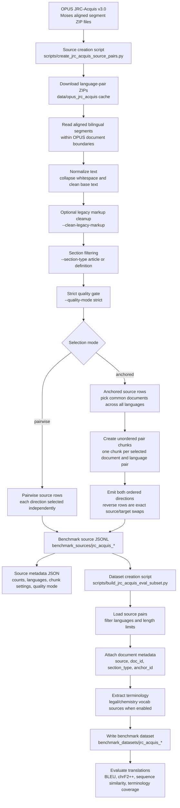

# JRC-Acquis Source-to-Dataset Pipeline

This diagram shows the current JRC-Acquis benchmark build flow, starting from the public OPUS/JRC
source files and ending with benchmark datasets that include terminology metadata.

## Source Creation

The source creation step produces portable source-pair JSONL files in `benchmark_sources/`. For the
preferred anchored JRC sources, the script:

- downloads OPUS JRC-Acquis v3.0 Moses aligned ZIP files;
- reads already-aligned bilingual segments;
- keeps chunks inside document boundaries;
- applies `--clean-legacy-markup` to remove legacy OPUS/JRC inline tags;
- applies `--quality-mode strict` to reject residual markup, control characters, replacement
  characters, all-caps blocks, bad starts, and bad endings;
- selects either `article` or `definition` text with `--section-type`;
- in anchored mode, selects common documents across all languages and emits exact reverse pairs.

## Dataset Creation

The dataset creation step starts from the source JSONL, not from OPUS directly. It creates benchmark
datasets by:

- selecting the requested language pairs and row limit;
- preserving source-pair metadata such as `doc_id`, `anchor_id`, and `section_type`;
- extracting terminology when enabled;
- writing benchmark-ready examples and manifests under `benchmark_datasets/`.

This separation keeps raw source construction reproducible while allowing dataset-level terminology
and evaluation settings to evolve independently.
