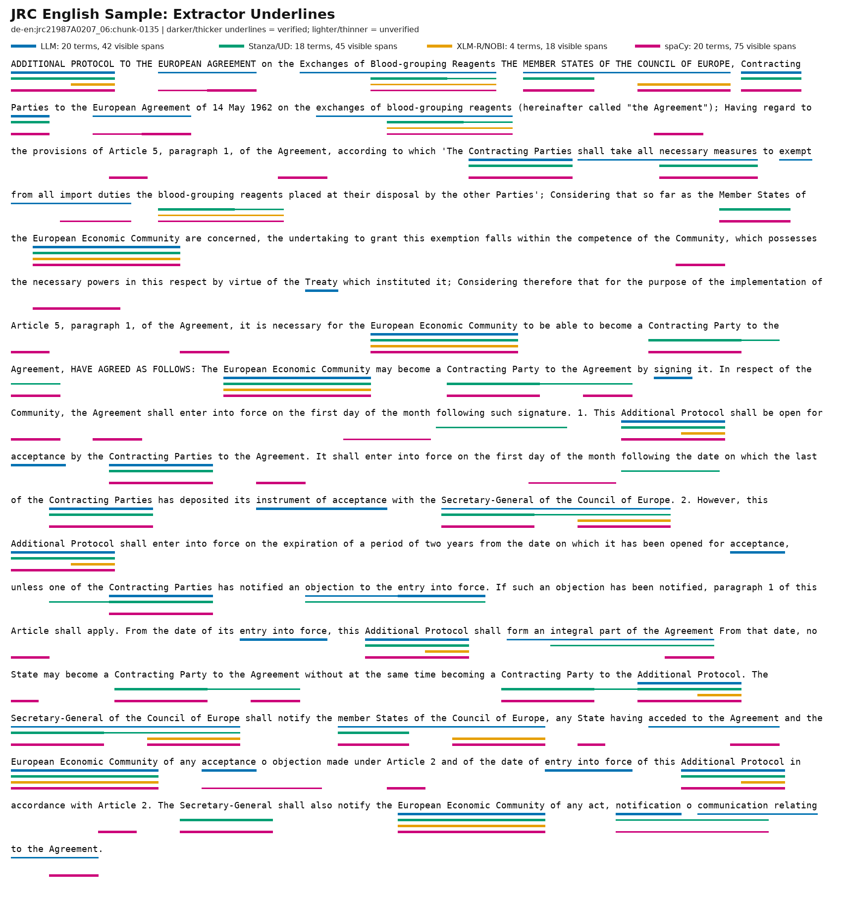

# JRC Anchored Articles Terminology Quality Report

This report reviews terminology generated for the small anchored JRC-Acquis article dataset, grouped
by candidate extractor and verification status.

Dataset reviewed:

```text
benchmark_datasets/jrc_acquis_anchored_articles_5_all_non_llm_terms/
```

Combined manifest:

```text
benchmark_datasets/jrc_acquis_anchored_articles_5_all_non_llm_terms/jrc-acquis-20-directions-100-manifest.jsonl
```

Additional mode-specific runs reviewed in this report:

```text
benchmark_datasets/jrc_acquis_anchored_articles_5_llm_terms/
benchmark_datasets/jrc_acquis_anchored_articles_5_nltk_msplade_only_terms/
benchmark_datasets/jrc_acquis_anchored_articles_5_spacy_only_terms/
```


## Pipeline And Methods

The JRC article terminology pipeline is target-side. The source builder starts from OPUS/JRC-Acquis
aligned segments, selects documents available in all required languages, and expands each anchored
chunk to every ordered language pair. The dataset builder then writes `source.csv`, `target.csv`, and
manifest rows per direction.

```text
target/reference article chunk
  -> candidate extractor mode
  -> exact-span cleanup and duplicate merge
  -> external verifier lookup
  -> verified or non-verified manifest terms
```

Repeated anchored target chunks are deduplicated before extraction, so the same target-language chunk
is reused across multiple source-language directions.

Methods reviewed in this report:

- **LLM legal extractor**: prompt-based legal/regulatory terminology extraction. It proposes coherent
  legal phrases and institutional terms, then the verifier layer adds evidence.
- **Stanza/UD**: deterministic Universal Dependencies extraction. It proposes noun-headed dependency
  spans, relaxed content n-grams, and proper-name sequences. It has high recall but also returns legal
  boilerplate, headings, and table-of-contents fragments.
- **XLM-R/NOBI**: neural automatic term extraction using an XLM-R token-classification checkpoint with
  NOBI labels for nested terms. It often finds compact named or domain terms, but it can return generic
  single words.
- **spaCy**: refreshed deterministic extraction using trained spaCy language models where available.
  The spaCy pipeline combines trained entities, noun chunks, contiguous token spans, POS-based cleanup,
  and compact noun-like n-gram ranking. It is evaluated as a separate spaCy-only run on the same rows.
- **NLTK n-grams**: high-recall diagnostic n-gram extraction. It was evaluated, but it is too noisy for
  final tables or figures.
- **mSPLADE**: sparse-activation salience extraction. It was evaluated as a ranking/salience signal,
  but it is not kept in the final tables or figures.

The tables and figures below focus on the final comparison methods: LLM, Stanza/UD, XLM-R/NOBI, and
spaCy.

## Dataset Summary

This summary describes the first all-non-LLM run with Stanza/UD and XLM-R/NOBI.
Later sections review LLM-only, NLTK/mSPLADE-only, and spaCy-only runs on the same
5-row-per-direction JRC article sample.

- Rows: 100.
- Directions: 20.
- Rows per direction: 5.
- Total terminology records: 1,919.
- Verified terminology records: 697.
- Non-verified terminology records: 1,222.
- Rows hitting the 20-term cap: 95 of 100.
- Target terms appearing exactly in target/reference text: 1,919 of 1,919.
- Records with populated `source_term`: 0 of 1,919.

## Extractor Target Counts

This table compares the final extractor methods kept in the report tables and figures. `Targets`
counts records tagged with that extractor; the rows should be compared by extractor, not summed as
one manifest.

| Extractor | Targets | Verified | Unverified | Unique targets |
| --- | ---: | ---: | ---: | ---: |
| Stanza/UD | 1,485 | 321 | 1,164 | 656 |
| XLM-R/NOBI | 537 | 460 | 77 | 151 |
| LLM | 1,628 | 798 | 830 | 661 |
| spaCy | 2,000 | 836 | 1,164 | 712 |

## Weighted Extracted-Text Length

This measures how much extracted terminology text each extractor contributes. For each extractor,
the weighted character sum is calculated as:

```text
sum(length of extracted target term * number of times extracted)
```

Rows in this table come from comparable mode-specific runs on the same 5-row-per-direction article
sample. They should be compared by extractor, not summed as one combined manifest.

| Extractor | Matches | Unique terms | Unique character sum | Weighted character sum |
| --- | ---: | ---: | ---: | ---: |
| Stanza/UD | 1,485 | 656 | 16,724 | 36,833 |
| XLM-R/NOBI | 537 | 151 | 2,674 | 9,580 |
| LLM | 1,628 | 661 | 16,461 | 39,312 |
| spaCy | 2,000 | 712 | 13,562 | 38,165 |

## English Sample Underline Figure

The figure below uses one English target sample from the JRC anchored article run:
`de-en:jrc21987A0207_06:chunk-0135` in direction `de-en`. The figure shows the target text once.
Colored underline lanes mark spans found by each extractor. Darker, thicker underlines indicate
verified terms; lighter, thinner underlines indicate unverified terms.



## Classes

For the first all-non-LLM run, terms are split into six Stanza/NOBI provenance
classes:

- `stanza_only + verified`
- `stanza_only + not_verified`
- `nobi_only + verified`
- `nobi_only + not_verified`
- `both + verified`
- `both + not_verified`

The compact table below gives record counts, unique-term counts, and frequency ranges for the
Stanza/NOBI run only. The term lists after it show up to 100 extracted terms per class, ordered by
frequency.

| Class | Records | Unique terms | 10+ repeats | 5-9 repeats | 2-4 repeats | 1 repeat |
| --- | ---: | ---: | ---: | ---: | ---: | ---: |
| Stanza only, verified | 237 | 79 | 0 | 4 | 52 | 23 |
| Stanza only, not verified | 1,145 | 550 | 0 | 6 | 285 | 259 |
| NOBI only, verified | 376 | 109 | 3 | 4 | 80 | 22 |
| NOBI only, not verified | 58 | 20 | 0 | 0 | 15 | 5 |
| Stanza + NOBI, verified | 84 | 25 | 0 | 0 | 21 | 4 |
| Stanza + NOBI, not verified | 19 | 6 | 0 | 0 | 5 | 1 |

Mode-level class counts for the separate runs:

| Class | Records | Unique terms | 10+ repeats | 5-9 repeats | 2-4 repeats | 1 repeat |
| --- | ---: | ---: | ---: | ---: | ---: | ---: |
| LLM, verified | 798 | 272 | 2 | 14 | 174 | 82 |
| LLM, not verified | 830 | 389 | 0 | 14 | 172 | 203 |
| spaCy, verified | 836 | 270 | 1 | 24 | 167 | 78 |
| spaCy, not verified | 1,164 | 444 | 0 | 16 | 291 | 137 |

## Per-Document Target-Language Matrices

Each cell is unverified/verified. Rows are the five anchored JRC article documents. Columns are target languages, not language pairs. Counts are summed across all rows in the sample that use that document and target language.

### Stanza/UD

| Document | de | en | es | fr | pt |
| --- | ---: | ---: | ---: | ---: | ---: |
| jrc21987A0207_06 | 72/4 | 40/32 | 24/27 | 39/30 | 43/25 |
| jrc21988A1031_02 | 37/3 | 69/6 | 71/3 | 65/7 | 50/4 |
| jrc21991A0204_01 | 30/3 | 31/8 | 40/4 | 32/16 | 28/16 |
| jrc21991A1231_02 | 70/0 | 64/8 | 53/13 | 77/3 | 72/2 |
| jrc21999A0218_01 | 60/8 | 25/27 | 28/24 | 20/20 | 24/28 |

### XLM-R/NOBI

| Document | de | en | es | fr | pt |
| --- | ---: | ---: | ---: | ---: | ---: |
| jrc21987A0207_06 | 8/4 | 4/12 | 0/19 | 0/15 | 0/16 |
| jrc21988A1031_02 | 3/0 | 0/6 | 0/6 | 2/6 | 1/7 |
| jrc21991A0204_01 | 24/20 | 4/37 | 4/32 | 0/36 | 8/28 |
| jrc21991A1231_02 | 2/8 | 0/10 | 3/12 | 0/1 | 2/5 |
| jrc21999A0218_01 | 12/8 | 0/36 | 0/44 | 0/52 | 0/40 |

### LLM

| Document | de | en | es | fr | pt |
| --- | ---: | ---: | ---: | ---: | ---: |
| jrc21987A0207_06 | 41/35 | 39/36 | 9/51 | 18/40 | 13/47 |
| jrc21988A1031_02 | 25/43 | 34/19 | 41/20 | 41/22 | 47/20 |
| jrc21991A0204_01 | 41/35 | 33/47 | 45/35 | 28/52 | 22/57 |
| jrc21991A1231_02 | 46/19 | 44/23 | 47/19 | 48/9 | 48/12 |
| jrc21999A0218_01 | 12/28 | 14/37 | 33/28 | 25/35 | 36/29 |

### spaCy

| Document | de | en | es | fr | pt |
| --- | ---: | ---: | ---: | ---: | ---: |
| jrc21987A0207_06 | 48/32 | 24/56 | 36/44 | 24/56 | 40/40 |
| jrc21988A1031_02 | 70/10 | 35/45 | 45/35 | 45/35 | 55/25 |
| jrc21991A0204_01 | 60/20 | 70/10 | 40/40 | 37/43 | 59/21 |
| jrc21991A1231_02 | 62/18 | 54/26 | 58/22 | 27/53 | 62/18 |
| jrc21999A0218_01 | 64/16 | 49/31 | 35/45 | 37/43 | 28/52 |


## Detailed Extractor Samples And Findings

## Stanza Only, Verified

Terms:

`Partes Contratantes (7x)`; `Parte Contratante (7x)`; `Grupos Sanguíneos (7x)`; `Member States (5x)`; `Secretary-General (4x)`; `Contracting Parties (4x)`; `Contracting Party (4x)`; `MEMBER STATES (4x)`; `Additional Protocol (4x)`; `necessary measures (4x)`; `Blood-grouping (4x)`; `United Nations (4x)`; `Nations Conference (4x)`; `Council Regulation (4x)`; `Monitoring Centre (4x)`; `Management Board (4x)`; `Organización internacional (4x)`; `Comisión Europea (4x)`; `Unión Europea (4x)`; `instrument d'acceptation (4x)`; `parties contractantes (4x)`; `protocole additionnel (4x)`; `partie contractante (4x)`; `secrétaire général (4x)`; `partie intégrante (4x)`; `vice-président du Conseil (4x)`; `Admission d'observateurs (4x)`; `publication des comptes (4x)`; `Échange d'informations (4x)`; `mise à disposition (4x)`; `Protocolo Adicional (4x)`; `instrumento de aceitação (4x)`; `Organização Internacional (4x)`; `Nações Unidas (4x)`; `DISPOSIÇÕES FINANCEIRAS (4x)`; `relatório de avaliação (4x)`; `União Europeia (4x)`; `Comissão Europeia (4x)`; `personalidade independente (4x)`; `Intercâmbio de informações (4x)`; `Europäischen Union (4x)`; `sustancia de transición (3x)`; `países en desarrollo (3x)`; `medidas preventivas (3x)`; `Vereinten Nationen (3x)`; `Secretario General (3x)`; `ESTADOS MIEMBROS (3x)`; `Acuerdo Europeo (3x)`; `instrumento de aceptación (3x)`; `période de douze mois (3x)`; `Exchange of information (3x)`; `Controlled substance (2x)`; `precautionary measures (2x)`; `Transitional substance (2x)`; `capa de ozono (2x)`; `rationalisation industrielle (2x)`; `control measures (1x)`; `controlled substances (1x)`; `developing country (1x)`; `premier jour du mois (1x)`; `secrétaire général du Conseil de l'Europe (1x)`; `Tagung der Vertragsparteien (1x)`; `integración económica regional (1x)`; `Grupo II (1x)`; `Grupo I (1x)`; `regional economic integration organization (1x)`; `rendement économique (1x)`; `Organisation der regionalen Wirtschaftsintegration (1x)`; `innerstaatliche Rechtsvorschriften (1x)`; `eficiencia económica (1x)`; `Secretário-geral do Conselho da Europa (1x)`; `país em desenvolvimento (1x)`; `países em desenvolvimento (1x)`; `grupo I (1x)`; `Partes interesadas (1x)`; `materia prima (1x)`; `pays en développement (1x)`; `Communication des données (1x)`; `dix pour cent (1x)`.

Analysis:

This class is mostly useful legal terminology. The terms are often multiword and externally backed,
but some are still generic or context-dependent. This class should be kept, with light filtering and
ranking.

## Stanza Only, Not Verified

Terms:

`date d'entrée en vigueur du présent protocole (6x)`; `límites de producción (5x)`; `besoins intérieurs fondamentaux (5x)`; `Annex A (5x)`; `one or more of these substances (5x)`; `basic domestic needs of the Parties (5x)`; `notification o communication (4x)`; `following such signature (4x)`; `following the date (4x)`; `Contracting Party to the Agreement (4x)`; `one of the Contracting Parties (4x)`; `objection to the entry into force (4x)`; `integral part of the Agreement (4x)`; `Contracting Party to the Additional Protocol (4x)`; `recommendations of the Council (4x)`; `functions of the Council (4x)`; `Sessions of the Council (4x)`; `Quorum for the Council (4x)`; `Jute Organization (4x)`; `Annex B Shares (4x)`; `Jute Products (4x)`; `Annex B (4x)`; `objective of the Centre (4x)`; `Regulation (EC (4x)`; `purpose of the consultations (4x)`; `unnecessary duplication (4x)`; `Decisiones y recomendaciones del Consejo (4x)`; `vicepresidente del Consejo (4x)`; `CAPÍTULO III ORGANIZACIÓN (4x)`; `CAPÍTULO II DEFINICIONES (4x)`; `CAPÍTULO V PRIVILEGIOS (4x)`; `funciones del Consejo (4x)`; `14 Cooperación (4x)`; `CAPÍTULO IX (4x)`; `Consejo internacional (4x)`; `proyectos12 Artículo (4x)`; `objetivo del Observatorio (4x)`; `n° 1035/97 (4x)`; `Observatorio Europeo (4x)`; `HAN CONVENIDO (4x)`; `datos y trabajos de carácter confidencial realizados (4x)`; `coordinación de sus actividades (4x)`; `présent protocole additionnel (4x)`; `pouvoirs nécessaires (4x)`; `objection à l'entrée (4x)`; `mesures nécessaires (4x)`; `trait à l'accord (4x)`; `telle objection (4x)`; `acceptation ou objection au sens de l'article (4x)`; `réactifs pour la détermination des groupes (4x)`; `recommandations du Conseil (4x)`; `Notification d'application (4x)`; `CHAPITRE III ORGANISATION (4x)`; `Membres de l'Organisation (4x)`; `XI DISPOSITIONS DIVERSES (4x)`; `XII DISPOSITIONS FINALES (4x)`; `CHAPITRE II DÉFINITIONS (4x)`; `18 Comptes financiers (4x)`; `niveau calculé de production (4x)`; `niveau calculé de production de ces substances (4x)`; `coordination de leurs activités (4x)`; `objectif de l'Observatoire (4x)`; `consultations régulières (4x)`; `presente Protocolo Adicional (4x)`; `Acordo Europeu (4x)`; `Contratante no Acordo (4x)`; `medidas necessárias (4x)`; `uma das Partes Contratantes (4x)`; `reagentes para determinação de grupos (4x)`; `objecção à sua entrada em vigor (4x)`; `parte integrante do Acordo (4x)`; `nº 1 deste artigo (4x)`; `Parte Contratante no Protocolo Adicional (4x)`; `Conselho Internacional (4x)`; `vice-presidente do Conselho (4x)`; `CAPÍTULO III ORGANIZAÇÃO (4x)`; `ACTIVIDADES OPERACIONAIS (4x)`; `CAPÍTULO X ESTATÍSTICAS (4x)`; `CAPÍTULO II DEFINIÇÕES (4x)`; `CAPÍTULO V PRIVILÉGIOS (4x)`; `nível calculado de produção (4x)`; `CE) n.° 1035/97 (4x)`; `Observatório Europeu (4x)`; `coordenação das suas actividades (4x)`; `I. Intercâmbio de informações (4x)`; `informações objectivas (4x)`; `difusão tão vasta (4x)`; `Vertragspartei des Übereinkommens (4x)`; `Europäischen Übereinkommens (4x)`; `MITGLIEDSTAATEN DES EUROPARATS (4x)`; `Inkrafttretens dieses Zusatzprotokolls (4x)`; `Vertragspartei des Zusatzprotokolls (4x)`; `Einwand gegen sein Inkrafttreten (4x)`; `Generalsekretär des Europarats (4x)`; `letzte der Vertragsparteien (4x)`; `erforderlichen Befugnisse (4x)`; `menschlichen Ursprungs (4x)`; `notwendigen Maßnahmen (4x)`; `beigetretenen Staaten (4x)`; `Mitteilung im Zusammenhang mit diesem Übereinkommen (4x)`.

Analysis:

This is the largest and noisiest class. It contains useful recall candidates, but many terms are
headings, legal scaffolding, table-of-contents fragments, partial citations, or broad boilerplate.
This class should not be used as final benchmark terminology without strong filters.

## NOBI Only, Verified

Terms:

`JUTE (12x)`; `ECRI (12x)`; `industrial (10x)`; `Council (8x)`; `xenofobia (8x)`; `racismo (8x)`; `Adicional (7x)`; `Council of Europe (4x)`; `Protocol (4x)`; `Common Fund for Commodities (4x)`; `payment (4x)`; `account (4x)`; `Administrative account (4x)`; `Committee on projects (4x)`; `Financial accounts (4x)`; `European Monitoring Centre on Racism and Xenophobia (4x)`; `European Commission against Racism and Intolerance (4x)`; `Council of the European Union (4x)`; `anti-semitism (4x)`; `xenophobia (4x)`; `General (4x)`; `Organización internacional del yute (4x)`; `Consejo internacional del yute (4x)`; `Cuenta administrativa (4x)`; `Cuenta especial (4x)`; `fondo común (4x)`; `cuentas (4x)`; `YUTE (4x)`; `Cuentas financieras (4x)`; `Comisión Europea contra el racismo y la intolerancia (4x)`; `Observatorio Europeo del Racismo y la Xenofobia (4x)`; `Consejo de administración (4x)`; `antisemitismo (4x)`; `droits d (4x)`; `Conseil international du jute (4x)`; `fonds commun (4x)`; `comptes (4x)`; `paiement (4x)`; `Organisation internationale du jute (4x)`; `Comptes financiers (4x)`; `spécial (4x)`; `Observatoire européen des phénomènes racistes et xénophobes (4x)`; `Commission européenne contre le racisme et l'intolérance (4x)`; `administration (4x)`; `antisémitisme (4x)`; `xénophobie (4x)`; `racisme (4x)`; `règlement (4x)`; `général (4x)`; `Conseil d (4x)`; `Secretário-geral (4x)`; `Conselho Internacional da Juta (4x)`; `Comité dos projectos (4x)`; `Conta administrativa (4x)`; `Conta especial (4x)`; `Fundo comum (4x)`; `contas (4x)`; `JUTA (4x)`; `Comissão Europeia contra o Racismo e a Intolerância (4x)`; `Observatório Europeu do Racismo e da Xenofobia (4x)`; `anti-semitismo (4x)`; `CERI (4x)`; `Conselho de Administração (4x)`; `Verwaltungskonto (4x)`; `Sonderkonto (4x)`; `Zahlung (4x)`; `Finanzkonten (4x)`; `Europarat (4x)`; `emissions (3x)`; `emisiones (3x)`; `ozono (3x)`; `Conselho da Europa (3x)`; `Conseil de l'Europe (3x)`; `Commission (3x)`; `INTERNATIONAL JUTE COUNCIL (3x)`; `technologies (2x)`; `technical (2x)`; `ozone depletion (2x)`; `Consejo de Europa (2x)`; `capa de (2x)`; `Ozonschicht (2x)`; `Endziel (2x)`; `technische (2x)`; `CONSEJO DE EUROPA (2x)`; `tecnologías (2x)`; `industrielle (2x)`; `FCKW (2x)`; `technology (1x)`; `International Jute Council (1x)`; `accounts (1x)`; `Comunidad Económica Europea (1x)`; `integración económica regional (1x)`; `CONSEIL DE L'EUROPE (1x)`; `production (1x)`; `consommation (1x)`; `integração económica (1x)`; `DE OZONO (1x)`; `Europeu (1x)`; `produção (1x)`; `emissões (1x)`.

Analysis:

This class is mixed. It has strong named entities and domain terms, but also many generic verified
single words. Verification alone is not enough here. Generic terms such as `Council`, `industrial`,
`payment`, `account`, `Protocol`, and `General` should be down-ranked.

## NOBI Only, Not Verified

Terms:

`International Jute Organization (4x)`; `INTERNACIONAL DEL YUTE (4x)`; `INTERNACIONAL DA JUTA (4x)`; `executivo (4x)`; `Europarats (4x)`; `Gemeinsamen Fonds für Rohstoffe (4x)`; `FINANZFRAGEN (4x)`; `JUTEERZEUGNISSE (4x)`; `JUTERAT (4x)`; `Europäischen Kommission gegen Rassismus und Intoleranz (4x)`; `EKRI (4x)`; `MONTREAL (3x)`; `Isomere (2x)`; `regionalen Wirtschaftsintegration (2x)`; `técnicas (2x)`; `réduction de consommation (1x)`; `régionale d'intégration économique (1x)`; `Internationalen Juterats (1x)`; `Internationalen Juteorganisation (1x)`; `resepectivo (1x)`.

Analysis:

This class is small. Some terms are useful and simply missed by verifiers, while others are headings,
inflected fragments, or errors. It is useful for recall diagnostics and manual review, but not final
benchmark terminology.

## Stanza + NOBI, Verified

Terms:

`European Economic Community (4x)`; `European Community (4x)`; `Council of Europe (4x)`; `Consejo de la Unión Europea (4x)`; `Consejo de Europa (4x)`; `Comunidad Europea (4x)`; `Secretaría General (4x)`; `Communauté économique européenne (4x)`; `Compte administratif (4x)`; `Conseil de l'Union européenne (4x)`; `Communauté européenne (4x)`; `CONSEIL DE L'EUROPE (4x)`; `Comunidade Económica Europeia (4x)`; `Conselho da União Europeia (4x)`; `Comunidade Europeia (4x)`; `Conselho da Europa (4x)`; `Europäische Wirtschaftsgemeinschaft (4x)`; `Rat der Europäischen Union (4x)`; `Comunidad Económica Europea (3x)`; `Protocolo Adicional (3x)`; `OZONE LAYER (2x)`; `capa de ozono (1x)`; `economic integration (1x)`; `tetracloreto de carbono (1x)`; `Tétrachlorure de carbone (1x)`.

Analysis:

This is the strongest class. Agreement between both extractors plus external verification is the
best available signal. This class should receive the highest ranking priority.

## Stanza + NOBI, Not Verified

Terms:

`blood-grouping reagents (4x)`; `Europäischen Wirtschaftsgemeinschaft (4x)`; `Europäischen Gemeinschaft (4x)`; `Internationalen Juterats (3x)`; `Internationalen Juteorganisation (3x)`; `regionalen Wirtschaftsintegration (1x)`.

Analysis:

This class is small but promising. Agreement between both extractors means these terms are likely
salient, even when external verifiers do not match. This class should be kept for review and possible
source-term alignment.

## LLM Mode

The LLM-only article dataset was built from the same anchored article source and the same 5 rows per
direction. Stanza/UD and XLM-R/NOBI were disabled. LLM candidates were verified with the JRC legal
verifier layer: IATE, Wikipedia/Wikidata, and UNTERM.

LLM mode summary:

- Rows: 100.
- Total terminology records: 1,628.
- Verified records: 798.
- Non-verified records: 830.
- Unique verified terms: 272.
- Unique non-verified terms: 389.
- Records with populated `source_term`: 0 of 1,628.

| LLM class | Records | Unique terms | 10+ repeats | 5-9 repeats | 2-4 repeats | 1 repeat |
| --- | ---: | ---: | ---: | ---: | ---: | ---: |
| LLM, verified | 798 | 272 | 2 | 14 | 174 | 82 |
| LLM, not verified | 830 | 389 | 0 | 14 | 172 | 203 |

### LLM, Verified

Terms:

`ECRI (12x)`; `Vertragsparteien (10x)`; `Protocolo (9x)`; `notification (8x)`; `PROTOCOLO ADICIONAL (8x)`; `Partes Contratantes (8x)`; `protocole (8x)`; `Inkrafttreten (6x)`; `entry into force (5x)`; `transferir (5x)`; `Consejo de Europa (5x)`; `Parte Contratante (5x)`; `Conselho da Europa (5x)`; `Protokoll (5x)`; `Produktion (5x)`; `Sekretariat (5x)`; `European Economic Community (4x)`; `ADDITIONAL PROTOCOL (4x)`; `Contracting Parties (4x)`; `instrument of acceptance (4x)`; `acceptance (4x)`; `Treaty (4x)`; `Common Fund for Commodities (4x)`; `International Jute Council (4x)`; `Privileges and immunities (4x)`; `Depositary (4x)`; `Notification of provisional application (4x)`; `Audit and publication of accounts (4x)`; `Relief from obligations (4x)`; `Committee on projects (4x)`; `Financial accounts (4x)`; `Special account (4x)`; `European Monitoring Centre on Racism and Xenophobia (4x)`; `European Commission against Racism and Intolerance (4x)`; `Council of Europe (4x)`; `AGREEMENT (4x)`; `Centre (4x)`; `confidential data (4x)`; `Management Board (4x)`; `work programme (4x)`; `Comunidad Económica Europea (4x)`; `ACUERDO EUROPEO (4x)`; `instrumento de aceptación (4x)`; `derechos de importación (4x)`; `Tratado constitutivo (4x)`; `entrada en vigor (4x)`; `notificación (4x)`; `aceptación (4x)`; `objeción (4x)`; `FONDO COMÚN PARA LOS PRODUCTOS BÁSICOS (4x)`; `Organización internacional del yute (4x)`; `Consejo internacional del yute (4x)`; `Privilegios e inmunidades (4x)`; `Comité de proyectos (4x)`; `Depositario (4x)`; `Cuentas financieras (4x)`; `Observatorio Europeo del Racismo y la Xenofobia (4x)`; `Comunidad Europea (4x)`; `Observatorio (4x)`; `ACUERDO (4x)`; `Intercambio de información y de datos (4x)`; `Communauté économique européenne (4x)`; `PROTOCOLE ADDITIONNEL (4x)`; `entrée en vigueur (4x)`; `ACCORD EUROPÉEN (4x)`; `instrument d'acceptation (4x)`; `parties contractantes (4x)`; `signature (4x)`; `traité (4x)`; `Organisation internationale du jute (4x)`; `Conseil international du jute (4x)`; `Privilèges et immunités (4x)`; `Dépositaire (4x)`; `Comité des projets (4x)`; `Adhésion (4x)`; `Compte administratif (4x)`; `Comptes financiers (4x)`; `Compte spécial (4x)`; `Observatoire européen des phénomènes racistes et xénophobes (4x)`; `Commission européenne contre le racisme et l'intolérance (4x)`; `Communauté européenne (4x)`; `Conseil de l'Europe (4x)`; `Observatoire (4x)`; `ACCORD (4x)`; `programme d'activité (4x)`; `Comunidade Económica Europeia (4x)`; `entrada em vigor (4x)`; `instrumento de aceitação (4x)`; `notificação (4x)`; `aceitação (4x)`; `objecção (4x)`; `Tratado (4x)`; `ACORDO INTERNACIONAL DE 1989 SOBRE A JUTA E OS ARTIGOS DE JUTA (4x)`; `Fundo comum para os produtos de base (4x)`; `Organização Internacional da Juta (4x)`; `Conselho Internacional da Juta (4x)`; `Privilégios e imunidades (4x)`; `Entrada em vigor (4x)`; `Denúncia (4x)`; `Comité dos projectos (4x)`.

Analysis:

The LLM verified group is broader and often more semantically meaningful than raw Stanza-only output.
It captures many legal headings and institutional terms in complete phrases. However, it still
contains generic or structurally weak terms such as `notification`, `acceptance`, `signature`,
`AGREEMENT`, `ACCORD`, `Centre`, and `Observatoire`. The LLM helps phrase quality, but verifier
evidence is still not enough to guarantee technical difficulty.

### LLM, Not Verified

Terms:

`Partes (9x)`; `anexo A (8x)`; `substances réglementées (8x)`; `anexo B (7x)`; `niveau calculé de production (7x)`; `substâncias regulamentadas (7x)`; `controlled substances (6x)`; `nível calculado de produção (6x)`; `sustancias controladas (5x)`; `parties (5x)`; `niveau calculé de consommation (5x)`; `besoins intérieurs fondamentaux (5x)`; `nível calculado de consumo (5x)`; `calculated level of production (5x)`; `Secretary-General of the Council of Europe (4x)`; `MEMBER STATES OF THE COUNCIL OF EUROPE (4x)`; `EUROPEAN AGREEMENT (4x)`; `objection to the entry into force (4x)`; `exempt from all import duties (4x)`; `acceded to the Agreement (4x)`; `import duties (4x)`; `exchanges of blood-grouping reagents (4x)`; `Signature, ratification, acceptance and approval (4x)`; `International Jute Organization (4x)`; `General obligations of members (4x)`; `Differential and remedial measures (4x)`; `Complaints and disputes (4x)`; `Annex A (4x)`; `Annex B (4x)`; `Council Regulation (EC) No 1035/97 (4x)`; `joint and/or complementary activities (4x)`; `Exchange of information and data (4x)`; `Secretario General del Consejo de Europa (4x)`; `nivel calculado de producción (4x)`; `Firma, ratificación, aceptación y aprobación (4x)`; `Obligaciones generales de los miembros (4x)`; `Procedimiento de votación del Consejo (4x)`; `Auditoría y publicación de cuentas (4x)`; `Quórum del Consejo (4x)`; `Decisiones y recomendaciones del Consejo (4x)`; `Medidas diferenciales y correctivas (4x)`; `Facultades y funciones del Consejo (4x)`; `Reclamaciones y controversias (4x)`; `anexo C (4x)`; `Reglamento (CE) n° 1035/97 (4x)`; `Comisión Europea contra el racismo y la intolerancia (ECRI (4x)`; `Consejo de administración del Observatorio (4x)`; `programa de trabajo del Observatorio (4x)`; `secrétaire général du Conseil de l'Europe (4x)`; `objection à l'entrée en vigueur (4x)`; `droits d'importation (4x)`; `ACCORD INTERNATIONAL DE 1989 SUR LE JUTE ET LES ARTICLES EN JUTE (4x)`; `Signature, ratification, acceptation et approbation (4x)`; `Obligations générales des membres (4x)`; `Plaintes et différends (4x)`; `Modes de paiement (4x)`; `règlement (CE) n° 1035/97 (4x)`; `mise à disposition réciproque des informations et données (4x)`; `coordination de leurs activités (4x)`; `Secretário-geral do Conselho da Europa (4x)`; `ACORDO EUROPEU (4x)`; `direitos de importação (4x)`; `Obrigações gerais dos membros (4x)`; `Assinatura, ratificação, aceitação e aprovação (4x)`; `Duração, prorrogação e fim do acordo (4x)`; `Queixas e diferendos (4x)`; `Regulamento (CE) n.° 1035/97 (4x)`; `Comissão Europeia contra o Racismo e a Intolerância (CERI (4x)`; `Conselho de Administração do Observatório (4x)`; `Intercâmbio de informações e de dados (4x)`; `coordenação das suas actividades (4x)`; `Mitgliedstaaten der Europäischen Wirtschaftsgemeinschaft (4x)`; `Generalsekretär des Europarats (4x)`; `EUROPÄISCHEN ÜBEREINKOMMEN (4x)`; `Verpflichtung zur Gewährung dieser Befreiung (4x)`; `Artikel 5 Absatz 1 des Übereinkommens (4x)`; `therapeutischen Substanzen menschlichen Ursprungs (4x)`; `Einwand gegen sein Inkrafttreten (4x)`; `Eingangsabgaben (4x)`; `Allgemeine Verpflichtungen der Mitglieder (4x)`; `Mitgliedschaft zwischenstaatlicher Organisationen (4x)`; `Mitgliedschaft in der Organisation (4x)`; `Beschwerden und Streitigkeiten (4x)`; `Befugnisse und Aufgaben des Rates (4x)`; `Produktionsgrenzen (4x)`; `Verordnung (EG) Nr. 1035/97 (4x)`; `Informations- und Datenaustausch (4x)`; `Mitglied des Verwaltungsrates (4x)`; `Article 2 C (4x)`; `calculated level of consumption (4x)`; `communication relating to the Agreement (3x)`; `production limits (3x)`; `período de dos años (3x)`; `CONVENIO INTERNACIONAL DEL YUTE Y LOS PRODUCTOS DEL YUTE, 1989 (3x)`; `ENMIENDA AL PROTOCOLO DE MONTREAL (3x)`; `períodos de control (3x)`; `recipiente utilizado para el transporte o almacenamiento (3x)`; `puesta a disposición recíproca (3x)`; `coordinación de sus actividades (3x)`; `transfert de production (3x)`.

Analysis:

The LLM non-verified group contains many of the best technical-looking terms, including `controlled
substances`, `substances réglementées`, `calculated level of production`, and `Council Regulation
(EC) No 1035/97`. The lack of verification does not mean low quality. It often means the term is a
longer legal/technical phrase or an inflected multilingual phrase that the verifier did not match
exactly. This group is better than Stanza-only non-verified terms and should be reviewed carefully.

### LLM Mode Takeaway

LLM mode is better at producing coherent legal and technical phrases than the raw non-LLM extractors.
Its non-verified terms are often more useful than non-verified Stanza-only terms. The weakness is
that it can still include headings and generic legal words, and it still does not populate
`source_term`.

## NLTK Mode

This mode was run on the same anchored 5-row-per-direction JRC article data as the earlier samples.
The source and target CSV rows were checked against the previous non-LLM sample datasets and matched
exactly for all 20 directions.

NLTK was used as a deterministic target-side n-gram extractor. It proposes exact spans from the
reference text using token windows, then the normal verifier layer is applied.

Article-mode summary:

- `nltk_ngram` records: 2,000.
- `nltk_ngram` records without mSPLADE support: 1,906.
- Unique NLTK-only terms: 839.
- Verified NLTK article records: 0.

Representative NLTK-only article terms:

`produccion de las Partes interesadas`; `substances reglementees du groupe I`;
`Chaque partie produisant une ou`; `communication relating to the Agreement`;
`European Economic Community may become`; `Additional Protocol in accordance with`;
`notify the European Economic Community`; `acceptance by the Contracting Parties`;
`Contracting Parties to the Agreement`; `General obligations of members`;
`No 1035/97 establishing a European Monitoring`; `establishing a European Monitoring Centre`;
`Secretariat of the European Commission`; `on Racism and Xenophobia`;
`Partes Contratantes adoptaran cuantas medidas`; `Protocolo Adicional formara parte integrante`.

Analysis:

NLTK is useful as a high-recall baseline, but by itself it is not a good final terminology source.
It reliably fills the per-row candidate budget, but many terms are ordinary prose fragments, clause
fragments, or document-structure spans. Examples include `Additional Protocol in accordance with`,
`Parties has deposited its instrument`, and table-of-contents text containing dot leaders and
`CHAPTER`/`Article`. NLTK should therefore be treated as a recall/diagnostic extractor whose output
must pass a later term-selection layer.

## mSPLADE Mode

mSPLADE was run as a separate candidate extractor using
`naver/splade-cocondenser-ensembledistil`.
The first attempted SPLADE default did not load through the masked-language-model interface, so the
run was regenerated with this compatible checkpoint.

In this implementation, SPLADE sparse lexical activations are used as a salience signal over exact
n-gram spans from the target/reference text. That means mSPLADE terms can merge with NLTK terms when
they select the same span, but the `source` field still records `msplade_sparse` separately.

Article-mode summary:

- `msplade_sparse` records: 94.
- Unique mSPLADE-tagged terms: 41.
- Verified mSPLADE article records: 0.
- Independent mSPLADE-only records after deduplication: 0, because all mSPLADE spans merged with
  matching `nltk_ngram` spans.

Representative mSPLADE-tagged article terms:

`this Additional Protocol shall enter`; `Additional Protocol shall enter into`;
`MONTREAL RELATIVO A LAS SUSTANCIAS`; `ENMIENDA AL PROTOCOLO DE MONTREAL`;
`AL PROTOCOLO DE MONTREAL RELATIVO`; `European Monitoring Centre on Racism`;
`MONTREAL PROTOCOL ON SUBSTANCES THAT`; `AMENDMENT TO THE MONTREAL PROTOCOL`;
`domestic needs of the Parties`; `Commission against Racism and Intolerance`;
`ALTERACAO DO PROTOCOLO DE MONTREAL`; `Por racionalizacion industrial se entiende`;
`production desdites substances n'excede pas`.

Analysis:

mSPLADE is more useful as salience evidence than as a standalone final extractor. It can identify
spans whose vocabulary is important for the segment, but it can still boost malformed or structural
spans if those spans are supplied by the n-gram candidate generator. In this sample, mSPLADE found
some useful domain phrases, but it also tagged spans crossing headings and article boundaries. It
should be used inside the future selector/ranker, not as an automatic keep decision.

## spaCy Mode

spaCy was run as a separate candidate extractor on the same anchored 5-row-per-direction JRC article
data. Stanza/UD, XLM-R/NOBI, NLTK, mSPLADE, and LLM extraction were disabled. All verifier sources
were enabled. This refreshed run uses trained spaCy language models where available, contiguous token
spans, entity/noun-chunk candidates, POS-based cleanup, and compact noun-like n-gram ranking.

Dataset reviewed:

```text
benchmark_datasets/jrc_acquis_anchored_articles_5_spacy_only_terms/
```

Combined manifest:

```text
benchmark_datasets/jrc_acquis_anchored_articles_5_spacy_only_terms/jrc-acquis-20-directions-100-manifest.jsonl
```

Article-mode summary:

- Rows: 100.
- Directions: 20.
- Total spaCy records: 2,000.
- Verified spaCy records: 836.
- Non-verified spaCy records: 1,164.
- Unique verified spaCy terms: 270.
- Unique non-verified spaCy terms: 444.
- Source tags: `spacy_ngram` 1,715; `spacy_noun_chunk` 1,517; `spacy_entity` 1,025.
- Verifier hits: IATE 736; AGROVOC 491; MeSH 118; NCI 77; ChEMBL 18; Wikipedia 16; PubChem 7.

Cells are `unverified/verified` counts:

| Target language | de | en | es | fr | pt |
| --- | ---: | ---: | ---: | ---: | ---: |
| spaCy-only | 304/96 | 232/168 | 214/186 | 170/230 | 244/156 |

### spaCy, Verified

Terms:

`Partes (16x)`; `Article (12x)`; `Protocolo (9x)`; `Member States (8x)`; `Partes Contratantes (8x)`; `Conseil de l'Europe (8x)`; `Xenofobia (8x)`; `ECRI (8x)`; `European Economic Community (4x)`; `Contracting Parties (4x)`; `Additional Protocol (4x)`; `Secretary-General (4x)`; `necessary measures (4x)`; `International Jute Council (4x)`; `Council Regulation (4x)`; `Comunidad Económica Europea (4x)`; `Comunidade Económica Europeia (4x)`; `European Commission (4x)`; `calculated level (6x)`; `nivel calculado (5x)`.

Analysis:

The refreshed spaCy run is dramatically better than the earlier baseline. It now has
broad verifier coverage across all five target languages and returns many complete legal or
institutional spans. The weakness is that many verified terms are generic legal words or entities
such as `Article`, `Partes`, `State`, `Agreement`, and `Community`. This reinforces that verifier hits
should support ranking but should not automatically define final benchmark terminology.

### spaCy, Not Verified

Terms:

`basic domestic needs (6x)`; `besoins intérieurs fondamentaux (6x)`; `Partes presentes (6x)`; `sustancias controladas (5x)`; `presente artículo (5x)`; `presente artigo (5x)`; `anwesenden und abstimmenden Vertragsparteien (5x)`; `geregelten Stoffen (5x)`; `Blood-grouping Reagents (4x)`; `International Jute Organization (4x)`; `Jute Products (4x)`; `European Monitoring Centre on Racism (4x)`; `Centre's Management Board (4x)`; `Racism and Intolerance (4x)`; `European Agreement (4x)`; `day of the month (4x)`; `notification o communication (4x)`; `CHAPTER IV INTERNATIONAL JUTE COUNCIL (4x)`; `CHAPTER III ORGANIZATION (4x)`.

Analysis:

The non-verified class now contains many useful legal/regulatory candidates, but it still includes
headings, document-structure spans, and some source-text artifacts such as `notification o
communication`. spaCy is now useful as a deterministic candidate source for JRC, but the final
benchmark terminology still needs a selector/ranker to remove generic legal scaffolding, headings,
and low-value institutional words.

## Main Points

1. The strongest deterministic precision class is `Stanza + NOBI, verified`.
2. The worst large class is `Stanza only, not verified`.
3. `NOBI only, verified` is useful but needs generic single-word filtering.
4. `Stanza + NOBI, not verified` is small and worth manual review.
5. `LLM, not verified` contains many coherent technical phrases that exact-match verifiers miss.
6. `NLTK` is useful for recall, but not as final terminology.
7. `mSPLADE` is useful as salience evidence, but not as an automatic keep decision.
8. Refreshed `spaCy` is much stronger with trained models, but it still needs generic-term and
   heading filters before final use.
9. Verification helps, but it does not guarantee benchmark-quality terminology.
10. The current terms are target-side only because `source_term` is empty.

## Needed Term Selection Layer

The main missing component is not another candidate extractor. The pipeline needs a separate
term-selection/ranking layer between candidate extraction and final verification.

Candidate extractors answer: which spans look structurally like terms? Stanza/UD does this with
syntax, XLM-R/NOBI does this with neural sequence labeling, and the LLM extractor does this with
prompted span extraction. None of these methods reliably answers whether a candidate is valuable for
translation evaluation.

External verifiers also do not fully answer that question. A verifier only shows that an expression
appears in a trusted terminology resource. It can validate evidence for a term, but it cannot decide
whether the candidate is complete, important in the current segment, difficult to translate, or useful
for scoring translation quality. This is why terms like `Council`, `payment`, or document headings can
still pass verification while not being good benchmark terms.

The intended architecture should be:

```text
candidate extractors
  -> deterministic cleanup
  -> term selector / ranker
  -> external verifier evidence
  -> source-target alignment
  -> final top benchmark terms
```

The selector should keep candidates only when they are complete lexical units, domain-specific,
contextually important, translation-sensitive, and alignable between source and reference. Verification
and extractor agreement should support the selector, but they should not make the final decision by
themselves.

## Recommendations

1. Rank `Stanza + NOBI, verified` highest.
2. Use LLM mode as a quality-oriented phrase proposer, especially for longer legal/technical terms.
3. Prefer verified multiword terms over verified single words.
4. Penalize generic verified words such as `Council`, `Protocol`, `payment`, `account`,
   `industrial`, `General`, and `Adicional`.
5. Keep `Stanza + NOBI, not verified` and `LLM, not verified` as review buckets.
6. Treat `Stanza only, not verified` and `NLTK only` as recall/diagnostic buckets, not final
   terminology.
7. Add filters for headings, table-of-contents spans, article references, malformed citations, and
   partial spans ending in function words.
8. Use mSPLADE as a salience/ranking signal inside the future selector, not as a standalone keep
   decision.
9. Use spaCy with trained language models as another deterministic evidence source, but do not treat
   spaCy verifier hits as automatic final terms.
10. Populate `source_term` by aligning accepted target terms back to source text.
11. Regenerate the 5-row sample after filtering/ranking changes before scaling to 250.

## Improving Technical Difficulty

The current pipeline produces many valid terms, but not all are technically difficult enough for a
strong terminology-sensitive benchmark. The next improvement should be a technical term
ranker/filter before final term selection.

Preferred signals:

- Found by both Stanza/UD and XLM-R/NOBI.
- Verified by at least one external source.
- Verified by multiple external sources.
- Multiword span, especially 2-6 tokens.
- Legal, institutional, scientific, chemical, or regulatory phrase.
- Acronym or formal entity name, such as `ECRI`, `JUTE`, or `FCKW`.
- Domain-bearing words such as `ozone`, `substance`, `carbon`, `economic integration`,
  `administrative account`, `monitoring centre`, or equivalent multilingual forms.

Penalty signals:

- Generic single word, such as `Council`, `Protocol`, `payment`, `account`, `industrial`,
  `General`, or `Adicional`.
- Heading or table-of-contents text.
- Article/paragraph numbering.
- Partial spans ending in function words, such as `droits d` or `Conseil d`.
- Malformed spans, dot leaders, OCR artifacts, or punctuation fragments.

Recommended scoring shape:

```text
technical_score =
  + both_extractors
  + verified
  + multiple_verifiers
  + multiword
  + domain_or_institution_pattern
  + acronym_or_formula_pattern
  - generic_single_word
  - heading_or_toc_pattern
  - article_or_numbering_pattern
  - partial_or_malformed_span
```

The final manifest should keep fewer, harder terms rather than filling every row with 20 broad
candidates. A better target is something like:

- top 5 verified technical terms per row;
- plus top 2 `Stanza + NOBI, not verified` terms for review;
- no generic verified single words unless they are acronyms, formulas, or clear domain terms.

The largest quality gain will come from populating `source_term`. A term is much more useful for
translation benchmarking if both the source span and target span are known, not only the target-side
reference span.

## Translation Benchmark Results

The terminology analysis above describes the benchmark terms and extractor quality. A separate
experiment then evaluated LLM translations on the config-driven five-anchor article benchmark.
This section records those translation results alongside the terminology findings without treating
the translation metrics as extractor metrics.

Experiment artifacts:

```text
config/experiments/jrc_5_anchor_two_models.toml
runs/jrc_5_anchor_two_models/summary.json
runs/jrc_5_anchor_two_models/summary.md
```

The benchmark contained 100 rows across 20 ordered language directions, with 10 rows per direction.
Both models completed every row successfully, for 200 scored model rows and zero prediction or
evaluation errors.

| Model | BLEU | chrF | chrF2++ | COMET | FSP/MQM | Target-term coverage |
| --- | ---: | ---: | ---: | ---: | ---: | ---: |
| `gpt_4_1_mini` | 44.25 | 73.93 | 71.15 | 0.89 | 97.71 | 91.37 |
| `gpt_4_1_nano` | 48.25 | 73.91 | 70.59 | 0.89 | 95.37 | 81.41 |

### Interpretation

`gpt_4_1_nano` achieved the higher mean BLEU score by 4.00 points, while the models were nearly
identical on chrF, chrF2++, and COMET. However, `gpt_4_1_mini` achieved the stronger terminology-
sensitive result: target-term coverage was 9.96 points higher, and FSP/MQM was 2.34 points higher.
It also produced fewer mean major and minor MQM errors. On this sample, BLEU alone would therefore
favor nano, while the combined quality and terminology metrics favor mini.

The strongest direction by mean BLEU was `es-en` at 63.76, followed by `fr-en` at 60.16 and `pt-en`
at 58.27. The weakest was `es-de` at 31.19, followed by `de-fr` at 32.69 and `de-pt` at 33.29.
Target-term coverage varied by direction, from 73.17 on `de-fr` to 96.67 on `en-es`.

These results are based on the verified model outputs and are separate from the terminology
extractor counts earlier in this report. The raw LLM translations are stored under the run's
`predictions/` directory, while per-row metric results are stored under `scores/`.

### Model Distribution Statistics

The following percentiles show the distribution across the 100 scored rows for each model. They
are useful because mean scores alone can hide difficult translation segments.

| Model | Metric | Min | P5 | P10 | P25 | Median | P75 | P90 | P95 | Max |
| --- | --- | ---: | ---: | ---: | ---: | ---: | ---: | ---: | ---: | ---: |
| `gpt_4_1_mini` | BLEU | 1.77 | 3.66 | 14.48 | 34.48 | 43.64 | 55.81 | 69.94 | 86.92 | 88.47 |
| `gpt_4_1_nano` | BLEU | 8.29 | 22.79 | 26.03 | 34.51 | 43.22 | 56.40 | 84.73 | 86.37 | 89.59 |
| `gpt_4_1_mini` | chrF | 52.39 | 58.28 | 61.69 | 68.82 | 74.36 | 80.27 | 84.74 | 89.02 | 93.80 |
| `gpt_4_1_nano` | chrF | 51.58 | 56.88 | 62.23 | 68.60 | 73.61 | 80.06 | 87.07 | 90.00 | 92.54 |
| `gpt_4_1_mini` | FSP/MQM | 95.00 | 95.00 | 95.00 | 98.00 | 98.00 | 98.00 | 100.00 | 100.00 | 100.00 |
| `gpt_4_1_nano` | FSP/MQM | 70.00 | 85.00 | 90.00 | 95.00 | 95.00 | 98.00 | 98.00 | 98.00 | 100.00 |
| `gpt_4_1_mini` | Target-term coverage | 45.00 | 62.50 | 66.39 | 87.50 | 100.00 | 100.00 | 100.00 | 100.00 | 100.00 |
| `gpt_4_1_nano` | Target-term coverage | 7.50 | 50.00 | 56.25 | 74.06 | 87.50 | 97.50 | 100.00 | 100.00 | 100.00 |

The lower tail is notably stronger for `gpt_4_1_mini`: its fifth-percentile target-term coverage is
62.50 compared with 50.00 for `gpt_4_1_nano`, and its minimum is 45.00 compared with 7.50. This
supports the conclusion that mini is more reliable on terminology preservation, not merely better
on average.

### Results By Language Direction

These aggregates combine the five rows from each direction for both models, giving 10 scored rows
per direction. They show where the benchmark is intrinsically easier or harder, independently of
the model-level comparison above.

| Direction | Rows | BLEU | chrF | COMET | FSP/MQM | Target-term coverage |
| --- | ---: | ---: | ---: | ---: | ---: | ---: |
| `de-en` | 10 | 55.44 | 78.52 | 0.89 | 97.30 | 90.83 |
| `de-es` | 10 | 40.61 | 70.66 | 0.87 | 95.50 | 89.06 |
| `de-fr` | 10 | 32.69 | 68.45 | 0.87 | 96.80 | 73.17 |
| `de-pt` | 10 | 33.29 | 65.45 | 0.88 | 95.70 | 82.46 |
| `en-de` | 10 | 42.09 | 71.62 | 0.89 | 96.50 | 88.08 |
| `en-es` | 10 | 46.51 | 74.71 | 0.89 | 97.00 | 96.67 |
| `en-fr` | 10 | 51.75 | 75.75 | 0.90 | 97.20 | 82.36 |
| `en-pt` | 10 | 39.88 | 69.13 | 0.89 | 97.70 | 90.92 |
| `es-de` | 10 | 31.19 | 66.41 | 0.88 | 96.50 | 82.04 |
| `es-en` | 10 | 63.76 | 83.41 | 0.89 | 97.70 | 91.00 |
| `es-fr` | 10 | 50.03 | 76.98 | 0.90 | 96.90 | 79.17 |
| `es-pt` | 10 | 52.12 | 77.58 | 0.91 | 96.40 | 93.12 |
| `fr-de` | 10 | 33.93 | 67.26 | 0.88 | 93.00 | 76.43 |
| `fr-en` | 10 | 60.16 | 80.29 | 0.89 | 96.90 | 92.04 |
| `fr-es` | 10 | 49.72 | 75.95 | 0.89 | 96.70 | 94.29 |
| `fr-pt` | 10 | 44.10 | 74.00 | 0.89 | 96.50 | 85.75 |
| `pt-de` | 10 | 38.02 | 68.53 | 0.89 | 96.80 | 79.54 |
| `pt-en` | 10 | 58.27 | 79.55 | 0.89 | 96.20 | 95.69 |
| `pt-es` | 10 | 54.71 | 78.19 | 0.90 | 96.30 | 88.05 |
| `pt-fr` | 10 | 46.74 | 75.96 | 0.90 | 97.20 | 77.14 |

### Results By Target Language

| Target language | Rows | BLEU | chrF | COMET | FSP/MQM | Target-term coverage |
| --- | ---: | ---: | ---: | ---: | ---: | ---: |
| German (`de`) | 40 | 36.30 | 68.45 | 0.88 | 95.70 | 81.52 |
| English (`en`) | 40 | 59.41 | 80.44 | 0.89 | 97.03 | 92.39 |
| Spanish (`es`) | 40 | 47.89 | 74.88 | 0.89 | 96.38 | 92.02 |
| French (`fr`) | 40 | 45.30 | 74.29 | 0.89 | 97.03 | 77.96 |
| Portuguese (`pt`) | 40 | 42.35 | 71.54 | 0.89 | 96.58 | 88.06 |

English was the strongest target language by BLEU and target-term coverage. French had the lowest
target-term coverage despite a high FSP/MQM score, which suggests that general translation quality
and exact glossary-term preservation are measuring different failure modes in this benchmark.

### Per-Model Results By Target Language

The tables below split the results by model and target language. Each cell aggregates 20 rows: five
benchmark rows from each of the four source languages translating into that target language.

#### Term-Based Metrics

`target_term_coverage` measures direct coverage of the accepted target terms from the benchmark
manifest. `terminology_success_rate` is shown as `n/a` because these score rows did not produce an
applicable value for that metric; missing values are not treated as zero.

| Model | Target | Rows | Target-term coverage | Terminology success rate |
| --- | --- | ---: | ---: | ---: |
| `gpt_4_1_mini` | `de` | 20 | 91.22 | n/a |
| `gpt_4_1_mini` | `en` | 20 | 97.40 | n/a |
| `gpt_4_1_mini` | `es` | 20 | 95.72 | n/a |
| `gpt_4_1_mini` | `fr` | 20 | 77.47 | n/a |
| `gpt_4_1_mini` | `pt` | 20 | 95.04 | n/a |
| `gpt_4_1_nano` | `de` | 20 | 71.83 | n/a |
| `gpt_4_1_nano` | `en` | 20 | 87.38 | n/a |
| `gpt_4_1_nano` | `es` | 20 | 88.32 | n/a |
| `gpt_4_1_nano` | `fr` | 20 | 78.44 | n/a |
| `gpt_4_1_nano` | `pt` | 20 | 81.08 | n/a |

`gpt_4_1_mini` leads `gpt_4_1_nano` in target-term coverage for German, English, Spanish, and
Portuguese. Nano is marginally higher for French, 78.44 versus 77.47, but mini has the stronger
overall terminology result.

#### General and Non-Glossary Metrics

These metrics assess translation overlap, semantic quality, fluency, and judged translation quality.
FSP/MQM can identify terminology errors as part of its broader judgment, but it is not a direct
glossary-coverage metric.

| Model | Target | Rows | BLEU | chrF | chrF2++ | COMET | FSP/MQM | Sequence similarity |
| --- | --- | ---: | ---: | ---: | ---: | ---: | ---: | ---: |
| `gpt_4_1_mini` | `de` | 20 | 33.59 | 68.44 | 64.47 | 0.88 | 97.10 | 26.02 |
| `gpt_4_1_mini` | `en` | 20 | 61.44 | 81.62 | 79.08 | 0.89 | 97.95 | 39.65 |
| `gpt_4_1_mini` | `es` | 20 | 43.47 | 73.76 | 71.80 | 0.89 | 97.65 | 36.68 |
| `gpt_4_1_mini` | `fr` | 20 | 43.46 | 74.58 | 71.42 | 0.89 | 98.25 | 46.03 |
| `gpt_4_1_mini` | `pt` | 20 | 39.29 | 71.26 | 68.98 | 0.89 | 97.60 | 40.08 |
| `gpt_4_1_nano` | `de` | 20 | 39.02 | 68.47 | 64.27 | 0.88 | 94.30 | 25.03 |
| `gpt_4_1_nano` | `en` | 20 | 57.38 | 79.27 | 76.59 | 0.89 | 96.10 | 39.43 |
| `gpt_4_1_nano` | `es` | 20 | 52.30 | 75.99 | 73.20 | 0.89 | 95.10 | 38.09 |
| `gpt_4_1_nano` | `fr` | 20 | 47.15 | 73.99 | 70.44 | 0.89 | 95.80 | 42.76 |
| `gpt_4_1_nano` | `pt` | 20 | 45.41 | 71.82 | 68.43 | 0.89 | 95.55 | 39.42 |

For general metrics, nano has higher BLEU for German, Spanish, French, and Portuguese, while mini
is higher for English. Mini has higher FSP/MQM in every target language, consistent with its stronger
overall judged quality and lower terminology loss.
