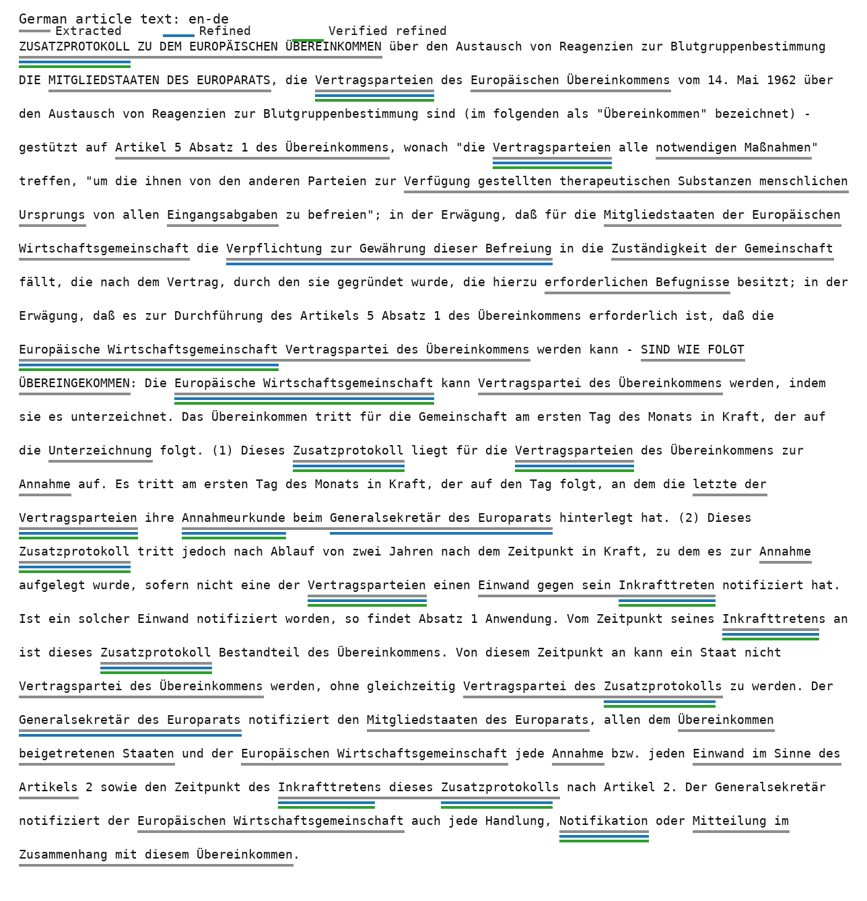
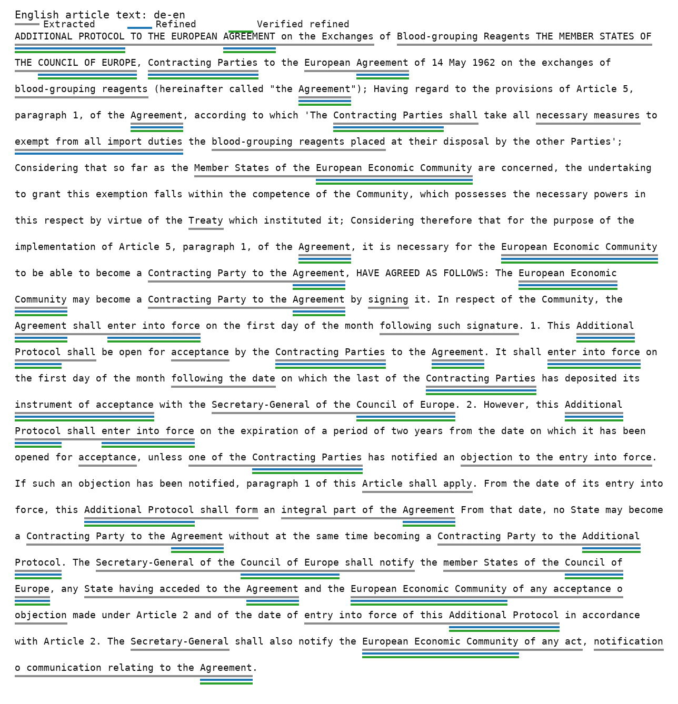
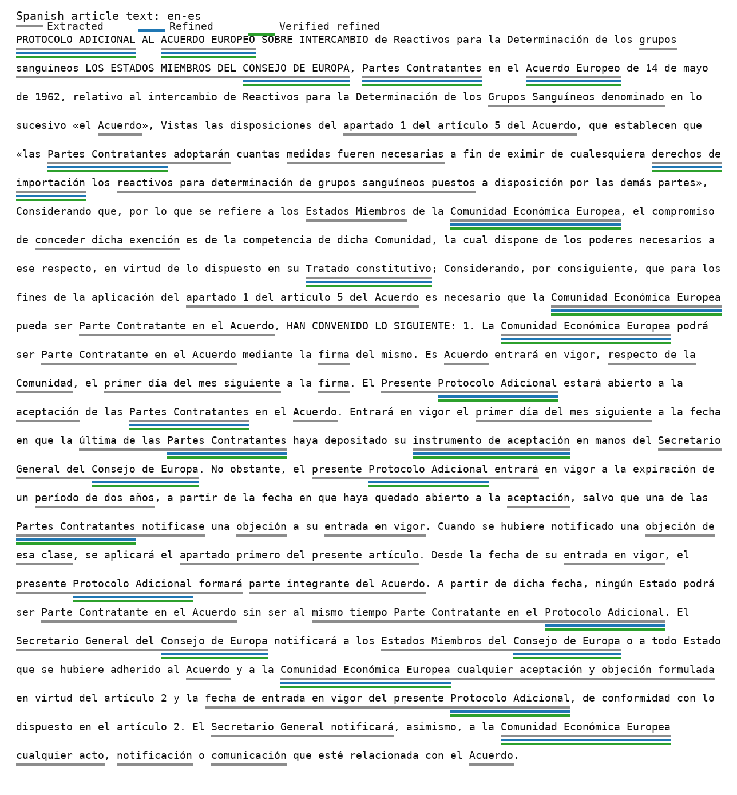
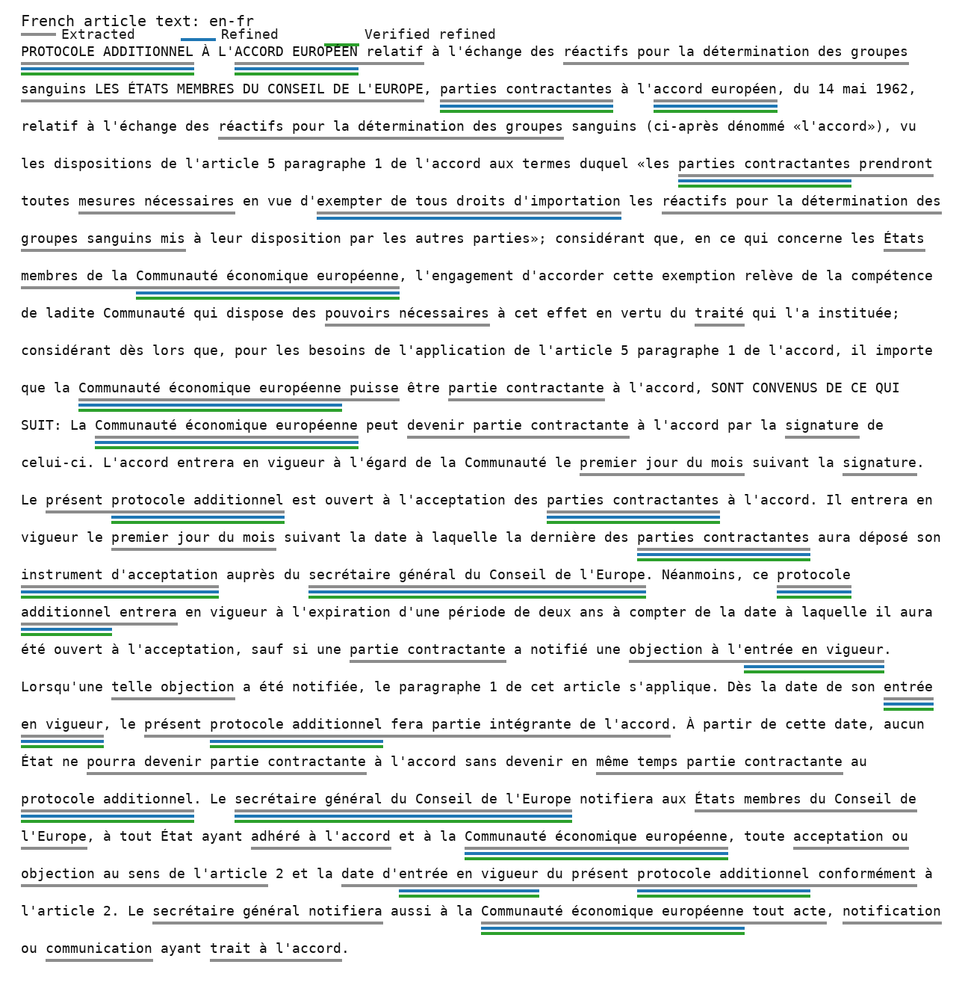
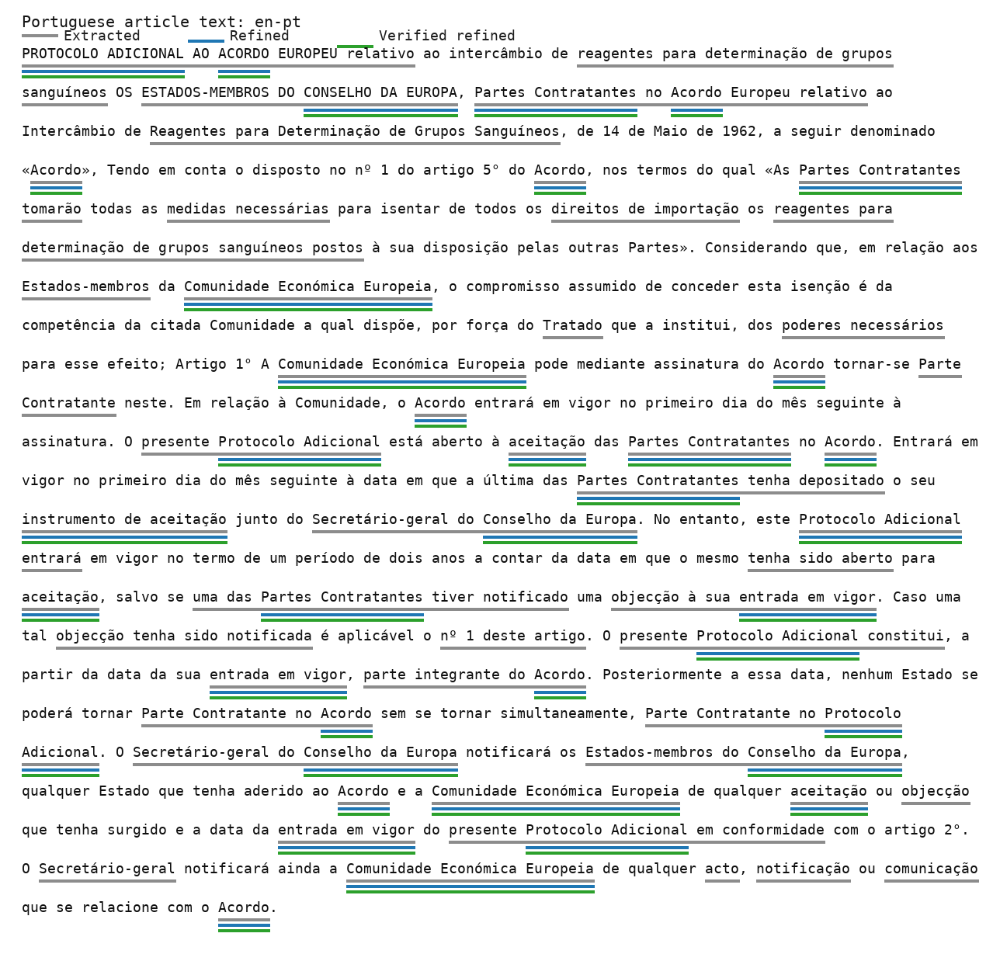

# One-Anchor Legal Benchmark Report

This report documents the one-anchor JRC-Acquis article benchmark generated from the
config-driven benchmark pipeline.

## Test Run

- Config: `config/benchmark_generation/legal_one_anchor.toml`
- Command: `uv run python scripts/generate_benchmark.py --config config/benchmark_generation/legal_one_anchor.toml`
- Dataset: `jrc_acquis`
- Section type: `article`
- Anchor ID: `en:jrc21987A0207_06`
- Directions: `20` ordered language directions
- Rows with terminology: `20` of `20`
- Refined terms across the article benchmark: `158`

## Flow

1. The TOML config selects the JRC article source snapshot and sets `anchor_limit = 1`.
2. The benchmark pipeline keeps one shared `anchor_id` and expands it across all ordered
   language directions for `de`, `en`, `es`, `fr`, and `pt`.
3. Each selected target/reference article text is passed through the legal terminology
   stack: legal LLM extraction, Stanza/UD, XLM-R/NOBI, spaCy, IATE, Wikidata, and UNTERM.
4. The LLM refiner selects the final `refined` terminology group, capped at eight terms
   per row.
5. The manifest stores both diagnostic candidate terms and final `refined` terms.

## Figure Legend

- Gray underline: extracted candidate term from LLM or deterministic extractors.
- Blue underline: LLM-refined final term.
- Green underline: refined term that also has verifier evidence.

## Article Text By Language

### German (`de`)

- Direction shown: `en-de`
- Candidate/verified terms: `54`
- Refined terms: `8`
- Verified refined terms: `6`
- Term groups: `algorithmic` = `33`, `llm` = `10`, `refined` = `8`, `verified` = `11`

Selected refined terms:

- `Europäische Wirtschaftsgemeinschaft` (`iate`)
- `ZUSATZPROTOKOLL` (`iate`)
- `Inkrafttreten` (`iate`)
- `Vertragsparteien` (`iate`)
- `Annahmeurkunde` (`iate`)
- `Notifikation` (`iate`)
- `Generalsekretär des Europarats`
- `Verpflichtung zur Gewährung dieser Befreiung`

### English (`en`)

- Direction shown: `de-en`
- Candidate/verified terms: `53`
- Refined terms: `8`
- Verified refined terms: `7`
- Term groups: `algorithmic` = `27`, `llm` = `9`, `refined` = `8`, `verified` = `17`

Selected refined terms:

- `European Economic Community` (`iate`)
- `instrument of acceptance` (`iate`)
- `ADDITIONAL PROTOCOL` (`iate`)
- `Contracting Parties` (`iate`)
- `Council of Europe` (`iate, wikipedia`)
- `enter into force` (`iate`)
- `Agreement` (`iate`)
- `exempt from all import duties`

### Spanish (`es`)

- Direction shown: `en-es`
- Candidate/verified terms: `52`
- Refined terms: `8`
- Verified refined terms: `8`
- Term groups: `algorithmic` = `29`, `llm` = `5`, `refined` = `8`, `verified` = `18`

Selected refined terms:

- `Comunidad Económica Europea` (`iate, wikipedia`)
- `PROTOCOLO ADICIONAL` (`iate`)
- `Partes Contratantes` (`iate`)
- `CONSEJO DE EUROPA` (`iate, wikipedia`)
- `ACUERDO EUROPEO` (`iate`)
- `instrumento de aceptación` (`iate`)
- `derechos de importación` (`iate`)
- `Tratado constitutivo` (`iate`)

### French (`fr`)

- Direction shown: `en-fr`
- Candidate/verified terms: `51`
- Refined terms: `8`
- Verified refined terms: `7`
- Term groups: `algorithmic` = `30`, `llm` = `5`, `refined` = `8`, `verified` = `16`

Selected refined terms:

- `secrétaire général du Conseil de l'Europe` (`wikipedia`)
- `Communauté économique européenne` (`iate`)
- `PROTOCOLE ADDITIONNEL` (`iate`)
- `parties contractantes` (`iate`)
- `entrée en vigueur` (`iate, wikipedia`)
- `ACCORD EUROPÉEN` (`iate`)
- `instrument d'acceptation` (`iate`)
- `exempter de tous droits d'importation`

### Portuguese (`pt`)

- Direction shown: `en-pt`
- Candidate/verified terms: `52`
- Refined terms: `8`
- Verified refined terms: `8`
- Term groups: `algorithmic` = `30`, `llm` = `6`, `refined` = `8`, `verified` = `16`

Selected refined terms:

- `Comunidade Económica Europeia` (`iate`)
- `Partes Contratantes` (`iate`)
- `Protocolo Adicional` (`iate`)
- `CONSELHO DA EUROPA` (`iate, wikipedia`)
- `entrada em vigor` (`iate`)
- `aceitação` (`iate, wikipedia`)
- `Acordo` (`iate`)
- `instrumento de aceitação` (`iate`)

