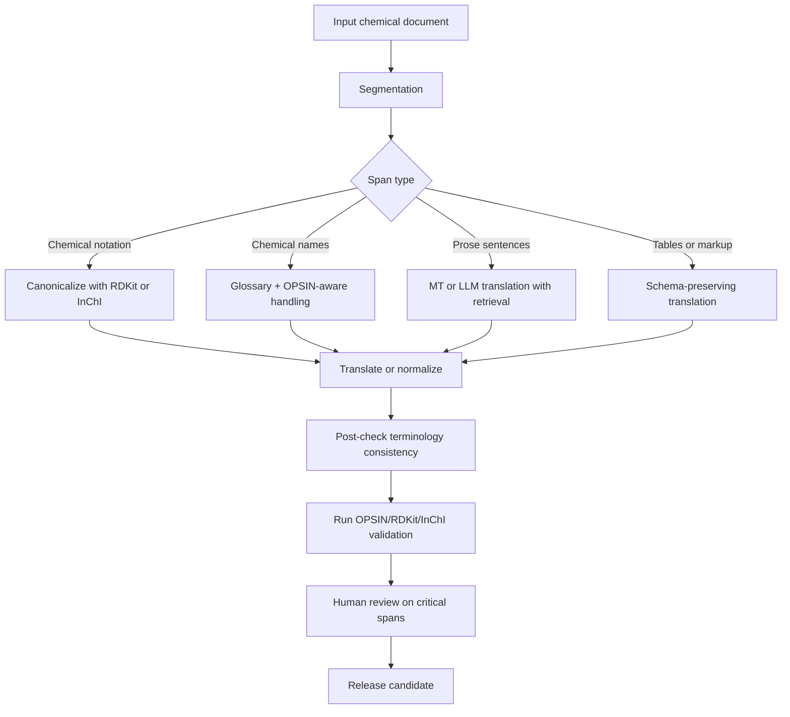

# LLM-Based Translation of Chemical Texts and Evaluation of Chemical Translation Quality

## Executive summary

Recent work shows that large language models can translate surprisingly well without explicit parallel-data pretraining, but the strongest results still come from carefully engineered workflows rather than from naïve zero-shot prompting. In general MT research since 2021, the most robust gains come from high-quality example selection for prompting, terminology-aware retrieval, document-context prompting, and domain adaptation through supervised or parameter-efficient fine-tuning. Several studies also show that raw BLEU can overstate progress, especially when stronger models produce more semantically faithful but lexically different outputs, so modern MT evaluation increasingly relies on chrF, COMET, MetricX, xCOMET, and MQM-style human assessment. citeturn39view0turn18view1turn18view4turn18view5turn18view2turn24view1turn24view3turn24view4turn24view0

For chemical text specifically, the evidence base is much thinner. Direct peer-reviewed work on **multilingual translation of chemistry prose** is still sparse in the sources reviewed. The chemistry literature is instead concentrated in two neighboring areas: **notation translation** such as SMILES/InChI/IUPAC conversion, and **chemical text mining / structured extraction** from prose, patents, and scientific articles. That distinction matters: notation translation behaves more like formal-language transduction, while chemical prose translation behaves more like technical-domain MT with unusually strict terminology and factuality constraints. Surveys and reviews of chemistry LLMs consistently foreground notation alignment tasks and emphasize the lack of standardized evaluation frameworks for chemistry-oriented extraction pipelines. citeturn31view3turn31view0turn31view1

The strongest chemistry-specific evidence presently available comes from name/structure transduction systems. STOUT showed that sequence models can learn SMILES↔IUPAC conversion with high BLEU and structural similarity, while a transformer-based InChI→IUPAC model achieved 91% test accuracy on 10 million PubChem pairs but degraded on inorganic and organometallic compounds because of representation limits and data imbalance. STOUT V2 then improved string and structural metrics further and operationalized a practical workflow around RDKit canonicalization and OPSIN round-tripping. At the same time, recent work on chemical strings shows that stereochemistry remains a disproportionately hard failure mode for transformer models, especially around chiral tokens. citeturn26view0turn26view1turn27view0turn27view4turn26view2turn31view2

For real chemical translation systems, the best current design is therefore hybrid. Use a strong MT or multilingual LLM backbone for prose, but add chemistry-specific controls: canonicalization for machine-readable notations, glossary injection for terms, retrieval from patent/scientific translation memory, structure-aware validation with OPSIN/RDKit/InChI, and human review focused on high-risk errors such as stereochemistry, units, hazard statements, and regulatory wording. In evaluation, lexical metrics alone are inadequate; a chemistry-aware stack should combine BLEU/chrF with COMET or xCOMET, entity-level F1 for chemicals and reaction roles, exact or canonicalized name/structure match, OPSIN parse rate, and round-trip structure fidelity. citeturn19view5turn23view3turn24view4turn24view1turn12search1turn12search2turn12search7turn12search4turn31view0

## Scope and evidence base

This report prioritizes papers and primary sources from 2021 onward where possible. Foundational metric papers such as BLEU, chrF, COMET, and BERTScore are older than 2021, but they remain indispensable because most recent work still evaluates against them. The literature reviewed falls into three overlapping buckets: general LLM-for-MT studies, chemistry-specific notation/extraction studies, and evaluation frameworks from WMT and chemistry toolchains. citeturn9search0turn7search2turn8search0turn7search5turn24view1turn31view0

A key caveat is that **chemistry-specific multilingual translation research is underdeveloped** relative to nearby domains such as biomedical MT or patent MT. In the sources reviewed, chemistry work is far more likely to frame the task as notation alignment or structured extraction than as sentence-level translation between natural languages. That means some recommendations below are extrapolated from adjacent technical-domain MT literature, especially patent translation, scientific-paper translation, and chemical text mining. Wherever that happens, it is explicitly indicated. citeturn31view3turn31view0turn34view0turn34view5

The most useful official or primary resources for chemistry-translation pipelines are the following. PubChem provides very large open-access chemical information and APIs for names, synonyms, SMILES, and identifiers. ChEBI provides a curated ontology and downloadable chemical entries. OPSIN is the main open-source name-to-structure parser for systematic nomenclature. RDKit provides canonical SMILES handling and chemistry validation. The InChI Trust maintains the standard structure-based identifier. For technical terminology and patent-oriented multilingual resources, WIPO Translate and WIPO Pearl are especially relevant. citeturn28search1turn12search5turn28search24turn28search27turn12search1turn12search2turn12search7turn12search4turn34view3turn34view4

## Translation methods

### Method families and how they map to chemical text

The recent LLM-MT literature has converged on four operational paradigms. The first is **zero-shot prompting**, which is cheap and often surprisingly capable, but brittle in specialized language. The second is **in-context learning** with retrieved demonstrations or translation memories. The third is **domain adaptation** through fine-tuning or parameter-efficient fine-tuning. The fourth is **hybrid systems** that combine LLM prompting with classic encoder–decoder MT, terminology extraction, reranking, or post-editing. Vilar et al. found that example quality is the dominant factor in few-shot prompting; Moslem et al. showed that retrieved fuzzy matches plus encoder–decoder assistance can outperform either alone in some settings; Xu et al. showed that a carefully staged fine-tuning recipe can outperform heavier parallel-data-only adaptation and that too much parallel data can wash out useful prior knowledge; and He et al. showed that self-generated knowledge such as keywords, topics, and demonstrations can reduce hallucination, omission, and awkward phrasing. citeturn39view0turn19view5turn19view6turn19view7turn23view3

For chemistry, these paradigms align with text types differently. **SMILES and InChI** are best treated as formal strings requiring canonicalization and deterministic validation. **IUPAC names** sit between natural language and formal notation and benefit from character- or subword-level modeling plus structure-aware post-checks. **Patents and research articles** benefit most from translation memory, domain glossary injection, and document context. **Safety data sheets** require strong formatting preservation, unit fidelity, and jurisdiction-specific phrase control. This distinction is not merely engineering convenience; chemistry reviews emphasize that domain knowledge and physical constraints should be used to validate or constrain LLM outputs because chemistry data extraction is unusually error-sensitive. citeturn26view1turn26view2turn31view0

### Architectures and adaptation strategies

A compact LaTeX-ready abstraction for technical translation is:

```latex
\[
\hat{y} = \arg\max_{y} \sum_{t=1}^{T} \log p_\theta(y_t \mid y_{<t}, x, c, g, d),
\]
```

where \(x\) is the source text, \(c\) is document context, \(g\) is a terminology glossary, and \(d\) is a retrieved demonstration set or translation memory. This form is useful because most successful recent MT-with-LLM methods can be interpreted as improving one of the conditioning variables \(c\), \(g\), or \(d\), or by adapting \(\theta\) with fine-tuning. The design is well supported by CAP for document-level context, COD for dictionary conditioning, MAPS for generated auxiliary knowledge, and adaptive MT work using fuzzy matches and encoder–decoder assists. citeturn18view4turn22view1turn23view3turn19view5

For prose translation in chemistry, decoder-only LLMs are attractive because they are easy to prompt and to adapt with LoRA-style methods, but the recent literature does **not** imply that they should replace encoder–decoder MT everywhere. PaLM prompting remained behind supervised SOTA in Vilar et al.; business-IT experiments found Llama-2 13B promising but still requiring retrieval and output cleanup; and ALMA-style staged fine-tuning achieved gains by careful recipe design rather than by abandoning classic MT assumptions. For high-throughput, sentence-level chemical prose translation, a strong encoder–decoder baseline still belongs in every experiment. citeturn39view0turn18view7turn18view2

For notation translation, character-heavy or tokenizer-sensitive models matter more than instruction-following polish. Handsel et al. used a two-stack transformer encoder–decoder and predicted character-by-character from InChI to IUPAC, reaching 91% test accuracy on 10 million PubChem pairs. STOUT similarly framed SMILES↔IUPAC as neural translation and reported about 90% BLEU and Tanimoto similarity above 0.9. STOUT V2 then added a more production-ready pipeline with RDKit canonicalization and post-hoc OPSIN-based verification. These systems are not multilingual MT tools, but they are directly relevant whenever a chemical translation workflow must preserve or normalize formal chemical mentions. citeturn26view1turn26view0turn26view2

### Terminology handling, retrieval, and data augmentation

Terminology handling is the single highest-leverage intervention for chemical prose. In general LLM-MT, dictionary- and glossary-based prompting has become a standard tactic for improving lexical precision, especially in lower-resource or domain-sensitive settings. COD explicitly chains multilingual dictionary entries into prompts; MAPS can surface keywords and demonstrations before translation; and adaptive MT pipelines using fuzzy matches and local translation memories improve both quality and domain fit. In patent translation, terminology-focused fine-tuning with glossary extraction has been competitive enough to top the WMT 2024 patent task among participating systems. citeturn22view1turn23view3turn19view5turn19view9

For chemistry, the practical analogues are clear. Use a layered terminology source built from WIPO Pearl for multilingual scientific and technical terms, from internal or curated lexicons for compound classes and hazard phrases, and from corpus-derived term mining on the domain at hand. WIPO Pearl exists precisely to support accurate and consistent scientific and technical terminology across languages, and WIPO Translate is explicitly positioned for patent and technical content. In a chemical patent workflow, those should be treated as first-class retrieval sources rather than optional extras. citeturn34view4turn34view3

Data augmentation can be split into two kinds. In general MT, recent work uses synthetic parallel data, back-translation, parallel-data mixing, and structured prompting resources. In chemistry notation tasks, augmentation often means canonicalization, randomization, or representation conversion rather than free-form paraphrase. Recent chemistry work also shows that augmentation must be chemically informed: stereochemical tokens are especially hard, and oversampling chirality-bearing examples can improve learning stability. That is a rare case where chemistry-specific evidence directly informs data design for translation models. citeturn39view1turn31view2

### Practical translation workflows for chemical documents

A robust workflow for chemical translation should be **branch-aware**: prose, formal notation, and tables/markup should not all go through the same path.



This design reflects the evidence base rather than mere best practice. RDKit canonicalization is central to STOUT V2. OPSIN provides open-source systematic-name parsing into SMILES and InChI. The InChI standard is designed for interoperability across chemistry data systems. Chemical extraction reviews explicitly recommend using domain knowledge and validation constraints in downstream pipelines. citeturn26view2turn12search1turn12search2turn12search4turn31view0

A LaTeX-ready algorithm skeleton for prose-plus-notation translation is:

```latex
\begin{algorithm}[t]
\caption{Chemistry-aware translation pipeline}
\begin{algorithmic}[1]
\Require source document $X$, glossary $G$, retriever $R$, MT/LLM model $M$
\State segment $X$ into spans $\{s_i\}$
\For{each span $s_i$}
  \If{$s_i$ is SMILES/InChI}
    \State canonicalize $s_i$ with RDKit/InChI tools
    \State preserve or deterministically normalize
  \ElsIf{$s_i$ is a chemical name}
    \State retrieve terminology from $G$
    \State translate with $M$ conditioned on glossary entries
    \State verify parseability with OPSIN when applicable
  \Else
    \State retrieve demonstrations $d_i \leftarrow R(s_i)$
    \State translate $s_i$ with context and glossary conditioning
  \EndIf
\EndFor
\State run post-hoc consistency checks across the full document
\State score outputs with lexical, semantic, and chemical-structure metrics
\State send high-risk spans to expert review
\end{algorithmic}
\end{algorithm}
```

For **SMILES and IUPAC names**, a specialized model such as STOUT or a notation-tuned transformer is the right baseline. For **chemical patents**, start with a patent-adapted MT backbone, retrieve fuzzy matches from JaParaPat or the local patent memory, and inject a WIPO Pearl glossary. For **research articles**, use sentence or paragraph retrieval from ASPEC-like scientific corpora and preserve citations, units, and formulas verbatim. For **safety data sheets**, keep section numbering, hazard codes, units, CAS numbers, and legally constrained phrases frozen unless an approved terminology entry exists; the regulatory and language constraints reflected in ECHA and OSHA materials make free paraphrase especially risky in this document class. citeturn26view2turn34view2turn34view0turn34view5turn33search7turn32search12

### Comparative table of key method papers

| Paper | Year | Core method | Data / domain | Main finding | Main limitation | Primary source |
|---|---:|---|---|---|---|---|
| Vilar et al., *Prompting PaLM for Translation* | 2023 | Few-shot prompting, example selection | General MT | Example quality is the most important factor; optimized prompting is strong but still lags supervised SOTA | Not domain-specific; still behind best supervised MT | citeturn39view0 |
| Moslem et al., *Adaptive Machine Translation with LLMs* | 2023 | Fuzzy-match retrieval, translation memory, hybrid with encoder–decoder MT | Adaptive / domain MT | Few-shot adaptive translation with fuzzy matches can beat strong adaptive MT; hybridization helps further | Results depend on language pair and retrieval setup | citeturn19view5 |
| He et al., *Exploring Human-Like Translation Strategy with LLMs* | 2024 | MAPS: generated keywords, topics, demos + QE reranking | General MT, 11 directions | Reduces mistranslation, omission, untranslated text, and awkward style | Higher inference cost; not chemistry-specific | citeturn23view3 |
| Cui et al., *Efficiently Exploring LLMs for DocMT with ICL* | 2024 | CAP document-context prompting | Document-level MT | Better coherence and context handling under ICL | Context management complexity | citeturn18view4 |
| Zhu et al., *Towards Robust ICL for MT with LLMs* | 2024 | Noise-robust demo selection | General MT, domain adaptation emphasis | Robust demonstration filtering helps especially under domain shift | Relies on good retrieval infrastructure | citeturn18view5 |
| Xu et al., *A Paradigm Shift in MT* | 2024 | Two-stage LLM fine-tuning (ALMA) | General MT | Monolingual-rich staged training can outperform naive heavy parallel-data tuning; too much parallel data may cause forgetting | Requires careful curation and recipe design | citeturn19view6turn19view7 |
| Lu et al., *Chain-of-Dictionary Prompting* | 2024 | Dictionary-conditioned prompting | Low-resource MT | Multilingual dictionary chains can materially improve prompting-based MT | Depends on coverage and dictionary quality | citeturn22view1 |
| Rajan et al., *STOUT* | 2021 | Neural translation for SMILES↔IUPAC | Chemical notation | Around 90% BLEU and Tanimoto \(>\) 0.9 for notation conversion | Not multilingual prose MT; lexical match and structure can diverge | citeturn26view0 |
| Handsel et al., *Translating the InChI* | 2021 | Transformer encoder–decoder, character-level decoding | InChI→IUPAC | 91% test accuracy on 10M PubChem pairs | Weaker on inorganic and organometallic compounds | citeturn26view1 |
| Rajan et al., *STOUT V2* | 2024 | Transformer + RDKit canonicalization + OPSIN verification | Chemical notation | Major gains over STOUT V1; integrates a stronger validation workflow | Exact IUPAC name accuracy still not perfect; fingerprint similarity can mislead | citeturn27view0turn27view2turn27view5 |
| Zhang et al., *Fine-tuning LLMs for Chemical Text Mining* | 2024 | Fine-tuned GPT/Mistral/Llama etc. | Chemical literature extraction | Fine-tuned LLMs reached 69–95% exact accuracy across five chemical text-mining tasks with modest annotation | Extraction, not multilingual translation; transfer to MT is indirect | citeturn31view1 |

## Evaluation of translated chemical texts

### General MT metrics and what they miss in chemistry

The standard lexical and semantic metrics remain necessary, but they are not sufficient on their own.

A LaTeX-ready reminder of BLEU is:

```latex
\[
\mathrm{BLEU} = \mathrm{BP}\cdot \exp\!\left(\sum_{n=1}^{N} w_n \log p_n\right),
\]
```

with brevity penalty \(\mathrm{BP}\) and modified \(n\)-gram precisions \(p_n\). BLEU is foundational and still widely reported, but its lexical-overlap bias is particularly problematic in chemistry because semantically equivalent translations may legitimately differ in wording while semantically dangerous translations may preserve large \(n\)-gram overlap. Post’s reproducibility recommendations via sacreBLEU remain essential. citeturn9search0turn11search0turn11search13

chrF and chrF++ are character-oriented and often work better on morphologically rich or noisy tokenization regimes. In technical translation, chrF is often a better lexical sanity-check than BLEU because symbols, inflections, and partial string overlaps matter. sacreBLEU provides a reference implementation for both chrF and chrF++. citeturn7search2turn7search6turn11search0

COMET, MetricX, xCOMET, and BERTScore are more informative for modern LLM MT systems. COMET learns to predict human judgments; MetricX-24 is a strong hybrid reference-based/reference-free learned metric; xCOMET enriches sentence scoring with error-span detection; and BERTScore provides token-semantic similarity using contextual embeddings. WMT24 found that fine-tuned neural metrics still perform well even for evaluating LLM-based translation systems, with MetaMetrics-MT, MetricX-24-Hybrid, and XCOMET among the strongest average performers. citeturn8search0turn24view3turn24view4turn36search0turn24view1turn25view0turn25view2

For chemical texts, that implies a simple rule: report **both** lexical and semantic metrics. A practical minimum for prose is BLEU + chrF++ + COMET or MetricX. For notation-heavy tasks, lexical metrics should be secondary to structure-based checks because “good prose” and “chemically valid output” are not the same target. STOUT V2 is explicit about this: it supplements string-based scores with OPSIN-backed retranslation and structural similarity, while also warning that Tanimoto can be misleading because structurally distinct molecules can sometimes achieve a perfect fingerprint similarity score. citeturn27view5

### Chemistry-specific metrics

A chemistry-aware evaluation stack should explicitly separate **string fidelity**, **entity fidelity**, and **structural fidelity**.

A compact LaTeX-ready suite is:

```latex
\[
\mathrm{NameAcc} = \frac{1}{N}\sum_{i=1}^{N}\mathbf{1}\{\hat{n}_i = n_i\},
\qquad
\mathrm{EntF1} = \frac{2PR}{P+R},
\]
```

```latex
\[
\mathrm{StructExact} = \frac{1}{N}\sum_{i=1}^{N}\mathbf{1}\{\mathrm{InChI}(\hat{s}_i)=\mathrm{InChI}(s_i)\},
\]
```

```latex
\[
\mathrm{RTF} = \frac{1}{N}\sum_{i=1}^{N}\mathbf{1}\{\mathrm{canon}(\mathrm{parse}(\mathrm{translate}(x_i)))=\mathrm{canon}(x_i)\},
\]
```

where \(\mathrm{parse}\) can be OPSIN for systematic names and \(\mathrm{canon}\) can be RDKit canonical SMILES or standard InChI.

This decomposition matches current best evidence. STOUT and STOUT V2 both evaluate exact string or BLEU-style naming quality together with structural similarity. OPSIN is the natural open-source parser for systematic names into structures. RDKit supports canonical SMILES generation. Standard InChI exists precisely for interoperable, structure-based identity. citeturn26view0turn27view2turn12search1turn12search2turn12search7turn12search4

For patents and research prose, add **entity-level F1** for chemical names, reaction roles, conditions, yields, and hazard phrases. Chemical text-mining benchmarks show this is practical and already common in neighboring tasks. ChEMU focuses on chemical reaction information extraction from patents, while ChemDataExtractor and related work provide practical NER and extraction infrastructure for chemical literature. citeturn14search0turn14search2turn13search0turn13search1

For safety data sheets, use an even stricter checklist. Translating SDS content is not just semantic rewriting; it is compliance-sensitive communication. At minimum, preserve section headers, H/P statements or their approved jurisdictional equivalents, units, concentration ranges, CAS numbers, exposure limits, and emergency instructions. The ECHA poison-centre material makes language requirements operationally explicit across market-placement countries, and OSHA materials warn that simple direct translation may be inadequate without considering comprehension and context. citeturn33search7turn32search0turn32search12

### Human evaluation protocols and error taxonomy

Human evaluation remains essential for chemistry because high-risk failures are often sparse and catastrophic rather than frequent and averageable. Freitag et al. proposed a professional-translator MQM protocol grounded in explicit error analysis and document context, and WMT24 continued to use MQM as the human reference point for modern metric evaluation. Error Span Annotation was later proposed as a faster and cheaper alternative that still preserves ranking usefulness. citeturn24view0turn24view1turn24view2

For chemical translation, the generic MQM taxonomy should be adapted into at least seven chemistry-facing buckets:

| Error class | Why it matters in chemistry | Suggested detection |
|---|---|---|
| Terminology substitution | Wrong reagent / material / hazard term | glossary match + expert check |
| Nomenclature error | Incorrect IUPAC fragment or locant | OPSIN parse + exact or canonicalized comparison |
| Structural error | Wrong structure despite plausible wording | standard InChI / canonical SMILES exactness |
| Stereochemistry / isomerism | Potentially safety- or efficacy-critical | explicit chiral token audit, structure comparison |
| Quantity / unit / condition error | Direct experimental or regulatory risk | regex/unit validator + manual review |
| Role / event error | Wrong reactant/product/catalyst/solvent assignment | entity-role F1 against gold labels |
| Regulatory / hazard phrasing error | Legal or safety non-compliance | approved phrase table + expert audit |

This adapted taxonomy is partly an inference from MQM and chemistry evidence, but it is well motivated by the literature: MQM error analysis is the established MT human protocol; chemistry extraction work focuses on entities, reaction roles, and conditions; and transformer studies on chemical strings show stereochemistry is a disproportionate failure mode. citeturn24view0turn31view1turn14search0turn31view2

### Reproducible evaluation pipeline

A reproducible chemistry-translation benchmark should be versioned and executable end-to-end. A practical pipeline is:

```latex
\begin{enumerate}
\item Normalize Unicode, punctuation, markup, and whitespace.
\item Freeze protected spans: CAS numbers, formulas, identifiers, units, and approved hazard phrases.
\item Compute BLEU and chrF++ with sacreBLEU.
\item Compute COMET / xCOMET / MetricX where licensing permits.
\item Run chemical NER / span extraction to score entity-level F1.
\item Parse translated systematic names with OPSIN.
\item Canonicalize SMILES with RDKit; compute exact canonical match and standard InChI match.
\item Compute round-trip fidelity and parse-rate.
\item Sample errors for MQM-style expert review.
\end{enumerate}
```

The software stack for this is unusually mature: sacreBLEU for lexical metrics, COMET for learned MT evaluation, MetricX code from Google Research, BERTScore for embedding-based similarity, OPSIN for systematic parsing, and RDKit/InChI for canonicalization and structure identity. citeturn11search0turn8search1turn36search1turn36search0turn12search1turn12search7turn12search4

### Comparative table of evaluation papers and tools

| Work / tool | Year | Evaluation contribution | Why it matters for chemistry translation | Limitation | Primary source |
|---|---:|---|---|---|---|
| Papineni et al., BLEU | 2002 | Lexical n-gram MT metric | Still standard for comparability | Weak on semantic and chemical correctness | citeturn9search0 |
| Popović, chrF / chrF++ | 2015 / 2017 | Character-oriented MT metrics | Better robustness to tokenization and morphology | Still lexical, not structure-aware | citeturn7search2turn7search6turn11search0 |
| Rei et al., COMET | 2020 | Learned metric aligned to human judgments | Better semantic quality estimates for technical prose | Opaque as a single score | citeturn8search0turn8search1 |
| Guerreiro et al., xCOMET | 2024 | Sentence score + fine-grained error spans | Useful for high-value chemistry error diagnosis | Still not chemistry-specific | citeturn24view4 |
| Juraska et al., MetricX-24 | 2024 | Strong hybrid reference/reference-free metric | Good default modern learned metric | Requires model access and heavier compute | citeturn24view3 |
| Freitag et al., MQM protocol study | 2021 | Professional human evaluation methodology | Best starting point for chemistry human review | Expensive and slow | citeturn24view0 |
| Freitag et al., WMT24 Metrics | 2024 | Meta-evaluation on LLM-based MT outputs | Confirms fine-tuned neural metrics remain strong on LLM MT | General-domain task, not chemistry-specific | citeturn24view1turn25view0turn25view2 |
| Kocmi & Federmann, GEMBA | 2023 | GPT-based MT evaluation | Demonstrates LLM-as-evaluator viability | Strongest at system level, weaker at segment level and under-resourced settings | citeturn24view5turn25view3 |
| STOUT V2 evaluation workflow | 2024 | Exact match + round-trip + Tanimoto | Directly relevant for IUPAC/SMILES tasks | Fingerprint similarity can overestimate equivalence | citeturn27view2turn27view5 |

## Recommended datasets, benchmarks, repositories, and reproducible setups

### Datasets and benchmarks

For **general MT baselines**, FLORES-200 and WMT remain the strongest multilingual evaluation anchors. FLORES-200 is Meta’s broad multilingual benchmark, and WMT24 continues to provide shared tasks and metric meta-evaluation. citeturn35search0turn35search6turn29search14turn24view1

For **technical and scientific text**, ASPEC remains a core open scientific-paper corpus, with Japanese–English and Chinese–Japanese scientific data. It is not chemistry-only, but it is the closest widely used open benchmark for scientific prose translation in the reviewed sources. citeturn34view5

For **patents**, the WAT/WMT 2024 Patent Task, the JPO patent corpora, and JaParaPat are the most relevant openly described resources. JaParaPat contains more than 300 million Japanese–English sentence pairs from patent applications and improved patent MT quality substantially in the authors’ experiments. Patent corpora are especially attractive for chemistry because chemical inventions are disproportionately patent-centric, even when the benchmark itself is not chemistry-only. WIPO Translate and WIPO Pearl are valuable supporting resources rather than benchmark sets. citeturn34view0turn34view1turn34view2turn34view3turn34view4

For **chemical notation and entity work**, the best open sources are PubChem, ChEBI, ChEMU, and OPSIN-linked evaluation sets. PubChem is the natural source for very large name–identifier pairs and is explicitly used by the InChI→IUPAC transformer work. ChEBI offers curated small-molecule records and downloads. ChEMU provides chemical-patent extraction data for entities and events, which is extremely useful when evaluating chemical-term preservation in translated patents. citeturn26view1turn28search1turn28search4turn28search24turn14search0turn14search2

For **safety data sheets**, I did not identify a widely adopted open benchmark specific to multilingual SDS translation in the primary sources reviewed. The safer path for current work is to construct an internal evaluation set from public or licensed SDS documents, stratified by section type and jurisdiction, and to evaluate against a frozen phrase inventory and expert review protocol. The regulatory sources reviewed support language- and market-specific constraints, but not a shared open benchmark. citeturn33search7turn32search0

### Recommended repositories and toolkits

The most useful official or primary repositories for reproducible work are COMET, MetricX, sacreBLEU, BERTScore, OPSIN, RDKit, ChemDataExtractor, and STOUT. Those together cover lexical metrics, learned metrics, entity extraction, name parsing, structure canonicalization, and notation translation. citeturn8search1turn36search1turn11search0turn36search0turn12search1turn12search7turn13search0turn37search1

### Suggested experiments and starting configurations

The following experimental matrix is a **recommended setup inferred from the literature**, not a single canonical protocol from one paper.

**Experiment family A: prose translation for patents / articles / SDS**

Use four baselines:  
(1) a strong encoder–decoder MT system;  
(2) a general multilingual LLM in zero-shot mode;  
(3) the same LLM with retrieved fuzzy matches, glossary injection, and document context;  
(4) LoRA- or PEFT-adapted LLM on in-domain parallel or pseudo-parallel data. This design is directly motivated by work on prompting, adaptive MT, robust ICL, document context, and staged fine-tuning. citeturn39view0turn19view5turn18view5turn18view4turn18view2

A good prompt template for chemical prose is:

```latex
\begin{quote}
Translate the following [source language] chemical text into [target language].
Requirements: preserve all chemical formulas, CAS numbers, units, stoichiometric numbers,
section numbering, and XML/HTML/markdown tags exactly. Use the approved glossary below
when applicable. Do not paraphrase hazard statements or procedural quantities. If a span is
a SMILES or InChI string, copy it unchanged unless explicitly instructed otherwise.
Glossary: \{...\}
Context: \{previous sentence / paragraph summary\}
Text: \{...\}
\end{quote}
```

For retrieved demonstrations, start with top-5 sentence or paragraph matches plus glossary entries, since fuzzy-match and retrieved-example setups are consistently helpful in adaptive MT work. citeturn19view5turn18view4turn18view5

**Experiment family B: notation translation**

Benchmark SMILES→IUPAC, IUPAC→SMILES, and InChI→IUPAC separately. Always compare a specialized notation model against a general LLM. Always canonicalize inputs first. Always evaluate exact string match, valid parse rate, canonical SMILES match, standard InChI match, and round-trip fidelity. That mirrors what the strongest chemistry-specific studies already do. citeturn26view1turn26view2turn27view2turn27view5

**Experiment family C: translation faithfulness under chemistry-specific stress**

Create controlled subsets for stereochemistry, organometallics, long systematic names, mixtures, and hazard statements. Recent chemistry evidence suggests that stereochemistry and long formal strings are disproportionately hard; patent and extraction literature suggests role-label confusion is another common failure mode. citeturn31view2turn26view1turn14search0

Recommended reporting for **every** experiment:

```latex
\begin{itemize}
\item sacreBLEU signature and chrF++ settings
\item COMET / xCOMET / MetricX model version
\item protected-span policy
\item OPSIN version and parse settings
\item RDKit version and canonicalization policy
\item percentage of untranslated protected spans
\item exact structural match rate and round-trip fidelity
\item MQM-style human review sample size and adjudication protocol
\end{itemize}
```

## LaTeX snippets and selected BibTeX

### LaTeX-ready methodological paragraph

```latex
Recent work on large language models for machine translation suggests that the best results in technical domains do not come from naive zero-shot prompting alone. Instead, quality improves when models are conditioned on high-quality demonstrations, domain glossaries, and document context, or when they are adapted with carefully curated fine-tuning data \cite{vilar2023prompting,moslem2023adaptive,he2024maps,cui2024cap,xu2024alma}. For chemical texts, additional structure-aware constraints are required: machine-readable notations such as SMILES and InChI should be canonicalized and validated with cheminformatics toolchains, while systematic names should be checked with name-to-structure parsers such as OPSIN \cite{rajan2021stout,handsel2021inchi,rajan2024stoutv2}.
```

### LaTeX-ready evaluation paragraph

```latex
Evaluation of chemical translation should combine lexical, semantic, and chemistry-aware metrics. BLEU and chrF++ remain useful for comparability, but modern learned metrics such as COMET, MetricX, and xCOMET correlate better with human judgments and provide stronger evaluation for LLM-generated translations \cite{papineni2002bleu,popovic2015chrf,rei2020comet,guerreiro2024xcomet,juraska2024metricx}. In chemistry-specific settings, exact name accuracy, entity-level F1, OPSIN parse rate, canonical SMILES or standard InChI exact match, and round-trip fidelity are necessary because lexical similarity alone does not guarantee structural equivalence \cite{rajan2024stoutv2}. Human evaluation should follow MQM-style protocols with chemistry-aware error categories and expert adjudication for high-risk spans \cite{freitag2021mqm}.
```

### Selected BibTeX entries

```bibtex
@inproceedings{vilar2023prompting,
  title     = {Prompting {P}a{LM} for Translation: Assessing Strategies and Performance},
  author    = {Vilar, David and Freitag, Markus and Cherry, Colin and Luo, Jiaming and Ratnakar, Viresh and Foster, George},
  booktitle = {Proceedings of the 61st Annual Meeting of the Association for Computational Linguistics (Volume 1: Long Papers)},
  year      = {2023},
  pages     = {15406--15427},
  doi       = {10.18653/v1/2023.acl-long.859},
  url       = {https://aclanthology.org/2023.acl-long.859/}
}

@inproceedings{moslem2023adaptive,
  title     = {Adaptive Machine Translation with Large Language Models},
  author    = {Moslem, Yasmin and Haque, Rejwanul and Way, Andy},
  booktitle = {Proceedings of the 24th Annual Conference of the European Association for Machine Translation},
  year      = {2023},
  pages     = {227--237}
}

@article{he2024maps,
  title   = {Exploring Human-Like Translation Strategy with Large Language Models},
  author  = {He, Zhiwei and Liang, Tian and Jiao, Wenxiang and Zhang, Zhuosheng and Yang, Yujiu and Wang, Rui and Tu, Zhaopeng and Shi, Shuming and Wang, Xing},
  journal = {Transactions of the Association for Computational Linguistics},
  year    = {2024},
  volume  = {12}
}

@inproceedings{cui2024cap,
  title     = {Efficiently Exploring Large Language Models for Document-Level Machine Translation with In-context Learning},
  author    = {Cui, Menglong and Du, Jiangcun and Zhu, Shaolin and Xiong, Deyi},
  booktitle = {Findings of the Association for Computational Linguistics: ACL 2024},
  year      = {2024}
}

@inproceedings{xu2024alma,
  title     = {A Paradigm Shift in Machine Translation: Boosting Translation Performance of Large Language Models},
  author    = {Xu, Haoran and Kim, Young Jin and Sharaf, Amr and Awadalla, Hany Hassan},
  booktitle = {International Conference on Learning Representations},
  year      = {2024}
}

@inproceedings{lu2024cod,
  title     = {Chain-of-Dictionary Prompting Elicits Translation in Large Language Models},
  author    = {Lu, Hongyuan and Yang, Haoran and Huang, Haoyang and Zhang, Dongdong and Lam, Wai and Wei, Furu},
  booktitle = {Proceedings of the 2024 Conference on Empirical Methods in Natural Language Processing},
  year      = {2024},
  pages     = {958--976}
}

@article{rajan2021stout,
  title   = {STOUT: SMILES to IUPAC names using neural machine translation},
  author  = {Rajan, Kohulan and Zielesny, Achim and Steinbeck, Christoph},
  journal = {Journal of Cheminformatics},
  year    = {2021},
  volume  = {13},
  number  = {34},
  doi     = {10.1186/s13321-021-00512-4}
}

@article{handsel2021inchi,
  title   = {Translating the InChI: adapting neural machine translation to predict IUPAC names from a chemical identifier},
  author  = {Handsel, Jennifer and Matthews, Brian and Knight, Nicola J. and Coles, Simon J.},
  journal = {Journal of Cheminformatics},
  year    = {2021},
  volume  = {13},
  number  = {57},
  doi     = {10.1186/s13321-021-00535-x}
}

@article{rajan2024stoutv2,
  title   = {STOUT V2.0: SMILES to IUPAC name conversion using transformer models},
  author  = {Rajan, Kohulan and Steinbeck, Christoph and Zielesny, Achim},
  journal = {Journal of Cheminformatics},
  year    = {2024},
  doi     = {10.1186/s13321-024-00941-x}
}

@article{zhang2024chemtext,
  title   = {Fine-tuning large language models for chemical text mining},
  author  = {Zhang, Wei and Wang, Qinggong and Kong, Xiangtai and others},
  journal = {Chemical Science},
  year    = {2024},
  volume  = {15},
  pages   = {10600--10611},
  doi     = {10.1039/D4SC00924J}
}

@inproceedings{papineni2002bleu,
  title     = {Bleu: a Method for Automatic Evaluation of Machine Translation},
  author    = {Papineni, Kishore and Roukos, Salim and Ward, Todd and Zhu, Wei-Jing},
  booktitle = {Proceedings of the 40th Annual Meeting of the Association for Computational Linguistics},
  year      = {2002},
  pages     = {311--318},
  doi       = {10.3115/1073083.1073135}
}

@inproceedings{popovic2015chrf,
  title     = {chrF: character n-gram F-score for automatic MT evaluation},
  author    = {Popovi{\'c}, Maja},
  booktitle = {Proceedings of the Tenth Workshop on Statistical Machine Translation},
  year      = {2015},
  pages     = {392--395},
  doi       = {10.18653/v1/W15-3049}
}

@inproceedings{rei2020comet,
  title     = {COMET: A Neural Framework for MT Evaluation},
  author    = {Rei, Ricardo and Stewart, Craig and Farinha, Ana C. and Lavie, Alon},
  booktitle = {Proceedings of the 2020 Conference on Empirical Methods in Natural Language Processing},
  year      = {2020},
  pages     = {2685--2702},
  doi       = {10.18653/v1/2020.emnlp-main.213}
}

@article{guerreiro2024xcomet,
  title   = {xCOMET: Transparent Machine Translation Evaluation through Fine-grained Error Detection},
  author  = {Guerreiro, Nuno M. and Rei, Ricardo and van Stigt, Daan and Coheur, Luisa and Colombo, Pierre and Martins, Andr{\'e} F. T.},
  journal = {Transactions of the Association for Computational Linguistics},
  year    = {2024},
  volume  = {12},
  pages   = {979--995},
  doi     = {10.1162/tacl_a_00683}
}

@article{freitag2021mqm,
  title   = {A Large-Scale Study of Human Evaluation for Machine Translation},
  author  = {Freitag, Markus and Foster, George and Grangier, David and Ratnakar, Viresh and Tan, Qijun and Macherey, Wolfgang},
  journal = {Transactions of the Association for Computational Linguistics},
  year    = {2021},
  volume  = {9},
  pages   = {106--121}
}

@inproceedings{juraska2024metricx,
  title     = {MetricX-24: The Google Submission to the WMT 2024 Metrics Shared Task},
  author    = {Juraska, Juraj and Deutsch, Daniel and Finkelstein, Mara and Freitag, Markus},
  booktitle = {Proceedings of the Ninth Conference on Machine Translation},
  year      = {2024},
  pages     = {492--504}
}
```

## Open questions and limitations

The main unresolved issue is not methodological but evidential: there is still a gap between the amount of work on **general LLM-based MT** and the amount of work on **chemistry-specific multilingual translation of prose**. The strongest chemistry papers reviewed focus on notation conversion and structured extraction, not multilingual sentence or document translation. That means several workflow recommendations here are evidence-based but partly extrapolated from patent MT, scientific MT, and chemical text-mining literature rather than from a large chemistry-prose translation benchmark. citeturn31view0turn31view3turn34view0turn34view5

A second limitation is benchmark coverage. Open resources are reasonably good for notation translation, patent translation, scientific text, and chemical entity extraction, but much weaker for multilingual safety data sheets and chemistry-specific article translation across many language pairs. In the primary sources reviewed, no shared open SDS benchmark emerged as a de facto standard. citeturn33search7turn32search0

The bottom-line conclusion is therefore precise rather than vague. If the goal is **production-grade translation of chemical texts today**, the literature supports building a hybrid system: encoder–decoder MT or multilingual LLM for prose, retrieval-augmented glossary conditioning for domain terms, specialized models for notation transduction, RDKit/OPSIN/InChI validation for formal spans, and MQM-style expert review for critical content. If the goal is **research**, the highest-value missing contribution is a public benchmark that joins natural-language chemical translation with structure-aware evaluation and expert human error annotation. citeturn19view5turn18view4turn18view2turn26view2turn12search1turn12search7turn24view0