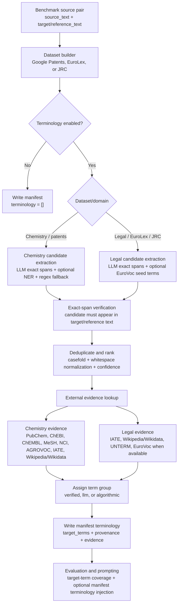

# Terminology Extraction

This document explains how benchmark terminology is created and used. The important design decision
is that terminology is generated during dataset creation, stored in each manifest row, and then reused
by translation prompts and terminology metrics.

The implementation lives in `src/chem_machine_translation/data/terminology.py`.

## Why We Extract Target-Side Terms

The benchmark datasets already contain a human/reference target translation. We use that target text
as the terminology source of truth:

- it avoids asking a model to invent source-to-target term mappings;
- every accepted term must be an exact span from the reference translation;
- terminology can be audited once when building the dataset;
- evaluation can score whether a translation preserved expected target terms without running a term
  extractor again.

For this reason, `source_term` is intentionally empty in the current manifest terminology records.
The useful fields are `target_terms`, `reference_candidates`, `term_group`, `source`, and
`verified_by`.

## Pipeline Overview



## Dataset Builder Entry Points

Terminology is attached when creating benchmark datasets from source-pair JSONL files:

- `scripts/build_google_patents_eval_subset.py`
  - chemistry/patent terminology;
  - enabled with `--extract-terminology`;
  - source-pair samples can be mirrored with `--bidirectional` for exact reverse
    source/target rows;
  - XLM-R/NOBI can be added with `--use-nobi-extractor`;
  - NLTK n-gram extraction can be added with `--use-nltk-extractor`;
  - spaCy tokenization/noun-chunk/entity extraction can be added with `--use-spacy-extractor`;
  - SPLADE/mSPLADE sparse-activation extraction can be added with `--use-msplade-extractor`;
  - the default Stanza/UD extractor can be disabled with `--no-stanza-extractor`;
  - optional evidence flags include `--pubchem-terminology`, `--chebi-terminology`,
    `--chembl-terminology`, `--mesh-terminology`, `--nci-terminology`,
    `--agrovoc-terminology`, `--iate-terminology`, and `--wikipedia-terminology`.
- `scripts/build_eurolex_eval_subset.py`
  - legal terminology;
  - enabled with `--extract-legal-terms`;
  - can include EuroVoc descriptor terms unless `--no-eurovoc-terminology` is passed;
  - optional evidence flags include `--iate-terminology`, `--wikipedia-terminology`, and
    `--unterm-terminology`.
- `scripts/build_jrc_acquis_eval_subset.py`
  - legal terminology for JRC-Acquis;
  - non-LLM target-side extraction is enabled with `--extract-stanza-terms`;
  - the default Stanza/UD extractor can be disabled with `--no-stanza-extractor`
    when testing only other target-side extractors;
  - XLM-R/NOBI can be added with `--use-nobi-extractor`;
  - NLTK n-gram extraction can be added with `--use-nltk-extractor`;
  - spaCy tokenization/noun-chunk/entity extraction can be added with `--use-spacy-extractor`;
  - SPLADE/mSPLADE sparse-activation extraction can be added with `--use-msplade-extractor`;
  - unique anchored target chunks can be parallelized with `--stanza-terminology-workers`;
  - optional evidence flags include `--iate-terminology`, `--wikipedia-terminology`,
    `--unterm-terminology`, `--pubchem-terminology`, `--chebi-terminology`,
    `--chembl-terminology`, `--mesh-terminology`, `--nci-terminology`, and
    `--agrovoc-terminology`.

The source-pair creation scripts do not extract terminology. They only create clean source/target
pairs. Terminology belongs to the dataset creation step because it is stored in benchmark manifests.

## Candidate Extraction Logic

### Chemistry and Patent Datasets

`DatasetTerminologyGenerator` builds target-side terminology for chemistry, patent, and JRC rows.
When enabled, it can combine:

- an LLM target candidate extractor that returns exact target/reference spans only;
- Stanza/Universal Dependencies candidates from exact target/reference spans;
- optional XLM-R/NOBI token-classification candidates;
- optional NLTK n-gram candidates over exact target/reference spans;
- optional spaCy candidates. If `--spacy-model` is provided, the configured spaCy pipeline can
  contribute entities and noun chunks; otherwise the extractor falls back to a blank language tokenizer
  and exact-span token n-grams;
- optional SPLADE/mSPLADE sparse-activation candidates. SPLADE activations are used to score exact
  n-gram spans from the target/reference text, not as free-form generated terms;
- external verifier evidence from chemistry, biomedical, legal, and multilingual terminology sources.

The LLM is only a candidate extractor when explicitly enabled. It is instructed not to translate, normalize, rewrite,
lemmatize, or invent terms. Any returned term that cannot be found exactly in the reference text is
dropped.

### Legal Datasets

`LegalTerminologyGenerator` builds target-side terminology for EuroLex and JRC-Acquis rows. It uses:

- an LLM legal candidate extractor that returns exact target/reference spans only;
- optional EuroVoc descriptor terms for EuroLex when descriptor metadata is present;
- external legal/encyclopedic evidence from IATE, Wikipedia/Wikidata, UNTERM, and EuroVoc.

The legal extractor looks for terms that a legal translator should preserve consistently: legal
acts, institutions, agencies, procedures, rights, obligations, restrictions, sanctions, remedies,
programmes, funds, regulatory domains, and explicit defined terms.

## External Evidence

External terminology sources are used as evidence, not as replacement translations. The final
`target_terms` remain exact spans from the reference text.

Chemistry/patent evidence can come from:

- PubChem;
- ChEBI;
- ChEMBL;
- MeSH RDF;
- NCI Thesaurus;
- AGROVOC;
- IATE;
- Wikipedia/Wikidata.

Legal evidence can come from:

- IATE;
- Wikipedia/Wikidata;
- UNTERM;
- EuroVoc descriptor matches when EuroLex metadata is available.

When at least one external source confirms a term, the term becomes `term_group: "verified"` and the
source names are recorded in `verified_by`.

## Term Groups and Provenance

Every manifest term has a coarse `term_group` and a detailed `source`.

- `verified`: the term is an exact reference span with external evidence. This is the default group
  used by terminology metrics.
- `llm`: the term was proposed by the LLM and verified as an exact reference span, but no external
  evidence source confirmed it.
- `algorithmic`: the term came from regex or optional deterministic/model-based extractors rather
  than external terminology databases.

The detailed `source` field records provenance such as `llm_target+pubchem`,
`stanza_ud_dependency+iate`, `xlmr_nobi+chebi`, `nltk_ngram`, or `msplade_sparse`. The
`verified_by` field stores only the evidence sources, for example `["pubchem"]`, `["iate"]`, or
`["wikipedia", "unterm"]`.

## Manifest Shape

Each manifest row can include a `terminology` list. A term record looks like this:

```json
{
  "source_term": "",
  "target_terms": ["chlorure de sodium"],
  "reference_candidates": ["chlorure de sodium"],
  "external_candidates": {
    "pubchem": ["sodium chloride", "chlorure de sodium"]
  },
  "category": "chemical",
  "source": "llm_target+pubchem",
  "term_group": "verified",
  "verified_by": ["pubchem"],
  "confidence": 0.96,
  "decision": "keep_reference",
  "reason": "LLM-proposed exact target span verified in reference text."
}
```

Important fields:

- `source_term`: empty in the current target-side pipeline.
- `target_terms`: final accepted target terms used by prompts and metrics.
- `reference_candidates`: exact target/reference spans that were extracted.
- `external_candidates`: evidence returned by external terminology sources.
- `source`: detailed provenance of the extraction and evidence path.
- `term_group`: `verified`, `llm`, or `algorithmic`.
- `verified_by`: external sources that confirmed the term.
- `decision`: usually `keep_reference`; `preserve` is reserved for compact formulas, identifiers,
  symbols, and numeric/unit expressions.
- `confidence`: extractor confidence, increased slightly when external evidence is found.

The legacy `candidates` field is still written for compatibility and mirrors
`external_candidates`.

## Cache and Reproducibility

Terminology extraction can call LLMs and public terminology services, so dataset builders support
cache files:

- Google Patents: `--terminology-cache`;
- EuroLex/JRC legal terms: `--legal-terminology-cache`.

The cache key includes the reference text, target language, model, max term count, enabled evidence
sources, and relevant descriptor metadata. Reusing the cache avoids repeated LLM/API calls and keeps
dataset rebuilds stable.

## How Evaluation Uses Terminology

The evaluation script reads terminology from the manifest:

`scripts/evaluate_parallel_manifest.py`

By default, terminology metrics use only `verified` terms. To include other groups, pass
`--terminology-term-group` one or more times, for example:

```powershell
uv run --no-sync python scripts/evaluate_parallel_manifest.py `
  --dataset-dir benchmark_datasets/jrc_acquis_anchored_articles_250_per_pair `
  --output results/jrc_articles_eval.jsonl `
  --terminology-term-group verified `
  --terminology-term-group llm
```

The most appropriate terminology metric for this target-side setup is target-term coverage: it checks
whether accepted target terms appear in the model output. Metrics that require source-to-target term
alignment are less appropriate because `source_term` is intentionally empty.

## How Translation Prompts Use Terminology

Terminology can also be injected into one-shot translation prompts with:

```powershell
--use-manifest-terminology
```

The `ManifestTerminologyLayer` reads selected manifest terms and adds them to the translation prompt.
This is separate from terminology extraction itself:

- extraction happens once during dataset creation;
- prompt injection happens during evaluation/translation runs;
- metrics then score whether the model used the expected target terms.

## Current Limitations

The pipeline is intentionally conservative, but it has tradeoffs:

- it does not align source terms to target terms;
- terms are only as good as the reference text and external evidence sources;
- lower-resource languages may have less external terminology coverage;
- legal/JRC terms are often terminology-heavy but not chemistry-specific;
- full phrase-level legal concepts may be rejected if they are too broad or not exact spans.

This is still the preferred benchmark approach because it gives us auditable, reference-anchored
target terminology and avoids using hallucinated model translations as ground truth.
