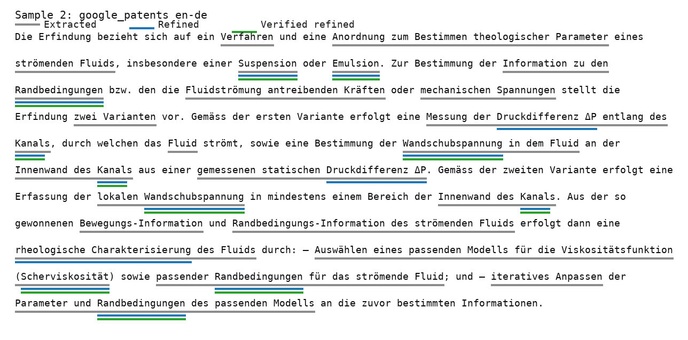
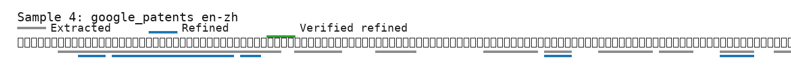
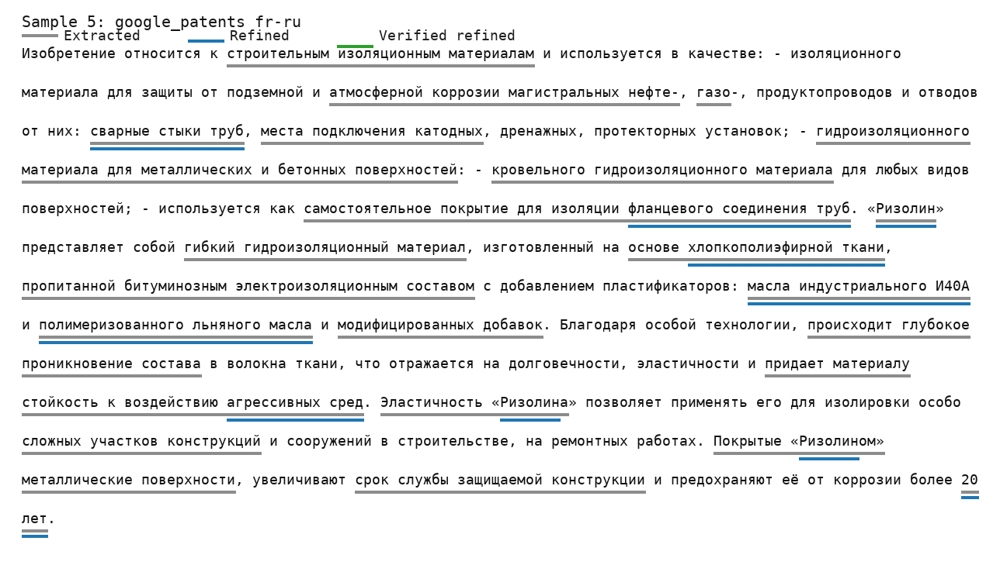

# Terminology Sample Audit

This audit shows candidate, refined, and verified-refined terminology spans for 10 multilingual samples. Underlines use three lanes: gray for all candidates, blue for refined terms, and green for verified refined terms.

The Google Patents chemistry samples are selected directly from the newer tracked source snapshot `benchmark_sources/google_patents_within_document_pairs_250_per_language_pair.jsonl` and then passed through the standard chemistry candidate extractor, verifier, and refiner flow.

## Summary

- Samples: 10
- Model: `gpt-4.1-mini`
- API mode: `responses`
- Total candidates: 397
- Total refined terms: 80
- Total verified refined terms: 51
- Total refiner time: 69.9s

## Sample 1: google_patents de-fr (French)

- Example: `within-document:abstract:de-fr:CH-707423-B1`
- Source snapshot: `benchmark_sources/google_patents_within_document_pairs_250_per_language_pair.jsonl`
- Source language: German
- Target language: French
- Approx source tokens: 163
- Counts: 40 candidates, 8 refined, 4 verified refined
- Refiner time: 7.8s

### Source Text

The present invention relates to new technical ceramics and a process for the preparation of these technical ceramics. The method of the invention for the production of a colored technical ceramic comprises the following steps: providing a composition comprising alumina, at least one pigment component and optionally binders, preparing a green body from this composition, optionally Delicate the green body, then subject the green body to treatment with a preparation containing one or more metals as another pigment component, and sinter the green body treated. The colored technical ceramic of the present invention consists of alumina as a technical ceramic, the technical ceramic comprising a first colored zone and a second colored zone of a different color, where the first colored zone contains a first pigment component, and the second colored area contains a second pigment component in association with the first pigment component.

### Target Text

La présente invention concerne de nouvelles céramiques techniques et un procédé de préparation de ces céramiques techniques. Le procédé de l’invention pour la production d’une céramique technique colorée comprend les étapes suivantes: fournir une composition comprenant de l’alumine, au moins un composant pigment et facultativement des liants, préparer un corps vert à partir de cette composition, facultativement délianter le corps vert, puis soumettre le corps vert à un traitement avec une préparation contenant un ou plusieurs métaux comme autre composant pigment, et fritter le corps vert traité. La céramique technique colorée de la présente invention consiste en de l’alumine comme céramique technique, la céramique technique comprenant une première zone colorée et une seconde zone colorée d’une couleur différente, où la première zone colorée contient un premier composant pigment, et la seconde zone colorée contient un second composant pigment en association avec le premier composant pigment.

### Candidates By Extractor

The same candidate can appear under multiple extractors when deduplication merged the same exact target span from several sources.

#### LLM chemistry extractor (`llm_target`; 14 candidates)

- `composition` [material; verified by mesh, nci, agrovoc, iate]
- `alumine` [chemical; verified by wikipedia]
- `fritter` [process; verified by iate, wikipedia]
- `céramiques techniques` [material; verified by iate]
- `céramique technique colorée` [material]
- `composant pigment` [material]
- `corps vert` [material]
- `traitement` [process; verified by agrovoc, iate]
- `procédé de préparation` [process]
- `liants` [material]
- `préparation contenant un ou plusieurs métaux` [material]
- `première zone colorée` [material]
- `seconde zone colorée` [material]
- `délianter` [process]

#### Stanza/UD dependency extractor (`stanza_ud_dependency`; 15 candidates)

- `composant pigment` [material]
- `corps vert` [material]
- `première zone colorée` [material]
- `seconde zone colorée` [material]
- `céramique technique` [other; verified by iate]
- `nouvelles céramiques techniques` [other]
- `premier composant pigment` [other]
- `présente invention` [other]
- `étapes suivantes` [other]
- `première zone` [other]
- `procédé de préparation de ces céramiques` [other]
- `seconde zone colorée d’une couleur différente` [other]
- `second composant pigment en association` [other]
- `procédé de l’invention pour la production d’une céramique` [other]
- `céramique technique colorée de la présente invention` [other]

#### Stanza/UD relaxed n-gram extractor (`stanza_ud_ngram`; 18 candidates)

- `céramiques techniques` [material; verified by iate]
- `céramique technique colorée` [material]
- `composant pigment` [material]
- `corps vert` [material]
- `procédé de préparation` [process]
- `première zone colorée` [material]
- `céramique technique` [other; verified by iate]
- `nouvelles céramiques techniques` [other]
- `premier composant pigment` [other]
- `présente invention` [other]
- `étapes suivantes` [other]
- `première zone` [other]
- `procédé de préparation de ces céramiques` [other]
- `second composant pigment en association` [other]
- `second composant pigment` [other]
- `autre composant pigment` [other]
- `métaux comme autre composant pigment` [other]
- `nouvelles céramiques` [other]

#### XLM-R/NOBI token-classification extractor (`xlmr_nobi`; 1 candidate)

- `alumine` [chemical; verified by wikipedia]

#### spaCy token n-gram extractor (`spacy_ngram`; 23 candidates)

- `composition` [material; verified by mesh, nci, agrovoc, iate]
- `céramiques techniques` [material; verified by iate]
- `céramique technique colorée` [material]
- `composant pigment` [material]
- `corps vert` [material]
- `traitement` [process; verified by agrovoc, iate]
- `seconde zone colorée` [material]
- `céramique technique` [other; verified by iate]
- `nouvelles céramiques techniques` [other]
- `présente invention` [other]
- `céramique technique comprenant` [other]
- `présente invention concerne` [other]
- `présente invention consiste` [other]
- `technique colorée comprend` [other]
- `second composant pigment` [other]
- `zone colorée contient` [other]
- `corps vert traité` [other]
- `facultativement délianter` [other]
- `composition comprenant` [other]
- `préparation contenant` [other]
- `nouvelles céramiques` [other]
- `technique comprenant` [other]
- `invention concerne` [other]

### Refined Terms

- `alumine` [chemical; verified by wikipedia]
- `fritter` [process; verified by iate, wikipedia]
- `céramiques techniques` [material; verified by iate]
- `céramique technique colorée` [material]
- `composant pigment` [material]
- `corps vert` [material]
- `traitement` [process; verified by agrovoc, iate]
- `procédé de préparation` [process]

### Verified Refined Terms

- `alumine` [chemical; verified by wikipedia]
- `fritter` [process; verified by iate, wikipedia]
- `céramiques techniques` [material; verified by iate]
- `traitement` [process; verified by agrovoc, iate]

## Sample 2: google_patents en-de (German)

- Example: `within-document:abstract:en-de:CH-703195-A2`
- Source snapshot: `benchmark_sources/google_patents_within_document_pairs_250_per_language_pair.jsonl`
- Source language: English
- Target language: German
- Approx source tokens: 130
- Counts: 40 candidates, 8 refined, 6 verified refined
- Refiner time: 6.3s

### Source Text

The method involves rotating a channel with rotation speed, where a mass portion of a fluid flows through the channel with average speed. Coriolis force acting on the flowing mass portion is measured, and mass flow is determined from the force. Wall shear stress in the fluid is determined from a pressure difference (delta P) along the channel. An appropriate model for shear viscosity and appropriate boundary conditions for the fluid are selected. A parameter and boundary conditions of the model are iteratively adjusted based on the force, mass flow, pressure difference and wall shear stress. An independent claim is also included for an arrangement for determining a rheological parameter of a flowing fluid.

### Target Text

Die Erfindung bezieht sich auf ein Verfahren und eine Anordnung zum Bestimmen theologischer Parameter eines strömenden Fluids, insbesondere einer Suspension oder Emulsion. Zur Bestimmung der Information zu den Randbedingungen bzw. den die Fluidströmung antreibenden Kräften oder mechanischen Spannungen stellt die Erfindung zwei Varianten vor. Gemäss der ersten Variante erfolgt eine Messung der Druckdifferenz ΔP entlang des Kanals, durch welchen das Fluid strömt, sowie eine Bestimmung der Wandschubspannung in dem Fluid an der Innenwand des Kanals aus einer gemessenen statischen Druckdifferenz ΔP. Gemäss der zweiten Variante erfolgt eine Erfassung der lokalen Wandschubspannung in mindestens einem Bereich der Innenwand des Kanals. Aus der so gewonnenen Bewegungs-Information und Randbedingungs-Information des strömenden Fluids erfolgt dann eine rheologische Charakterisierung des Fluids durch: – Auswählen eines passenden Modells für die Viskositätsfunktion (Scherviskosität) sowie passender Randbedingungen für das strömende Fluid; und – iteratives Anpassen der Parameter und Randbedingungen des passenden Modells an die zuvor bestimmten Informationen.

### Candidates By Extractor

The same candidate can appear under multiple extractors when deduplication merged the same exact target span from several sources.

#### LLM chemistry extractor (`llm_target`; 18 candidates)

- `Wandschubspannung` [property; verified by wikipedia]
- `Scherviskosität` [property; verified by iate]
- `Suspension` [material; verified by chembl, mesh, nci, agrovoc, iate]
- `Parameter` [property; verified by mesh, nci, agrovoc, iate]
- `Emulsion` [material; verified by chembl, mesh, nci, agrovoc, iate]
- `Kanal` [equipment; verified by agrovoc, iate, wikipedia]
- `rheologische Charakterisierung` [process]
- `Viskositätsfunktion` [property]
- `Druckdifferenz ΔP` [property]
- `Verfahren` [process; verified by agrovoc, iate]
- `Randbedingungen` [property; verified by iate]
- `Anordnung` [equipment; verified by agrovoc, iate]
- `Kräfte` [property; verified by agrovoc]
- `iteratives Anpassen` [process]
- `Fluidströmung` [process]
- `Randbedingungs-Information` [property]
- `Bewegungs-Information` [property]
- `Innenwand des Kanals` [equipment]

#### Stanza/UD dependency extractor (`stanza_ud_dependency`; 18 candidates)

- `Innenwand des Kanals` [equipment]
- `Parameter und Randbedingungen des passenden Modells` [other]
- `rheologische Charakterisierung des Fluids` [other]
- `Information zu den Randbedingungen` [other]
- `Fluidströmung antreibenden Kräften` [other]
- `Wandschubspannung in dem Fluid` [other]
- `lokalen Wandschubspannung` [other]
- `mechanischen Spannungen` [other]
- `strömenden Fluids` [other]
- `passenden Modells` [other]
- `zwei Varianten` [other]
- `Messung der Druckdifferenz ΔP entlang des Kanals` [other]
- `Druckdifferenz ΔP entlang des Kanals` [other]
- `Auswählen eines passenden Modells für die Viskositätsfunktion` [other]
- `Randbedingungs-Information des strömenden Fluids` [other]
- `Anordnung zum Bestimmen theologischer Parameter` [other]
- `passenden Modells für die Viskositätsfunktion (Scherviskosität` [other]
- `passender Randbedingungen für das strömende Fluid` [other]

#### Stanza/UD relaxed n-gram extractor (`stanza_ud_ngram`; 18 candidates)

- `rheologische Charakterisierung` [process]
- `Druckdifferenz ΔP` [property]
- `Innenwand des Kanals` [equipment]
- `rheologische Charakterisierung des Fluids` [other]
- `Information zu den Randbedingungen` [other]
- `Fluidströmung antreibenden Kräften` [other]
- `Wandschubspannung in dem Fluid` [other]
- `lokalen Wandschubspannung` [other]
- `mechanischen Spannungen` [other]
- `strömenden Fluids` [other]
- `passenden Modells` [other]
- `zwei Varianten` [other]
- `Druckdifferenz ΔP entlang des Kanals` [other]
- `Anordnung zum Bestimmen theologischer Parameter` [other]
- `passender Randbedingungen für das strömende Fluid` [other]
- `gemessenen statischen Druckdifferenz ΔP` [other]
- `statischen Druckdifferenz ΔP` [other]
- `gemessenen statischen Druckdifferenz` [other]

#### XLM-R/NOBI token-classification extractor (`xlmr_nobi`; 3 candidates)

- `Wandschubspannung` [property; verified by wikipedia]
- `Fluid` [other; verified by chembl, mesh, nci, agrovoc, iate]
- `Druckdifferenz` [other; verified by iate]

#### spaCy token n-gram extractor (`spacy_ngram`; 16 candidates)

- `Wandschubspannung` [property; verified by wikipedia]
- `Scherviskosität` [property; verified by iate]
- `rheologische Charakterisierung` [process]
- `Viskositätsfunktion` [property]
- `Druckdifferenz ΔP` [property]
- `Randbedingungen` [property; verified by iate]
- `iteratives Anpassen` [process]
- `Randbedingungs-Information` [property]
- `Bewegungs-Information` [property]
- `Fluidströmung antreibenden Kräften` [other]
- `lokalen Wandschubspannung` [other]
- `mechanischen Spannungen` [other]
- `strömenden Fluids` [other]
- `passenden Modells` [other]
- `statischen Druckdifferenz ΔP` [other]
- `gemessenen statischen Druckdifferenz` [other]

### Refined Terms

- `Wandschubspannung` [property; verified by wikipedia]
- `Scherviskosität` [property; verified by iate]
- `Suspension` [material; verified by chembl, mesh, nci, agrovoc, iate]
- `Emulsion` [material; verified by chembl, mesh, nci, agrovoc, iate]
- `Kanal` [equipment; verified by agrovoc, iate, wikipedia]
- `rheologische Charakterisierung` [process]
- `Druckdifferenz ΔP` [property]
- `Randbedingungen` [property; verified by iate]

### Verified Refined Terms

- `Wandschubspannung` [property; verified by wikipedia]
- `Scherviskosität` [property; verified by iate]
- `Suspension` [material; verified by chembl, mesh, nci, agrovoc, iate]
- `Emulsion` [material; verified by chembl, mesh, nci, agrovoc, iate]
- `Kanal` [equipment; verified by agrovoc, iate, wikipedia]
- `Randbedingungen` [property; verified by iate]

## Sample 3: google_patents en-fr (French)

- Example: `within-document:abstract:en-fr:BE-1013838-A6`
- Source snapshot: `benchmark_sources/google_patents_within_document_pairs_250_per_language_pair.jsonl`
- Source language: English
- Target language: French
- Approx source tokens: 130
- Counts: 40 candidates, 8 refined, 4 verified refined
- Refiner time: 6.2s

### Source Text

An edible paste product in solid or liquid form is made from plantain bananas with added ingredients. The solid product is made from unripe plantains boiled in water and mixed with oil or butter; the liquid product is made from ripe fruit mixed with 5 - 10 per cent by weight of wheat, manoic or potato flour, 0.1 - 1 per cent of a raising agent, 1 - 2 per cent oil or butter, 0.1 - 0.5 per cent of salt and/or spices and 8 - 15 per cent dairy protein. Other optional ingredients can include eggs or peanut butter.

### Target Text

La présente invention a pour objet: le procédé de transformation de la banane plantain en une pâte solide et une pâte liquide utilisables comme base de préparation des produits pâtissiers (pain, crêpes, gaufres, galettes, biscuits etc.) ainsi que des plats cuisinés(pizza, quiche, tarte, lituma etc. Les procédés de productions de ces produits et plats cuisinés les produits et plats cuisinés obtenus par la mise en oeuvre des présents procédés l'utilisation des produits et des plats cuisinés obtenus par la mise en oeuvre des présents procédés, dans la restauration rapide (fast-food) par des châines existantes ou à créer. La pâte liquide est obtenue par un mélange des bananes plantains mûres, de féculent, d'un agent levant, d'huile ou de beurre, des protèines de laitiers. La pâte solide est obtenue par pétrissage des bananes plantain quasi vertes, préalablement bouillies dans l'eau et ensuite mélangée à l'huile ou du beurre. Des garnitures préparées, à l'avance peuvent être déposées sur la pâte, afin de faire des plats cuisinés. La cuisson se fera dans un four, dans des moules ou sur des plaques appropriées.

### Candidates By Extractor

The same candidate can appear under multiple extractors when deduplication merged the same exact target span from several sources.

#### Stanza/UD dependency extractor (`stanza_ud_dependency`; 11 candidates)

- `pâte liquide utilisables` [other]
- `utilisation des produits` [other]
- `protèines de laitiers` [other]
- `plats cuisinés(pizza` [other]
- `présente invention` [other]
- `présents procédés` [other]
- `biscuits etc` [other]
- `pâte liquide` [other]
- `pâte solide` [other]
- `procédés de productions de ces produits et plats cuisinés les produits` [other]
- `fast-food` [other]

#### Stanza/UD relaxed n-gram extractor (`stanza_ud_ngram`; 23 candidates)

- `banane plantain` [other; verified by agrovoc, wikipedia]
- `pâte liquide utilisables` [other]
- `utilisation des produits` [other]
- `protèines de laitiers` [other]
- `présente invention` [other]
- `présents procédés` [other]
- `biscuits etc` [other]
- `pâte liquide` [other]
- `pâte solide` [other]
- `restauration rapide` [other; verified by agrovoc, iate]
- `agent levant` [other; verified by agrovoc, wikipedia]
- `bananes plantains mûres` [other]
- `bananes plantain quasi` [other]
- `plantain quasi vertes` [other]
- `fast-food` [other]
- `pâte liquide utilisables comme base` [other]
- `liquide utilisables` [other]
- `produits pâtissiers` [other]
- `plaques appropriées` [other]
- `châines existantes` [other]
- `bananes plantains` [other]
- `bananes plantain` [other]
- `plantains mûres` [other]

#### XLM-R/NOBI token-classification extractor (`xlmr_nobi`; 8 candidates)

- `pain` [other; verified by chembl, mesh, nci, agrovoc, iate, wikipedia]
- `fast` [other; verified by pubchem, mesh, nci, agrovoc, iate, wikipedia]
- `banane plantain` [other; verified by agrovoc, wikipedia]
- `plantain` [other; verified by chembl, nci, agrovoc, iate]
- `lituma` [other; verified by wikipedia]
- `huile` [other; verified by chembl, agrovoc, iate]
- `châines` [other]
- `plantains` [other; verified by agrovoc]

#### spaCy token n-gram extractor (`spacy_ngram`; 28 candidates)

- `banane plantain` [other; verified by agrovoc, wikipedia]
- `pâte liquide utilisables` [other]
- `plats cuisinés(pizza` [other]
- `présente invention` [other]
- `présents procédés` [other]
- `biscuits etc` [other]
- `pâte liquide` [other]
- `pâte solide` [other]
- `restauration rapide` [other; verified by agrovoc, iate]
- `agent levant` [other; verified by agrovoc, wikipedia]
- `bananes plantains mûres` [other]
- `bananes plantain quasi` [other]
- `plats cuisinés obtenus` [other]
- `plantain quasi vertes` [other]
- `préalablement bouillies` [other]
- `garnitures préparées` [other]
- `liquide utilisables` [other]
- `produits pâtissiers` [other]
- `plaques appropriées` [other]
- `châines existantes` [other]
- `bananes plantains` [other]
- `bananes plantain` [other]
- `cuisinés obtenus` [other]
- `ensuite mélangée` [other]
- `plantains mûres` [other]
- `plats cuisinés` [other]
- `plantain quasi` [other]
- `quasi vertes` [other]

### Refined Terms

- `pain` [other; verified by chembl, mesh, nci, agrovoc, iate, wikipedia]
- `banane plantain` [other; verified by agrovoc, wikipedia]
- `lituma` [other; verified by wikipedia]
- `huile` [other; verified by chembl, agrovoc, iate]
- `châines` [other]
- `protèines de laitiers` [other]
- `pâte liquide` [other]
- `pâte solide` [other]

### Verified Refined Terms

- `pain` [other; verified by chembl, mesh, nci, agrovoc, iate, wikipedia]
- `banane plantain` [other; verified by agrovoc, wikipedia]
- `lituma` [other; verified by wikipedia]
- `huile` [other; verified by chembl, agrovoc, iate]

## Sample 4: google_patents en-zh (Chinese)

- Example: `within-document:abstract:en-zh:CN-1003094-B`
- Source snapshot: `benchmark_sources/google_patents_within_document_pairs_250_per_language_pair.jsonl`
- Source language: English
- Target language: Chinese
- Approx source tokens: 147
- Counts: 40 candidates, 8 refined, 1 verified refined
- Refiner time: 7.3s

### Source Text

The invention provides a device for non-contact testing of minority carrier lifetime and resistivity of a semiconductor material by using a dielectric waveguide and an infrared light source. The device has the advantages that the test result is consistent with that of the conventional contact method, the operation is simple and convenient, and the minority carrier lifetime of the flaky samples with different thicknesses and the difference of the minority carrier lifetime of different parts on the same sample are measured. The non-contact test is especially suitable for polishing sheets, ion implantation sheets and semiconductor sheets subjected to various chemical treatments, and can achieve no damage and no contamination. The method can be used as an important means for material inspection and process monitoring in the production process of integrated circuits and semiconductor devices.

### Target Text

本发明提供了一种用介质波导加红外光源非接触测试半导体材料少子寿命及电阻率的装置。该装置的测试结果与常规的有接触方法一致、操作简便，能够测量不同厚度片状样品的少子寿命以及同一样品上不同部位少于寿命的差异。由于是非接触测试，对于抛光片、离子注入片以及经过各种化学处理的半导体薄片尤为适宜，能够做到无损伤、无沾污。在集成电路、半导体器件的生产过程中可用作材料检验和工艺监控的重要手段。

### Candidates By Extractor

The same candidate can appear under multiple extractors when deduplication merged the same exact target span from several sources.

#### LLM chemistry extractor (`llm_target`; 17 candidates)

- `半导体器件` [material; verified by wikipedia]
- `半导体材料` [material]
- `半导体薄片` [material]
- `介质波导` [material]
- `红外光源` [equipment]
- `少子寿命` [property]
- `集成电路` [material]
- `电阻率` [property]
- `非接触测试` [method]
- `离子注入片` [material]
- `化学处理` [process]
- `抛光片` [material]
- `无损伤` [property]
- `无沾污` [property]
- `片状样品` [material]
- `材料检验` [process]
- `工艺监控` [process]

#### Stanza/UD dependency extractor (`stanza_ud_dependency`; 14 candidates)

- `半导体器件` [material; verified by wikipedia]
- `半导体薄片` [material]
- `介质波导` [material]
- `化学处理` [process]
- `工艺监控` [process]
- `一种用介质波导加红外光源非接触测试半导体材料少子寿命及电阻率的装置` [other]
- `寿命的差异` [other]
- `不同厚度` [other]
- `接触测试` [other]
- `外光源` [other]
- `一样` [other]
- `装置的测试结果` [other]
- `材料检验和工艺监控的重要手段` [other]
- `样品上不同部位` [other]

#### Stanza/UD relaxed n-gram extractor (`stanza_ud_ngram`; 26 candidates)

- `半导体器件` [material; verified by wikipedia]
- `半导体薄片` [material]
- `介质波导` [material]
- `化学处理` [process]
- `工艺监控` [process]
- `寿命的差异` [other]
- `不同厚度` [other]
- `接触测试` [other]
- `外光源` [other]
- `一样` [other]
- `装置的测试结果` [other]
- `样品上不同部位` [other]
- `介质波导加红外光源` [other]
- `半导体材料少子寿命` [other]
- `不同厚度片状样品` [other]
- `介质波导加红外` [other]
- `波导加红外光源` [other]
- `半导体材料少子` [other]
- `介质波导加红` [other]
- `材料少子寿命` [other]
- `接触方法一致` [other]
- `不同厚度片状` [other]
- `厚度片状样品` [other]
- `波导加红外` [other]
- `加红外光源` [other]
- `不同部位少` [other]

### Refined Terms

- `半导体器件` [material; verified by wikipedia]
- `半导体材料` [material]
- `介质波导` [material]
- `红外光源` [equipment]
- `少子寿命` [property]
- `集成电路` [material]
- `电阻率` [property]
- `非接触测试` [method]

### Verified Refined Terms

- `半导体器件` [material; verified by wikipedia]

## Sample 5: google_patents fr-ru (Russian)

- Example: `within-document:abstract:fr-ru:WO-2010095916-A1`
- Source snapshot: `benchmark_sources/google_patents_within_document_pairs_250_per_language_pair.jsonl`
- Source language: French
- Target language: Russian
- Approx source tokens: 193
- Counts: 40 candidates, 8 refined, 0 verified refined
- Refiner time: 5.9s

### Source Text

L’invention concerne des matériaux de construction utilisés pour l’isolation et plus particulièrement un matériau d’isolation électrique et hydraulique « Rizolin », utilisé dans des tuyauteries pour protéger les surfaces contre la corrosion ainsi en tant que matériau de couverture pour tout type de surfaces, fabriqué à partir d’un tissu de coton / polyester imprégné d’une composition isolant l’électricité à base de bitume, avec le rapport de composants suivant, en % en masse : bitume de pétrole utilisé dans la construction BN 90/10, 20 %; bitume de pétrole utilisé sur les chaussées BN 60/90 ou BND 90/130, 72 %; huile industrielle I40A ou I80, 4 %; huile de lin polymérisée, 2 %; et additifs modifiants, 2 %. Le matériau obtenu est durable, élastique et résistant face aux milieux agressifs.

### Target Text

Изобретение относится к строительным изоляционным материалам и используется в качестве: - изоляционного материала для защиты от подземной и атмосферной коррозии магистральных нефте-, газо-, продуктопроводов и отводов от них: сварные стыки труб, места подключения катодных, дренажных, протекторных установок; - гидроизоляционного материала для металлических и бетонных поверхностей: - кровельного гидроизоляционного материала для любых видов поверхностей; - используется как самостоятельное покрытие для изоляции фланцевого соединения труб. «Pизoлин» представляет собой гибкий гидроизоляционный материал, изготовленный на основе хлопкополиэфирной ткани, пропитанной битуминозным электроизоляционным составом с добавлением пластификаторов: масла индустриального И40A и полимеризованного льняного масла и модифицированных добавок. Благодаря особой технологии, происходит глубокое проникновение состава в волокна ткани, что отражается на долговечности, эластичности и придает материалу стойкость к воздействию агрессивных сред. Эластичность «Pизoлинa» позволяет применять его для изолировки особо сложных участков конструкций и сооружений в строительстве, на ремонтных работах. Покрытые «Pизoлинoм» металлические поверхности, увеличивают срок службы защищаемой конструкции и предохраняют её от коррозии более 20 лет.

### Candidates By Extractor

The same candidate can appear under multiple extractors when deduplication merged the same exact target span from several sources.

#### Stanza/UD dependency extractor (`stanza_ud_dependency`; 20 candidates)

- `масла индустриального И40A` [other]
- `индустриального И40A` [other]
- `Покрытые «Pизoлинoм» металлические поверхности` [other]
- `срок службы защищаемой конструкции` [other]
- `гибкий гидроизоляционный материал` [other]
- `полимеризованного льняного масла` [other]
- `службы защищаемой конструкции` [other]
- `сложных участков конструкций` [other]
- `фланцевого соединения труб` [other]
- `модифицированных добавок` [other]
- `хлопкополиэфирной ткани` [other]
- `Эластичность «Pизoлинa` [other]
- `защищаемой конструкции` [other]
- `магистральных нефте-` [other]
- `сварные стыки труб` [other]
- `агрессивных сред` [other]
- `20 лет` [other]
- `стойкость к воздействию агрессивных сред` [other]
- `гидроизоляционного материала для металлических и бетонных поверхностей` [other]
- `самостоятельное покрытие для изоляции фланцевого соединения` [other]

#### Stanza/UD relaxed n-gram extractor (`stanza_ud_ngram`; 25 candidates)

- `масла индустриального И40A` [other]
- `индустриального И40A` [other]
- `гибкий гидроизоляционный материал` [other]
- `полимеризованного льняного масла` [other]
- `сложных участков конструкций` [other]
- `фланцевого соединения труб` [other]
- `хлопкополиэфирной ткани` [other]
- `магистральных нефте-` [other]
- `сварные стыки труб` [other]
- `агрессивных сред` [other]
- `20 лет` [other]
- `стойкость к воздействию агрессивных сред` [other]
- `самостоятельное покрытие для изоляции фланцевого соединения` [other]
- `атмосферной коррозии магистральных нефте-` [other]
- `изоляции фланцевого соединения труб` [other]
- `битуминозным электроизоляционным составом` [other]
- `кровельного гидроизоляционного материала` [other]
- `строительным изоляционным материалам` [other]
- `атмосферной коррозии магистральных` [other]
- `изоляции фланцевого соединения` [other]
- `основе хлопкополиэфирной ткани` [other]
- `глубокое проникновение состава` [other]
- `коррозии магистральных нефте-` [other]
- `воздействию агрессивных сред` [other]
- `места подключения катодных` [other]

#### XLM-R/NOBI token-classification extractor (`xlmr_nobi`; 5 candidates)

- `нефте` [other]
- `газо` [other]
- `Pизoлин` [other]
- `труб` [other]
- `масла` [other]

#### spaCy token n-gram extractor (`spacy_ngram`; 22 candidates)

- `масла индустриального И40A` [other]
- `гибкий гидроизоляционный материал` [other]
- `полимеризованного льняного масла` [other]
- `службы защищаемой конструкции` [other]
- `сложных участков конструкций` [other]
- `фланцевого соединения труб` [other]
- `модифицированных добавок` [other]
- `хлопкополиэфирной ткани` [other]
- `сварные стыки труб` [other]
- `пропитанной битуминозным электроизоляционным` [other]
- `битуминозным электроизоляционным составом` [other]
- `кровельного гидроизоляционного материала` [other]
- `строительным изоляционным материалам` [other]
- `атмосферной коррозии магистральных` [other]
- `происходит глубокое проникновение` [other]
- `изоляции фланцевого соединения` [other]
- `основе хлопкополиэфирной ткани` [other]
- `глубокое проникновение состава` [other]
- `коррозии магистральных нефте-` [other]
- `воздействию агрессивных сред` [other]
- `придает материалу стойкость` [other]
- `места подключения катодных` [other]

### Refined Terms

- `Pизoлин` [other]
- `масла индустриального И40A` [other]
- `полимеризованного льняного масла` [other]
- `фланцевого соединения труб` [other]
- `хлопкополиэфирной ткани` [other]
- `сварные стыки труб` [other]
- `агрессивных сред` [other]
- `20 лет` [other]

### Verified Refined Terms

- None

## Sample 6: jrc_acquis de-es (Spanish)

- Example: `de-es:jrc21987A0207_06:chunk-0143`
- Source language: German
- Target language: Spanish
- Approx source tokens: 339
- Counts: 32 candidates, 8 refined, 8 verified refined
- Refiner time: 5.8s

### Source Text

ZUSATZPROTOKOLL ZU DEM EUROPÄISCHEN ÜBEREINKOMMEN über den Austausch von Reagenzien zur Blutgruppenbestimmung DIE MITGLIEDSTAATEN DES EUROPARATS, die Vertragsparteien des Europäischen Übereinkommens vom 14. Mai 1962 über den Austausch von Reagenzien zur Blutgruppenbestimmung sind (im folgenden als "Übereinkommen" bezeichnet) - gestützt auf Artikel 5 Absatz 1 des Übereinkommens, wonach "die Vertragsparteien alle notwendigen Maßnahmen" treffen, "um die ihnen von den anderen Parteien zur Verfügung gestellten therapeutischen Substanzen menschlichen Ursprungs von allen Eingangsabgaben zu befreien"; in der Erwägung, daß für die Mitgliedstaaten der Europäischen Wirtschaftsgemeinschaft die Verpflichtung zur Gewährung dieser Befreiung in die Zuständigkeit der Gemeinschaft fällt, die nach dem Vertrag, durch den sie gegründet wurde, die hierzu erforderlichen Befugnisse besitzt; in der Erwägung, daß es zur Durchführung des Artikels 5 Absatz 1 des Übereinkommens erforderlich ist, daß die Europäische Wirtschaftsgemeinschaft Vertragspartei des Übereinkommens werden kann - SIND WIE FOLGT ÜBEREINGEKOMMEN: Die Europäische Wirtschaftsgemeinschaft kann Vertragspartei des Übereinkommens werden, indem sie es unterzeichnet. Das Übereinkommen tritt für die Gemeinschaft am ersten Tag des Monats in Kraft, der auf die Unterzeichnung folgt. (1) Dieses Zusatzprotokoll liegt für die Vertragsparteien des Übereinkommens zur Annahme auf. Es tritt am ersten Tag des Monats in Kraft, der auf den Tag folgt, an dem die letzte der Vertragsparteien ihre Annahmeurkunde beim Generalsekretär des Europarats hinterlegt hat. (2) Dieses Zusatzprotokoll tritt jedoch nach Ablauf von zwei Jahren nach dem Zeitpunkt in Kraft, zu dem es zur Annahme aufgelegt wurde, sofern nicht eine der Vertragsparteien einen Einwand gegen sein Inkrafttreten notifiziert hat. Ist ein solcher Einwand notifiziert worden, so findet Absatz 1 Anwendung. Vom Zeitpunkt seines Inkrafttretens an ist dieses Zusatzprotokoll Bestandteil des Übereinkommens. Von diesem Zeitpunkt an kann ein Staat nicht Vertragspartei des Übereinkommens werden, ohne gleichzeitig Vertragspartei des Zusatzprotokolls zu werden. Der Generalsekretär des Europarats notifiziert den Mitgliedstaaten des Europarats, allen dem Übereinkommen beigetretenen Staaten und der Europäischen Wirtschaftsgemeinschaft jede Annahme bzw. jeden Einwand im Sinne des Artikels 2 sowie den Zeitpunkt des Inkrafttretens dieses Zusatzprotokolls nach Artikel 2. Der Generalsekretär notifiziert der Europäischen Wirtschaftsgemeinschaft auch jede Handlung, Notifikation oder Mitteilung im Zusammenhang mit diesem Übereinkommen.

### Target Text

PROTOCOLO ADICIONAL AL ACUERDO EUROPEO SOBRE INTERCAMBIO de Reactivos para la Determinación de los grupos sanguíneos LOS ESTADOS MIEMBROS DEL CONSEJO DE EUROPA, Partes Contratantes en el Acuerdo Europeo de 14 de mayo de 1962, relativo al intercambio de Reactivos para la Determinación de los Grupos Sanguíneos denominado en lo sucesivo «el Acuerdo», Vistas las disposiciones del apartado 1 del artículo 5 del Acuerdo, que establecen que «las Partes Contratantes adoptarán cuantas medidas fueren necesarias a fin de eximir de cualesquiera derechos de importación los reactivos para determinación de grupos sanguíneos puestos a disposición por las demás partes», Considerando que, por lo que se refiere a los Estados Miembros de la Comunidad Económica Europea, el compromiso de conceder dicha exención es de la competencia de dicha Comunidad, la cual dispone de los poderes necesarios a ese respecto, en virtud de lo dispuesto en su Tratado constitutivo; Considerando, por consiguiente, que para los fines de la aplicación del apartado 1 del artículo 5 del Acuerdo es necesario que la Comunidad Económica Europea pueda ser Parte Contratante en el Acuerdo, HAN CONVENIDO LO SIGUIENTE: 1. La Comunidad Económica Europea podrá ser Parte Contratante en el Acuerdo mediante la firma del mismo. Es Acuerdo entrará en vigor, respecto de la Comunidad, el primer día del mes siguiente a la firma. 1. El Presente Protocolo Adicional estará abierto a la aceptación de las Partes Contratantes en el Acuerdo. Entrará en vigor el primer día del mes siguiente a la fecha en que la última de las Partes Contratantes haya depositado su instrumento de aceptación en manos del Secretario General del Consejo de Europa. 2. No obstante, el presente Protocolo Adicional entrará en vigor a la expiración de un período de dos años, a partir de la fecha en que haya quedado abierto a la aceptación, salvo que una de las Partes Contratantes notificase una objeción a su entrada en vigor. Cuando se hubiere notificado una objeción de esa clase, se aplicará el apartado primero del presente artículo. Desde la fecha de su entrada en vigor, el presente Protocolo Adicional formará parte integrante del Acuerdo. A partir de dicha fecha, ningún Estado podrá ser Parte Contratante en el Acuerdo sin ser al mismo tiempo Parte Contratante en el Protocolo Adicional. El Secretario General del Consejo de Europa notificará a los Estados Miembros del Consejo de Europa o a todo Estado que se hubiere adherido al Acuerdo y a la Comunidad Económica Europea cualquier aceptación y objeción formulada en virtud del artículo 2 y la fecha de entrada en vigor del presente Protocolo Adicional, de conformidad con lo dispuesto en el artículo 2. El Secretario General notificará, asimismo, a la Comunidad Económica Europea cualquier acto, notificación o comunicación que esté relacionada con el Acuerdo.

### Candidates By Extractor

The same candidate can appear under multiple extractors when deduplication merged the same exact target span from several sources.

#### LLM legal extractor (`legal_llm`; 15 candidates)

- `Comunidad Económica Europea` [other; verified by iate, wikipedia]
- `PROTOCOLO ADICIONAL` [legal_act; verified by iate]
- `Partes Contratantes` [defined_term; verified by iate]
- `ACUERDO EUROPEO` [legal_act; verified by iate]
- `instrumento de aceptación` [procedure; verified by iate]
- `derechos de importación` [obligation; verified by iate]
- `Tratado constitutivo` [legal_act; verified by iate]
- `entrada en vigor` [legal_act; verified by iate]
- `notificación` [procedure; verified by iate]
- `aceptación` [procedure; verified by iate]
- `objeción` [remedy; verified by iate]
- `Secretario General del Consejo de Europa` [institution]
- `medidas` [obligation; verified by iate]
- `reactivos para determinación de grupos sanguíneos` [other]
- `período de dos años` [restriction]

#### XLM-R/NOBI token-classification extractor (`xlmr_nobi`; 4 candidates)

- `Comunidad Económica Europea` [other; verified by iate, wikipedia]
- `Consejo de Europa` [other; verified by agrovoc, iate, wikipedia]
- `Adicional` [other; verified by agrovoc]
- `General` [other; verified by mesh, nci, agrovoc, wikipedia]

#### spaCy named-entity extractor (`spacy_entity`; 17 candidates)

- `Comunidad Económica Europea` [other; verified by iate, wikipedia]
- `PROTOCOLO ADICIONAL` [legal_act; verified by iate]
- `Partes Contratantes` [defined_term; verified by iate]
- `Consejo de Europa` [other; verified by agrovoc, iate, wikipedia]
- `Tratado constitutivo` [legal_act; verified by iate]
- `Contratante` [other; verified by agrovoc, iate]
- `Comunidad` [other; verified by agrovoc, iate]
- `MIEMBROS` [other; verified by agrovoc, iate]
- `Secretario General` [other; verified by iate]
- `Considerando` [other; verified by iate]
- `EUROPEO` [other; verified by agrovoc]
- `Determinación de los Grupos Sanguíneos` [other]
- `Presente Protocolo Adicional` [other]
- `disposiciones del apartado` [other]
- `INTERCAMBIO de Reactivos para la Determinación` [other]
- `Reactivos` [other]
- `CONVENIDO` [other]

#### spaCy noun-chunk extractor (`spacy_noun_chunk`; 9 candidates)

- `Comunidad Económica Europea` [other; verified by iate, wikipedia]
- `PROTOCOLO ADICIONAL` [legal_act; verified by iate]
- `Partes Contratantes` [defined_term; verified by iate]
- `Secretario General del Consejo de Europa` [institution]
- `Contratante` [other; verified by agrovoc, iate]
- `Comunidad` [other; verified by agrovoc, iate]
- `Presente Protocolo Adicional` [other]
- `presente artículo` [other]
- `dicha fecha` [other]

#### spaCy token n-gram extractor (`spacy_ngram`; 17 candidates)

- `Comunidad Económica Europea` [other; verified by iate, wikipedia]
- `PROTOCOLO ADICIONAL` [legal_act; verified by iate]
- `Partes Contratantes` [defined_term; verified by iate]
- `Consejo de Europa` [other; verified by agrovoc, iate, wikipedia]
- `Tratado constitutivo` [legal_act; verified by iate]
- `Contratante` [other; verified by agrovoc, iate]
- `Comunidad` [other; verified by agrovoc, iate]
- `MIEMBROS` [other; verified by agrovoc, iate]
- `Secretario General` [other; verified by iate]
- `Considerando` [other; verified by iate]
- `EUROPEO` [other; verified by agrovoc]
- `Presente Protocolo Adicional` [other]
- `disposiciones del apartado` [other]
- `Reactivos` [other]
- `CONVENIDO` [other]
- `presente artículo` [other]
- `dicha fecha` [other]

### Refined Terms

- `Comunidad Económica Europea` [other; verified by iate, wikipedia]
- `PROTOCOLO ADICIONAL` [legal_act; verified by iate]
- `Partes Contratantes` [defined_term; verified by iate]
- `Consejo de Europa` [other; verified by agrovoc, iate, wikipedia]
- `ACUERDO EUROPEO` [legal_act; verified by iate]
- `instrumento de aceptación` [procedure; verified by iate]
- `derechos de importación` [obligation; verified by iate]
- `Tratado constitutivo` [legal_act; verified by iate]

### Verified Refined Terms

- `Comunidad Económica Europea` [other; verified by iate, wikipedia]
- `PROTOCOLO ADICIONAL` [legal_act; verified by iate]
- `Partes Contratantes` [defined_term; verified by iate]
- `Consejo de Europa` [other; verified by agrovoc, iate, wikipedia]
- `ACUERDO EUROPEO` [legal_act; verified by iate]
- `instrumento de aceptación` [procedure; verified by iate]
- `derechos de importación` [obligation; verified by iate]
- `Tratado constitutivo` [legal_act; verified by iate]

## Sample 7: jrc_acquis es-en (English)

- Example: `es-en:jrc21987A0207_06:chunk-0182`
- Source language: Spanish
- Target language: English
- Approx source tokens: 456
- Counts: 40 candidates, 8 refined, 6 verified refined
- Refiner time: 10.2s

### Source Text

PROTOCOLO ADICIONAL AL ACUERDO EUROPEO SOBRE INTERCAMBIO de Reactivos para la Determinación de los grupos sanguíneos LOS ESTADOS MIEMBROS DEL CONSEJO DE EUROPA, Partes Contratantes en el Acuerdo Europeo de 14 de mayo de 1962, relativo al intercambio de Reactivos para la Determinación de los Grupos Sanguíneos denominado en lo sucesivo «el Acuerdo», Vistas las disposiciones del apartado 1 del artículo 5 del Acuerdo, que establecen que «las Partes Contratantes adoptarán cuantas medidas fueren necesarias a fin de eximir de cualesquiera derechos de importación los reactivos para determinación de grupos sanguíneos puestos a disposición por las demás partes», Considerando que, por lo que se refiere a los Estados Miembros de la Comunidad Económica Europea, el compromiso de conceder dicha exención es de la competencia de dicha Comunidad, la cual dispone de los poderes necesarios a ese respecto, en virtud de lo dispuesto en su Tratado constitutivo; Considerando, por consiguiente, que para los fines de la aplicación del apartado 1 del artículo 5 del Acuerdo es necesario que la Comunidad Económica Europea pueda ser Parte Contratante en el Acuerdo, HAN CONVENIDO LO SIGUIENTE: 1. La Comunidad Económica Europea podrá ser Parte Contratante en el Acuerdo mediante la firma del mismo. Es Acuerdo entrará en vigor, respecto de la Comunidad, el primer día del mes siguiente a la firma. El Presente Protocolo Adicional estará abierto a la aceptación de las Partes Contratantes en el Acuerdo. Entrará en vigor el primer día del mes siguiente a la fecha en que la última de las Partes Contratantes haya depositado su instrumento de aceptación en manos del Secretario General del Consejo de Europa. No obstante, el presente Protocolo Adicional entrará en vigor a la expiración de un período de dos años, a partir de la fecha en que haya quedado abierto a la aceptación, salvo que una de las Partes Contratantes notificase una objeción a su entrada en vigor. Cuando se hubiere notificado una objeción de esa clase, se aplicará el apartado primero del presente artículo. Desde la fecha de su entrada en vigor, el presente Protocolo Adicional formará parte integrante del Acuerdo. A partir de dicha fecha, ningún Estado podrá ser Parte Contratante en el Acuerdo sin ser al mismo tiempo Parte Contratante en el Protocolo Adicional. El Secretario General del Consejo de Europa notificará a los Estados Miembros del Consejo de Europa o a todo Estado que se hubiere adherido al Acuerdo y a la Comunidad Económica Europea cualquier aceptación y objeción formulada en virtud del artículo 2 y la fecha de entrada en vigor del presente Protocolo Adicional, de conformidad con lo dispuesto en el artículo 2. El Secretario General notificará, asimismo, a la Comunidad Económica Europea cualquier acto, notificación o comunicación que esté relacionada con el Acuerdo.

### Target Text

ADDITIONAL PROTOCOL TO THE EUROPEAN AGREEMENT on the Exchanges of Blood-grouping Reagents THE MEMBER STATES OF THE COUNCIL OF EUROPE, Contracting Parties to the European Agreement of 14 May 1962 on the exchanges of blood-grouping reagents (hereinafter called "the Agreement"); Having regard to the provisions of Article 5, paragraph 1, of the Agreement, according to which 'The Contracting Parties shall take all necessary measures to exempt from all import duties the blood-grouping reagents placed at their disposal by the other Parties'; Considering that so far as the Member States of the European Economic Community are concerned, the undertaking to grant this exemption falls within the competence of the Community, which possesses the necessary powers in this respect by virtue of the Treaty which instituted it; Considering therefore that for the purpose of the implementation of Article 5, paragraph 1, of the Agreement, it is necessary for the European Economic Community to be able to become a Contracting Party to the Agreement, HAVE AGREED AS FOLLOWS: The European Economic Community may become a Contracting Party to the Agreement by signing it. In respect of the Community, the Agreement shall enter into force on the first day of the month following such signature. This Additional Protocol shall be open for acceptance by the Contracting Parties to the Agreement. It shall enter into force on the first day of the month following the date on which the last of the Contracting Parties has deposited its instrument of acceptance with the Secretary-General of the Council of Europe. However, this Additional Protocol shall enter into force on the expiration of a period of two years from the date on which it has been opened for acceptance, unless one of the Contracting Parties has notified an objection to the entry into force. If such an objection has been notified, paragraph 1 of this Article shall apply. From the date of its entry into force, this Additional Protocol shall form an integral part of the Agreement From that date, no State may become a Contracting Party to the Agreement without at the same time becoming a Contracting Party to the Additional Protocol. The Secretary-General of the Council of Europe shall notify the member States of the Council of Europe, any State having acceded to the Agreement and the European Economic Community of any acceptance o objection made under Article 2 and of the date of entry into force of this Additional Protocol in accordance with Article 2. The Secretary-General shall also notify the European Economic Community of any act, notification o communication relating to the Agreement.

### Candidates By Extractor

The same candidate can appear under multiple extractors when deduplication merged the same exact target span from several sources.

#### LLM legal extractor (`legal_llm`; 18 candidates)

- `Secretary-General of the Council of Europe` [institution]
- `MEMBER STATES OF THE COUNCIL OF EUROPE` [institution]
- `European Economic Community` [other; verified by iate, wikipedia]
- `instrument of acceptance` [procedure; verified by iate]
- `Contracting Parties` [defined_term; verified by iate]
- `ADDITIONAL PROTOCOL` [legal_act; verified by iate]
- `EUROPEAN AGREEMENT` [legal_act]
- `entry into force` [procedure; verified by iate]
- `Agreement` [legal_act; verified by iate, mesh, nci, agrovoc]
- `notification` [procedure; verified by iate]
- `acceptance` [procedure; verified by iate]
- `Treaty` [legal_act; verified by iate]
- `objection to the entry into force` [restriction]
- `exempt from all import duties` [remedy]
- `acceded to the Agreement` [procedure]
- `import duties` [obligation]
- `communication relating to the Agreement` [procedure]
- `exchanges of blood-grouping reagents` [regulatory_domain]

#### Stanza/UD dependency extractor (`stanza_ud_dependency`; 16 candidates)

- `Secretary-General of the Council of Europe` [institution]
- `European Economic Community` [other; verified by iate, wikipedia]
- `Contracting Parties` [defined_term; verified by iate]
- `ADDITIONAL PROTOCOL` [legal_act; verified by iate]
- `objection to the entry into force` [restriction]
- `blood-grouping reagents` [other]
- `Secretary-General` [other; verified by iate]
- `necessary measures` [other; verified by iate]
- `notification o communication` [other]
- `Blood-grouping` [other; verified by iate]
- `following such signature` [other]
- `following the date` [other]
- `Contracting Party to the Agreement` [other]
- `one of the Contracting Parties` [other]
- `integral part of the Agreement` [other]
- `Contracting Party to the Additional Protocol` [other]

#### Stanza/UD relaxed n-gram extractor (`stanza_ud_ngram`; 12 candidates)

- `European Economic Community` [other; verified by iate, wikipedia]
- `Contracting Parties` [defined_term; verified by iate]
- `ADDITIONAL PROTOCOL` [legal_act; verified by iate]
- `objection to the entry into force` [restriction]
- `Contracting Party` [other; verified by iate, wikipedia]
- `Member States` [other; verified by agrovoc]
- `necessary measures` [other; verified by iate]
- `notification o communication` [other]
- `Contracting Party to the Agreement` [other]
- `one of the Contracting Parties` [other]
- `integral part of the Agreement` [other]
- `Contracting Party to the Additional Protocol` [other]

#### Stanza/UD proper-name extractor (`stanza_ud_proper_name`; 3 candidates)

- `Contracting Parties` [defined_term; verified by iate]
- `Contracting Party` [other; verified by iate, wikipedia]
- `Member States` [other; verified by agrovoc]

#### XLM-R/NOBI token-classification extractor (`xlmr_nobi`; 4 candidates)

- `European Economic Community` [other; verified by iate, wikipedia]
- `Council of Europe` [other; verified by agrovoc, iate, wikipedia]
- `Protocol` [other; verified by mesh, nci, agrovoc, iate]
- `blood-grouping reagents` [other]

#### spaCy named-entity extractor (`spacy_entity`; 13 candidates)

- `European Economic Community` [other; verified by iate, wikipedia]
- `Contracting Parties` [defined_term; verified by iate]
- `ADDITIONAL PROTOCOL` [legal_act; verified by iate]
- `EUROPEAN AGREEMENT` [legal_act]
- `Council of Europe` [other; verified by agrovoc, iate, wikipedia]
- `Agreement` [legal_act; verified by iate, mesh, nci, agrovoc]
- `Community` [other; verified by mesh, nci, agrovoc, iate]
- `State` [other; verified by mesh, nci, agrovoc, iate]
- `Article` [other; verified by mesh, nci, agrovoc, iate]
- `States` [other; verified by mesh, agrovoc, iate]
- `Contracting Party` [other; verified by iate, wikipedia]
- `Member States` [other; verified by agrovoc]
- `day of the month` [other]

#### spaCy noun-chunk extractor (`spacy_noun_chunk`; 17 candidates)

- `European Economic Community` [other; verified by iate, wikipedia]
- `Contracting Parties` [defined_term; verified by iate]
- `ADDITIONAL PROTOCOL` [legal_act; verified by iate]
- `EUROPEAN AGREEMENT` [legal_act]
- `Agreement` [legal_act; verified by iate, mesh, nci, agrovoc]
- `Community` [other; verified by mesh, nci, agrovoc, iate]
- `State` [other; verified by mesh, nci, agrovoc, iate]
- `Article` [other; verified by mesh, nci, agrovoc, iate]
- `import duties` [obligation]
- `blood-grouping reagents` [other]
- `Contracting Party` [other; verified by iate, wikipedia]
- `Member States` [other; verified by agrovoc]
- `Secretary-General` [other; verified by iate]
- `necessary measures` [other; verified by iate]
- `necessary powers` [other; verified by iate]
- `notification o communication` [other]
- `acceptance o objection` [other]

#### spaCy token n-gram extractor (`spacy_ngram`; 17 candidates)

- `European Economic Community` [other; verified by iate, wikipedia]
- `Contracting Parties` [defined_term; verified by iate]
- `ADDITIONAL PROTOCOL` [legal_act; verified by iate]
- `EUROPEAN AGREEMENT` [legal_act]
- `Council of Europe` [other; verified by agrovoc, iate, wikipedia]
- `Agreement` [legal_act; verified by iate, mesh, nci, agrovoc]
- `Community` [other; verified by mesh, nci, agrovoc, iate]
- `State` [other; verified by mesh, nci, agrovoc, iate]
- `Article` [other; verified by mesh, nci, agrovoc, iate]
- `States` [other; verified by mesh, agrovoc, iate]
- `import duties` [obligation]
- `Contracting Party` [other; verified by iate, wikipedia]
- `Member States` [other; verified by agrovoc]
- `necessary measures` [other; verified by iate]
- `necessary powers` [other; verified by iate]
- `notification o communication` [other]
- `acceptance o objection` [other]

### Refined Terms

- `Secretary-General of the Council of Europe` [institution]
- `European Economic Community` [other; verified by iate, wikipedia]
- `instrument of acceptance` [procedure; verified by iate]
- `ADDITIONAL PROTOCOL` [legal_act; verified by iate]
- `Contracting Parties` [defined_term; verified by iate]
- `entry into force` [procedure; verified by iate]
- `Agreement` [legal_act; verified by iate, mesh, nci, agrovoc]
- `exempt from all import duties` [remedy]

### Verified Refined Terms

- `European Economic Community` [other; verified by iate, wikipedia]
- `instrument of acceptance` [procedure; verified by iate]
- `ADDITIONAL PROTOCOL` [legal_act; verified by iate]
- `Contracting Parties` [defined_term; verified by iate]
- `entry into force` [procedure; verified by iate]
- `Agreement` [legal_act; verified by iate, mesh, nci, agrovoc]

## Sample 8: jrc_acquis fr-pt (Portuguese)

- Example: `fr-pt:jrc21987A0207_06:chunk-0180`
- Source language: French
- Target language: Portuguese
- Approx source tokens: 405
- Counts: 41 candidates, 8 refined, 8 verified refined
- Refiner time: 6.5s

### Source Text

PROTOCOLE ADDITIONNEL À L'ACCORD EUROPÉEN relatif à l'échange des réactifs pour la détermination des groupes sanguins LES ÉTATS MEMBRES DU CONSEIL DE L'EUROPE, parties contractantes à l'accord européen, du 14 mai 1962, relatif à l'échange des réactifs pour la détermination des groupes sanguins (ci-après dénommé «l'accord»), vu les dispositions de l'article 5 paragraphe 1 de l'accord aux termes duquel «les parties contractantes prendront toutes mesures nécessaires en vue d'exempter de tous droits d'importation les réactifs pour la détermination des groupes sanguins mis à leur disposition par les autres parties»; considérant que, en ce qui concerne les États membres de la Communauté économique européenne, l'engagement d'accorder cette exemption relève de la compétence de ladite Communauté qui dispose des pouvoirs nécessaires à cet effet en vertu du traité qui l'a instituée; considérant dès lors que, pour les besoins de l'application de l'article 5 paragraphe 1 de l'accord, il importe que la Communauté économique européenne puisse être partie contractante à l'accord, SONT CONVENUS DE CE QUI SUIT: La Communauté économique européenne peut devenir partie contractante à l'accord par la signature de celui-ci. L'accord entrera en vigueur à l'égard de la Communauté le premier jour du mois suivant la signature. Le présent protocole additionnel est ouvert à l'acceptation des parties contractantes à l'accord. Il entrera en vigueur le premier jour du mois suivant la date à laquelle la dernière des parties contractantes aura déposé son instrument d'acceptation auprès du secrétaire général du Conseil de l'Europe. Néanmoins, ce protocole additionnel entrera en vigueur à l'expiration d'une période de deux ans à compter de la date à laquelle il aura été ouvert à l'acceptation, sauf si une partie contractante a notifié une objection à l'entrée en vigueur. Lorsqu'une telle objection a été notifiée, le paragraphe 1 de cet article s'applique. Dès la date de son entrée en vigueur, le présent protocole additionnel fera partie intégrante de l'accord. À partir de cette date, aucun État ne pourra devenir partie contractante à l'accord sans devenir en même temps partie contractante au protocole additionnel. Le secrétaire général du Conseil de l'Europe notifiera aux États membres du Conseil de l'Europe, à tout État ayant adhéré à l'accord et à la Communauté économique européenne, toute acceptation ou objection au sens de l'article 2 et la date d'entrée en vigueur du présent protocole additionnel conformément à l'article 2. Le secrétaire général notifiera aussi à la Communauté économique européenne tout acte, notification ou communication ayant trait à l'accord.

### Target Text

PROTOCOLO ADICIONAL AO ACORDO EUROPEU relativo ao intercâmbio de reagentes para determinação de grupos sanguíneos OS ESTADOS-MEMBROS DO CONSELHO DA EUROPA, Partes Contratantes no Acordo Europeu relativo ao Intercâmbio de Reagentes para Determinação de Grupos Sanguíneos, de 14 de Maio de 1962, a seguir denominado «Acordo», Tendo em conta o disposto no nº 1 do artigo 5° do Acordo, nos termos do qual «As Partes Contratantes tomarão todas as medidas necessárias para isentar de todos os direitos de importação os reagentes para determinação de grupos sanguíneos postos à sua disposição pelas outras Partes». Considerando que, em relação aos Estados-membros da Comunidade Económica Europeia, o compromisso assumido de conceder esta isenção é da competência da citada Comunidade a qual dispõe, por força do Tratado que a institui, dos poderes necessários para esse efeito; Considerando, por conseguinte, que, para aplicação do nº 1 do artigo 5° do Acordo, é necessário que a Comunidade Económica Europeia nele possa ser Parte Contratante, ACORDARAM NO SEGUINTE: A Comunidade Económica Europeia pode mediante assinatura do Acordo tornar-se Parte Contratante neste. Em relação à Comunidade, o Acordo entrará em vigor no primeiro dia do mês seguinte à assinatura. O presente Protocolo Adicional está aberto à aceitação das Partes Contratantes no Acordo. Entrará em vigor no primeiro dia do mês seguinte à data em que a última das Partes Contratantes tenha depositado o seu instrumento de aceitação junto do Secretário-geral do Conselho da Europa. No entanto, este Protocolo Adicional entrará em vigor no termo de um período de dois anos a contar da data em que o mesmo tenha sido aberto para aceitação, salvo se uma das Partes Contratantes tiver notificado uma objecção à sua entrada em vigor. Caso uma tal objecção tenha sido notificada é aplicável o nº 1 deste artigo. O presente Protocolo Adicional constitui, a partir da data da sua entrada em vigor, parte integrante do Acordo. Posteriormente a essa data, nenhum Estado se poderá tornar Parte Contratante no Acordo sem se tornar simultaneamente, Parte Contratante no Protocolo Adicional. O Secretário-geral do Conselho da Europa notificará os Estados-membros do Conselho da Europa, qualquer Estado que tenha aderido ao Acordo e a Comunidade Económica Europeia de qualquer aceitação ou objecção que tenha surgido e a data da entrada em vigor do presente Protocolo Adicional em conformidade com o artigo 2°. O Secretário-geral notificará ainda a Comunidade Económica Europeia de qualquer acto, notificação ou comunicação que se relacione com o Acordo.

### Candidates By Extractor

The same candidate can appear under multiple extractors when deduplication merged the same exact target span from several sources.

#### LLM legal extractor (`legal_llm`; 15 candidates)

- `Comunidade Económica Europeia` [other; verified by agrovoc, iate, wikipedia]
- `Partes Contratantes` [defined_term; verified by iate]
- `PROTOCOLO ADICIONAL` [legal_act; verified by iate]
- `Parte Contratante` [defined_term; verified by iate]
- `entrada em vigor` [legal_effect; verified by iate]
- `instrumento de aceitação` [procedure; verified by iate]
- `notificação` [procedure; verified by iate]
- `aceitação` [procedure; verified by iate]
- `objecção` [procedure; verified by iate]
- `Tratado` [legal_act; verified by iate, agrovoc]
- `Secretário-geral do Conselho da Europa` [institution; verified by wikipedia]
- `ACORDO EUROPEU` [legal_act]
- `direitos de importação` [right]
- `comunicação` [procedure; verified by iate]
- `acto` [other; verified by iate]

#### Stanza/UD dependency extractor (`stanza_ud_dependency`; 15 candidates)

- `Comunidade Económica Europeia` [other; verified by agrovoc, iate, wikipedia]
- `Partes Contratantes` [defined_term; verified by iate]
- `PROTOCOLO ADICIONAL` [legal_act; verified by iate]
- `Parte Contratante` [defined_term; verified by iate]
- `instrumento de aceitação` [procedure; verified by iate]
- `Secretário-geral do Conselho da Europa` [institution; verified by wikipedia]
- `presente Protocolo Adicional` [other]
- `Contratante no Acordo` [other]
- `medidas necessárias` [other]
- `uma das Partes Contratantes` [other]
- `reagentes para determinação de grupos` [other]
- `objecção à sua entrada em vigor` [other]
- `parte integrante do Acordo` [other]
- `nº 1 deste artigo` [other]
- `Parte Contratante no Protocolo Adicional` [other]

#### Stanza/UD relaxed n-gram extractor (`stanza_ud_ngram`; 15 candidates)

- `Comunidade Económica Europeia` [other; verified by agrovoc, iate, wikipedia]
- `Partes Contratantes` [defined_term; verified by iate]
- `PROTOCOLO ADICIONAL` [legal_act; verified by iate]
- `Parte Contratante` [defined_term; verified by iate]
- `instrumento de aceitação` [procedure; verified by iate]
- `ACORDO EUROPEU` [legal_act]
- `presente Protocolo Adicional` [other]
- `Grupos Sanguíneos` [other; verified by iate]
- `Contratante no Acordo` [other]
- `medidas necessárias` [other]
- `uma das Partes Contratantes` [other]
- `reagentes para determinação de grupos` [other]
- `parte integrante do Acordo` [other]
- `nº 1 deste artigo` [other]
- `Parte Contratante no Protocolo Adicional` [other]

#### Stanza/UD proper-name extractor (`stanza_ud_proper_name`; 6 candidates)

- `Comunidade Económica Europeia` [other; verified by agrovoc, iate, wikipedia]
- `Partes Contratantes` [defined_term; verified by iate]
- `PROTOCOLO ADICIONAL` [legal_act; verified by iate]
- `Parte Contratante` [defined_term; verified by iate]
- `ACORDO EUROPEU` [legal_act]
- `Grupos Sanguíneos` [other; verified by iate]

#### XLM-R/NOBI token-classification extractor (`xlmr_nobi`; 4 candidates)

- `Comunidade Económica Europeia` [other; verified by agrovoc, iate, wikipedia]
- `CONSELHO DA EUROPA` [other; verified by agrovoc, iate, wikipedia]
- `Secretário-geral` [other; verified by iate]
- `Adicional` [other; verified by agrovoc, iate]

#### spaCy named-entity extractor (`spacy_entity`; 16 candidates)

- `Comunidade Económica Europeia` [other; verified by agrovoc, iate, wikipedia]
- `Partes Contratantes` [defined_term; verified by iate]
- `PROTOCOLO ADICIONAL` [legal_act; verified by iate]
- `Tratado` [legal_act; verified by iate, agrovoc]
- `Secretário-geral do Conselho da Europa` [institution; verified by wikipedia]
- `ACORDO EUROPEU` [legal_act]
- `EUROPA` [other; verified by mesh, agrovoc, iate]
- `Comunidade` [other; verified by agrovoc, iate]
- `Acordo` [other; verified by agrovoc, iate]
- `Contratante` [other; verified by iate]
- `SEGUINTE` [other; verified by iate]
- `Contratante no Protocolo Adicional` [other]
- `Determinação de Grupos Sanguíneos` [other]
- `Intercâmbio de Reagentes` [other]
- `ACORDARAM` [other]
- `Partes` [other]

#### spaCy noun-chunk extractor (`spacy_noun_chunk`; 15 candidates)

- `Comunidade Económica Europeia` [other; verified by agrovoc, iate, wikipedia]
- `Partes Contratantes` [defined_term; verified by iate]
- `PROTOCOLO ADICIONAL` [legal_act; verified by iate]
- `Tratado` [legal_act; verified by iate, agrovoc]
- `EUROPA` [other; verified by mesh, agrovoc, iate]
- `Comunidade` [other; verified by agrovoc, iate]
- `Acordo` [other; verified by agrovoc, iate]
- `Contratante` [other; verified by iate]
- `SEGUINTE` [other; verified by iate]
- `PROTOCOLO` [other; verified by agrovoc, iate]
- `presente Protocolo Adicional` [other]
- `ACORDARAM` [other]
- `Partes` [other]
- `poderes necessários para esse efeito` [other]
- `Estados-membros` [other]

#### spaCy token n-gram extractor (`spacy_ngram`; 19 candidates)

- `Comunidade Económica Europeia` [other; verified by agrovoc, iate, wikipedia]
- `Partes Contratantes` [defined_term; verified by iate]
- `PROTOCOLO ADICIONAL` [legal_act; verified by iate]
- `Tratado` [legal_act; verified by iate, agrovoc]
- `Secretário-geral do Conselho da Europa` [institution; verified by wikipedia]
- `ACORDO EUROPEU` [legal_act]
- `EUROPA` [other; verified by mesh, agrovoc, iate]
- `Comunidade` [other; verified by agrovoc, iate]
- `Acordo` [other; verified by agrovoc, iate]
- `Contratante` [other; verified by iate]
- `SEGUINTE` [other; verified by iate]
- `PROTOCOLO` [other; verified by agrovoc, iate]
- `Contratante no Protocolo Adicional` [other]
- `Determinação de Grupos Sanguíneos` [other]
- `Intercâmbio de Reagentes` [other]
- `presente Protocolo Adicional` [other]
- `ACORDARAM` [other]
- `Partes` [other]
- `Estados-membros` [other]

### Refined Terms

- `Comunidade Económica Europeia` [other; verified by agrovoc, iate, wikipedia]
- `PROTOCOLO ADICIONAL` [legal_act; verified by iate]
- `Partes Contratantes` [defined_term; verified by iate]
- `entrada em vigor` [legal_effect; verified by iate]
- `instrumento de aceitação` [procedure; verified by iate]
- `objecção` [procedure; verified by iate]
- `Tratado` [legal_act; verified by iate, agrovoc]
- `Secretário-geral do Conselho da Europa` [institution; verified by wikipedia]

### Verified Refined Terms

- `Comunidade Económica Europeia` [other; verified by agrovoc, iate, wikipedia]
- `PROTOCOLO ADICIONAL` [legal_act; verified by iate]
- `Partes Contratantes` [defined_term; verified by iate]
- `entrada em vigor` [legal_effect; verified by iate]
- `instrumento de aceitação` [procedure; verified by iate]
- `objecção` [procedure; verified by iate]
- `Tratado` [legal_act; verified by iate, agrovoc]
- `Secretário-geral do Conselho da Europa` [institution; verified by wikipedia]

## Sample 9: jrc_acquis pt-fr (French)

- Example: `pt-fr:jrc21987A0207_06:chunk-0180`
- Source language: Portuguese
- Target language: French
- Approx source tokens: 404
- Counts: 40 candidates, 8 refined, 7 verified refined
- Refiner time: 5.6s

### Source Text

PROTOCOLO ADICIONAL AO ACORDO EUROPEU relativo ao intercâmbio de reagentes para determinação de grupos sanguíneos OS ESTADOS-MEMBROS DO CONSELHO DA EUROPA, Partes Contratantes no Acordo Europeu relativo ao Intercâmbio de Reagentes para Determinação de Grupos Sanguíneos, de 14 de Maio de 1962, a seguir denominado «Acordo», Tendo em conta o disposto no nº 1 do artigo 5° do Acordo, nos termos do qual «As Partes Contratantes tomarão todas as medidas necessárias para isentar de todos os direitos de importação os reagentes para determinação de grupos sanguíneos postos à sua disposição pelas outras Partes». Considerando que, em relação aos Estados-membros da Comunidade Económica Europeia, o compromisso assumido de conceder esta isenção é da competência da citada Comunidade a qual dispõe, por força do Tratado que a institui, dos poderes necessários para esse efeito; Considerando, por conseguinte, que, para aplicação do nº 1 do artigo 5° do Acordo, é necessário que a Comunidade Económica Europeia nele possa ser Parte Contratante, ACORDARAM NO SEGUINTE: A Comunidade Económica Europeia pode mediante assinatura do Acordo tornar-se Parte Contratante neste. Em relação à Comunidade, o Acordo entrará em vigor no primeiro dia do mês seguinte à assinatura. O presente Protocolo Adicional está aberto à aceitação das Partes Contratantes no Acordo. Entrará em vigor no primeiro dia do mês seguinte à data em que a última das Partes Contratantes tenha depositado o seu instrumento de aceitação junto do Secretário-geral do Conselho da Europa. No entanto, este Protocolo Adicional entrará em vigor no termo de um período de dois anos a contar da data em que o mesmo tenha sido aberto para aceitação, salvo se uma das Partes Contratantes tiver notificado uma objecção à sua entrada em vigor. Caso uma tal objecção tenha sido notificada é aplicável o nº 1 deste artigo. O presente Protocolo Adicional constitui, a partir da data da sua entrada em vigor, parte integrante do Acordo. Posteriormente a essa data, nenhum Estado se poderá tornar Parte Contratante no Acordo sem se tornar simultaneamente, Parte Contratante no Protocolo Adicional. O Secretário-geral do Conselho da Europa notificará os Estados-membros do Conselho da Europa, qualquer Estado que tenha aderido ao Acordo e a Comunidade Económica Europeia de qualquer aceitação ou objecção que tenha surgido e a data da entrada em vigor do presente Protocolo Adicional em conformidade com o artigo 2°. O Secretário-geral notificará ainda a Comunidade Económica Europeia de qualquer acto, notificação ou comunicação que se relacione com o Acordo.

### Target Text

PROTOCOLE ADDITIONNEL À L'ACCORD EUROPÉEN relatif à l'échange des réactifs pour la détermination des groupes sanguins LES ÉTATS MEMBRES DU CONSEIL DE L'EUROPE, parties contractantes à l'accord européen, du 14 mai 1962, relatif à l'échange des réactifs pour la détermination des groupes sanguins (ci-après dénommé «l'accord»), vu les dispositions de l'article 5 paragraphe 1 de l'accord aux termes duquel «les parties contractantes prendront toutes mesures nécessaires en vue d'exempter de tous droits d'importation les réactifs pour la détermination des groupes sanguins mis à leur disposition par les autres parties»; considérant que, en ce qui concerne les États membres de la Communauté économique européenne, l'engagement d'accorder cette exemption relève de la compétence de ladite Communauté qui dispose des pouvoirs nécessaires à cet effet en vertu du traité qui l'a instituée; considérant dès lors que, pour les besoins de l'application de l'article 5 paragraphe 1 de l'accord, il importe que la Communauté économique européenne puisse être partie contractante à l'accord, SONT CONVENUS DE CE QUI SUIT: La Communauté économique européenne peut devenir partie contractante à l'accord par la signature de celui-ci. L'accord entrera en vigueur à l'égard de la Communauté le premier jour du mois suivant la signature. Le présent protocole additionnel est ouvert à l'acceptation des parties contractantes à l'accord. Il entrera en vigueur le premier jour du mois suivant la date à laquelle la dernière des parties contractantes aura déposé son instrument d'acceptation auprès du secrétaire général du Conseil de l'Europe. Néanmoins, ce protocole additionnel entrera en vigueur à l'expiration d'une période de deux ans à compter de la date à laquelle il aura été ouvert à l'acceptation, sauf si une partie contractante a notifié une objection à l'entrée en vigueur. Lorsqu'une telle objection a été notifiée, le paragraphe 1 de cet article s'applique. Dès la date de son entrée en vigueur, le présent protocole additionnel fera partie intégrante de l'accord. À partir de cette date, aucun État ne pourra devenir partie contractante à l'accord sans devenir en même temps partie contractante au protocole additionnel. Le secrétaire général du Conseil de l'Europe notifiera aux États membres du Conseil de l'Europe, à tout État ayant adhéré à l'accord et à la Communauté économique européenne, toute acceptation ou objection au sens de l'article 2 et la date d'entrée en vigueur du présent protocole additionnel conformément à l'article 2. Le secrétaire général notifiera aussi à la Communauté économique européenne tout acte, notification ou communication ayant trait à l'accord.

### Candidates By Extractor

The same candidate can appear under multiple extractors when deduplication merged the same exact target span from several sources.

#### LLM legal extractor (`legal_llm`; 15 candidates)

- `Communauté économique européenne` [other; verified by iate, wikipedia]
- `parties contractantes` [defined_term; verified by iate]
- `PROTOCOLE ADDITIONNEL` [legal_act; verified by iate]
- `entrée en vigueur` [legal_effect; verified by iate]
- `ACCORD EUROPÉEN` [legal_act; verified by iate]
- `instrument d'acceptation` [procedure; verified by iate]
- `partie intégrante` [legal_effect; verified by iate]
- `notification` [procedure; verified by iate]
- `signature` [procedure; verified by iate]
- `traité` [legal_act; verified by iate]
- `secrétaire général du Conseil de l'Europe` [institution]
- `exempter de tous droits d'importation` [obligation]
- `objection à l'entrée en vigueur` [restriction]
- `droits d'importation` [obligation]
- `adhéré à l'accord` [procedure]

#### Stanza/UD dependency extractor (`stanza_ud_dependency`; 17 candidates)

- `Communauté économique européenne` [other; verified by iate, wikipedia]
- `parties contractantes` [defined_term; verified by iate]
- `PROTOCOLE ADDITIONNEL` [legal_act; verified by iate]
- `instrument d'acceptation` [procedure; verified by iate]
- `partie intégrante` [legal_effect; verified by iate]
- `partie contractante` [other; verified by iate]
- `secrétaire général` [other; verified by iate]
- `présent protocole additionnel` [other]
- `pouvoirs nécessaires` [other]
- `mesures nécessaires` [other]
- `objection à l'entrée` [other]
- `trait à l'accord` [other]
- `telle objection` [other]
- `acceptation ou objection au sens de l'article` [other]
- `date d'entrée en vigueur du présent protocole` [other]
- `réactifs pour la détermination des groupes` [other]
- `premier jour du mois` [other]

#### Stanza/UD relaxed n-gram extractor (`stanza_ud_ngram`; 14 candidates)

- `Communauté économique européenne` [other; verified by iate, wikipedia]
- `parties contractantes` [defined_term; verified by iate]
- `PROTOCOLE ADDITIONNEL` [legal_act; verified by iate]
- `instrument d'acceptation` [procedure; verified by iate]
- `partie intégrante` [legal_effect; verified by iate]
- `partie contractante` [other; verified by iate]
- `secrétaire général` [other; verified by iate]
- `présent protocole additionnel` [other]
- `pouvoirs nécessaires` [other]
- `mesures nécessaires` [other]
- `objection à l'entrée` [other]
- `trait à l'accord` [other]
- `telle objection` [other]
- `premier jour du mois` [other]

#### XLM-R/NOBI token-classification extractor (`xlmr_nobi`; 4 candidates)

- `Communauté économique européenne` [other; verified by iate, wikipedia]
- `Conseil de l'Europe` [other; verified by agrovoc, iate, wikipedia]
- `général` [other; verified by agrovoc, iate, wikipedia]
- `droits d` [other; verified by agrovoc]

#### spaCy named-entity extractor (`spacy_entity`; 10 candidates)

- `Communauté économique européenne` [other; verified by iate, wikipedia]
- `PROTOCOLE ADDITIONNEL` [legal_act; verified by iate]
- `Conseil de l'Europe` [other; verified by agrovoc, iate, wikipedia]
- `ACCORD EUROPÉEN` [legal_act; verified by iate]
- `EUROPE` [other; verified by chembl, mesh, nci, agrovoc, iate]
- `ÉTATS MEMBRES` [other; verified by agrovoc]
- `Communauté` [other; verified by agrovoc, iate]
- `CONSEIL` [other; verified by agrovoc, iate]
- `État` [other; verified by agrovoc, iate]
- `États` [other; verified by agrovoc]

#### spaCy noun-chunk extractor (`spacy_noun_chunk`; 15 candidates)

- `parties contractantes` [defined_term; verified by iate]
- `PROTOCOLE ADDITIONNEL` [legal_act; verified by iate]
- `EUROPE` [other; verified by chembl, mesh, nci, agrovoc, iate]
- `Communauté` [other; verified by agrovoc, iate]
- `CONSEIL` [other; verified by agrovoc, iate]
- `État` [other; verified by agrovoc, iate]
- `partie contractante` [other; verified by iate]
- `secrétaire général` [other; verified by iate]
- `groupes sanguins` [other; verified by iate]
- `États` [other; verified by agrovoc]
- `présent protocole additionnel` [other]
- `Communauté économique` [other]
- `pouvoirs nécessaires` [other]
- `mesures nécessaires` [other]
- `exemption relève` [other]

#### spaCy token n-gram extractor (`spacy_ngram`; 19 candidates)

- `Communauté économique européenne` [other; verified by iate, wikipedia]
- `parties contractantes` [defined_term; verified by iate]
- `PROTOCOLE ADDITIONNEL` [legal_act; verified by iate]
- `ACCORD EUROPÉEN` [legal_act; verified by iate]
- `EUROPE` [other; verified by chembl, mesh, nci, agrovoc, iate]
- `ÉTATS MEMBRES` [other; verified by agrovoc]
- `Communauté` [other; verified by agrovoc, iate]
- `CONSEIL` [other; verified by agrovoc, iate]
- `État` [other; verified by agrovoc, iate]
- `partie contractante` [other; verified by iate]
- `secrétaire général` [other; verified by iate]
- `groupes sanguins` [other; verified by iate]
- `États` [other; verified by agrovoc]
- `présent protocole additionnel` [other]
- `Communauté économique` [other]
- `pouvoirs nécessaires` [other]
- `mesures nécessaires` [other]
- `exemption relève` [other]
- `ACCORD EUROPÉEN relatif` [other]

### Refined Terms

- `Communauté économique européenne` [other; verified by iate, wikipedia]
- `PROTOCOLE ADDITIONNEL` [legal_act; verified by iate]
- `Conseil de l'Europe` [other; verified by agrovoc, iate, wikipedia]
- `entrée en vigueur` [legal_effect; verified by iate]
- `ACCORD EUROPÉEN` [legal_act; verified by iate]
- `instrument d'acceptation` [procedure; verified by iate]
- `partie intégrante` [legal_effect; verified by iate]
- `exempter de tous droits d'importation` [obligation]

### Verified Refined Terms

- `Communauté économique européenne` [other; verified by iate, wikipedia]
- `PROTOCOLE ADDITIONNEL` [legal_act; verified by iate]
- `Conseil de l'Europe` [other; verified by agrovoc, iate, wikipedia]
- `entrée en vigueur` [legal_effect; verified by iate]
- `ACCORD EUROPÉEN` [legal_act; verified by iate]
- `instrument d'acceptation` [procedure; verified by iate]
- `partie intégrante` [legal_effect; verified by iate]

## Sample 10: jrc_acquis en-de (German)

- Example: `en-de:jrc21987A0207_06:chunk-0135`
- Source language: English
- Target language: German
- Approx source tokens: 431
- Counts: 44 candidates, 8 refined, 7 verified refined
- Refiner time: 8.3s

### Source Text

ADDITIONAL PROTOCOL TO THE EUROPEAN AGREEMENT on the Exchanges of Blood-grouping Reagents THE MEMBER STATES OF THE COUNCIL OF EUROPE, Contracting Parties to the European Agreement of 14 May 1962 on the exchanges of blood-grouping reagents (hereinafter called "the Agreement"); Having regard to the provisions of Article 5, paragraph 1, of the Agreement, according to which 'The Contracting Parties shall take all necessary measures to exempt from all import duties the blood-grouping reagents placed at their disposal by the other Parties'; Considering that so far as the Member States of the European Economic Community are concerned, the undertaking to grant this exemption falls within the competence of the Community, which possesses the necessary powers in this respect by virtue of the Treaty which instituted it; Considering therefore that for the purpose of the implementation of Article 5, paragraph 1, of the Agreement, it is necessary for the European Economic Community to be able to become a Contracting Party to the Agreement, HAVE AGREED AS FOLLOWS: The European Economic Community may become a Contracting Party to the Agreement by signing it. In respect of the Community, the Agreement shall enter into force on the first day of the month following such signature. 1. This Additional Protocol shall be open for acceptance by the Contracting Parties to the Agreement. It shall enter into force on the first day of the month following the date on which the last of the Contracting Parties has deposited its instrument of acceptance with the Secretary-General of the Council of Europe. 2. However, this Additional Protocol shall enter into force on the expiration of a period of two years from the date on which it has been opened for acceptance, unless one of the Contracting Parties has notified an objection to the entry into force. If such an objection has been notified, paragraph 1 of this Article shall apply. From the date of its entry into force, this Additional Protocol shall form an integral part of the Agreement From that date, no State may become a Contracting Party to the Agreement without at the same time becoming a Contracting Party to the Additional Protocol. The Secretary-General of the Council of Europe shall notify the member States of the Council of Europe, any State having acceded to the Agreement and the European Economic Community of any acceptance o objection made under Article 2 and of the date of entry into force of this Additional Protocol in accordance with Article 2. The Secretary-General shall also notify the European Economic Community of any act, notification o communication relating to the Agreement.

### Target Text

ZUSATZPROTOKOLL ZU DEM EUROPÄISCHEN ÜBEREINKOMMEN über den Austausch von Reagenzien zur Blutgruppenbestimmung DIE MITGLIEDSTAATEN DES EUROPARATS, die Vertragsparteien des Europäischen Übereinkommens vom 14. Mai 1962 über den Austausch von Reagenzien zur Blutgruppenbestimmung sind (im folgenden als "Übereinkommen" bezeichnet) - gestützt auf Artikel 5 Absatz 1 des Übereinkommens, wonach "die Vertragsparteien alle notwendigen Maßnahmen" treffen, "um die ihnen von den anderen Parteien zur Verfügung gestellten therapeutischen Substanzen menschlichen Ursprungs von allen Eingangsabgaben zu befreien"; in der Erwägung, daß für die Mitgliedstaaten der Europäischen Wirtschaftsgemeinschaft die Verpflichtung zur Gewährung dieser Befreiung in die Zuständigkeit der Gemeinschaft fällt, die nach dem Vertrag, durch den sie gegründet wurde, die hierzu erforderlichen Befugnisse besitzt; in der Erwägung, daß es zur Durchführung des Artikels 5 Absatz 1 des Übereinkommens erforderlich ist, daß die Europäische Wirtschaftsgemeinschaft Vertragspartei des Übereinkommens werden kann - SIND WIE FOLGT ÜBEREINGEKOMMEN: Die Europäische Wirtschaftsgemeinschaft kann Vertragspartei des Übereinkommens werden, indem sie es unterzeichnet. Das Übereinkommen tritt für die Gemeinschaft am ersten Tag des Monats in Kraft, der auf die Unterzeichnung folgt. (1) Dieses Zusatzprotokoll liegt für die Vertragsparteien des Übereinkommens zur Annahme auf. Es tritt am ersten Tag des Monats in Kraft, der auf den Tag folgt, an dem die letzte der Vertragsparteien ihre Annahmeurkunde beim Generalsekretär des Europarats hinterlegt hat. (2) Dieses Zusatzprotokoll tritt jedoch nach Ablauf von zwei Jahren nach dem Zeitpunkt in Kraft, zu dem es zur Annahme aufgelegt wurde, sofern nicht eine der Vertragsparteien einen Einwand gegen sein Inkrafttreten notifiziert hat. Ist ein solcher Einwand notifiziert worden, so findet Absatz 1 Anwendung. Vom Zeitpunkt seines Inkrafttretens an ist dieses Zusatzprotokoll Bestandteil des Übereinkommens. Von diesem Zeitpunkt an kann ein Staat nicht Vertragspartei des Übereinkommens werden, ohne gleichzeitig Vertragspartei des Zusatzprotokolls zu werden. Der Generalsekretär des Europarats notifiziert den Mitgliedstaaten des Europarats, allen dem Übereinkommen beigetretenen Staaten und der Europäischen Wirtschaftsgemeinschaft jede Annahme bzw. jeden Einwand im Sinne des Artikels 2 sowie den Zeitpunkt des Inkrafttretens dieses Zusatzprotokolls nach Artikel 2. Der Generalsekretär notifiziert der Europäischen Wirtschaftsgemeinschaft auch jede Handlung, Notifikation oder Mitteilung im Zusammenhang mit diesem Übereinkommen.

### Candidates By Extractor

The same candidate can appear under multiple extractors when deduplication merged the same exact target span from several sources.

#### LLM legal extractor (`legal_llm`; 19 candidates)

- `Europäische Wirtschaftsgemeinschaft` [other; verified by agrovoc, iate, wikipedia]
- `ZUSATZPROTOKOLL` [legal_act; verified by iate]
- `Übereinkommen` [legal_act; verified by iate]
- `Vertragsparteien` [defined_term; verified by iate]
- `Inkrafttreten` [procedure; verified by iate]
- `Notifikation` [procedure; verified by iate]
- `Mitgliedstaaten der Europäischen Wirtschaftsgemeinschaft` [institution]
- `Mitgliedstaaten des Europarats` [institution]
- `Generalsekretär des Europarats` [institution]
- `EUROPÄISCHEN ÜBEREINKOMMEN` [legal_act]
- `Vertragspartei des Übereinkommens` [defined_term]
- `Annahmeurkunde` [procedure; verified by iate]
- `Annahme` [procedure; verified by iate]
- `Zuständigkeit der Gemeinschaft` [institution; verified by iate]
- `Verpflichtung zur Gewährung dieser Befreiung` [obligation]
- `Artikel 5 Absatz 1 des Übereinkommens` [legal_act]
- `therapeutischen Substanzen menschlichen Ursprungs` [defined_term]
- `Einwand gegen sein Inkrafttreten` [obligation]
- `Eingangsabgaben` [legal_act]

#### Stanza/UD dependency extractor (`stanza_ud_dependency`; 18 candidates)

- `Europäische Wirtschaftsgemeinschaft` [other; verified by agrovoc, iate, wikipedia]
- `Europäischen Wirtschaftsgemeinschaft` [other]
- `Mitgliedstaaten des Europarats` [institution]
- `Generalsekretär des Europarats` [institution]
- `Vertragspartei des Übereinkommens` [defined_term]
- `Europäische Wirtschaftsgemeinschaft Vertragspartei des Übereinkommens` [other]
- `Einwand gegen sein Inkrafttreten` [obligation]
- `Europäischen Übereinkommens` [other]
- `erforderlichen Befugnisse` [other]
- `menschlichen Ursprungs` [other]
- `notwendigen Maßnahmen` [other]
- `Inkrafttretens dieses Zusatzprotokolls` [other]
- `Vertragspartei des Zusatzprotokolls` [other]
- `letzte der Vertragsparteien` [other]
- `beigetretenen Staaten` [other]
- `SIND WIE FOLGT ÜBEREINGEKOMMEN` [other]
- `Mitteilung im Zusammenhang mit diesem Übereinkommen` [other]
- `Annahmeurkunde beim Generalsekretär des Europarats` [other]

#### Stanza/UD relaxed n-gram extractor (`stanza_ud_ngram`; 18 candidates)

- `Europäische Wirtschaftsgemeinschaft` [other; verified by agrovoc, iate, wikipedia]
- `Europäischen Wirtschaftsgemeinschaft` [other]
- `Mitgliedstaaten des Europarats` [institution]
- `Generalsekretär des Europarats` [institution]
- `Vertragspartei des Übereinkommens` [defined_term]
- `Europäische Wirtschaftsgemeinschaft Vertragspartei des Übereinkommens` [other]
- `Einwand gegen sein Inkrafttreten` [obligation]
- `Europäischen Übereinkommens` [other]
- `erforderlichen Befugnisse` [other]
- `menschlichen Ursprungs` [other]
- `notwendigen Maßnahmen` [other]
- `Europäische Wirtschaftsgemeinschaft Vertragspartei` [other]
- `Inkrafttretens dieses Zusatzprotokolls` [other]
- `Vertragspartei des Zusatzprotokolls` [other]
- `letzte der Vertragsparteien` [other]
- `beigetretenen Staaten` [other]
- `SIND WIE FOLGT ÜBEREINGEKOMMEN` [other]
- `Annahmeurkunde beim Generalsekretär des Europarats` [other]

#### Stanza/UD proper-name extractor (`stanza_ud_proper_name`; 6 candidates)

- `Europäische Wirtschaftsgemeinschaft` [other; verified by agrovoc, iate, wikipedia]
- `Europäischen Wirtschaftsgemeinschaft` [other]
- `Mitgliedstaaten des Europarats` [institution]
- `Europäischen Übereinkommens` [other]
- `Europäische Wirtschaftsgemeinschaft Vertragspartei` [other]
- `SIND WIE FOLGT ÜBEREINGEKOMMEN` [other]

#### XLM-R/NOBI token-classification extractor (`xlmr_nobi`; 3 candidates)

- `Europäische Wirtschaftsgemeinschaft` [other; verified by agrovoc, iate, wikipedia]
- `Europarats` [other]
- `Europäischen Wirtschaftsgemeinschaft` [other]

#### spaCy named-entity extractor (`spacy_entity`; 13 candidates)

- `Europäische Wirtschaftsgemeinschaft` [other; verified by agrovoc, iate, wikipedia]
- `ZUSATZPROTOKOLL` [legal_act; verified by iate]
- `Europarats` [other]
- `Europäischen Wirtschaftsgemeinschaft` [other]
- `Vertragspartei des Übereinkommens` [defined_term]
- `Gemeinschaft` [other; verified by agrovoc, iate]
- `Absatz` [other; verified by agrovoc, iate]
- `Kraft` [other; verified by agrovoc, iate]
- `Europäische Wirtschaftsgemeinschaft Vertragspartei des Übereinkommens` [other]
- `Staaten` [other; verified by agrovoc]
- `Inkrafttretens` [other]
- `Artikels` [other]
- `Monats` [other]

#### spaCy noun-chunk extractor (`spacy_noun_chunk`; 16 candidates)

- `Europäische Wirtschaftsgemeinschaft` [other; verified by agrovoc, iate, wikipedia]
- `ZUSATZPROTOKOLL` [legal_act; verified by iate]
- `Europarats` [other]
- `Europäischen Wirtschaftsgemeinschaft` [other]
- `Gemeinschaft` [other; verified by agrovoc, iate]
- `Kraft` [other; verified by agrovoc, iate]
- `EUROPÄISCHEN` [other; verified by agrovoc]
- `Reagenzien` [other; verified by agrovoc]
- `Europäischen Übereinkommens` [other]
- `erforderlichen Befugnisse` [other]
- `menschlichen Ursprungs` [other]
- `notwendigen Maßnahmen` [other]
- `Inkrafttretens` [other]
- `Artikels` [other]
- `Monats` [other]
- `FOLGT` [other]

#### spaCy token n-gram extractor (`spacy_ngram`; 18 candidates)

- `Europäische Wirtschaftsgemeinschaft` [other; verified by agrovoc, iate, wikipedia]
- `ZUSATZPROTOKOLL` [legal_act; verified by iate]
- `Europarats` [other]
- `Europäischen Wirtschaftsgemeinschaft` [other]
- `Gemeinschaft` [other; verified by agrovoc, iate]
- `Absatz` [other; verified by agrovoc, iate]
- `Kraft` [other; verified by agrovoc, iate]
- `Staaten` [other; verified by agrovoc]
- `EUROPÄISCHEN` [other; verified by agrovoc]
- `Reagenzien` [other; verified by agrovoc]
- `Europäischen Übereinkommens` [other]
- `erforderlichen Befugnisse` [other]
- `menschlichen Ursprungs` [other]
- `notwendigen Maßnahmen` [other]
- `Inkrafttretens` [other]
- `Artikels` [other]
- `Monats` [other]
- `FOLGT` [other]

### Refined Terms

- `Europäische Wirtschaftsgemeinschaft` [other; verified by agrovoc, iate, wikipedia]
- `ZUSATZPROTOKOLL` [legal_act; verified by iate]
- `Übereinkommen` [legal_act; verified by iate]
- `Vertragsparteien` [defined_term; verified by iate]
- `Inkrafttreten` [procedure; verified by iate]
- `Notifikation` [procedure; verified by iate]
- `Annahmeurkunde` [procedure; verified by iate]
- `Verpflichtung zur Gewährung dieser Befreiung` [obligation]

### Verified Refined Terms

- `Europäische Wirtschaftsgemeinschaft` [other; verified by agrovoc, iate, wikipedia]
- `ZUSATZPROTOKOLL` [legal_act; verified by iate]
- `Übereinkommen` [legal_act; verified by iate]
- `Vertragsparteien` [defined_term; verified by iate]
- `Inkrafttreten` [procedure; verified by iate]
- `Notifikation` [procedure; verified by iate]
- `Annahmeurkunde` [procedure; verified by iate]

