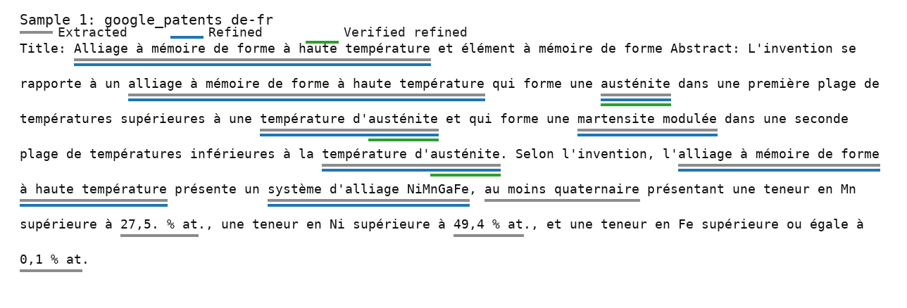
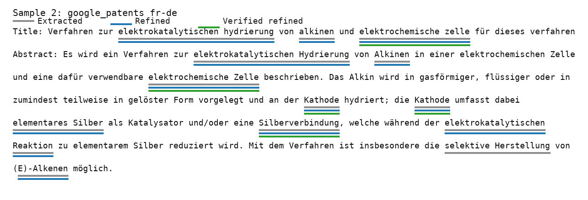
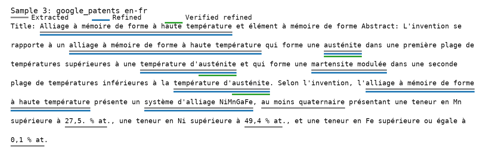
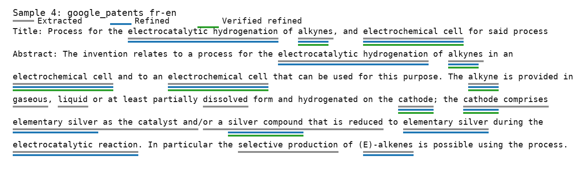
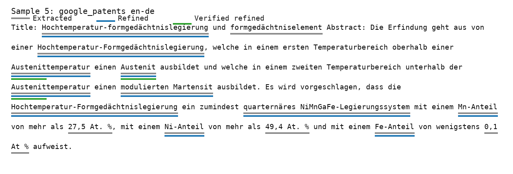
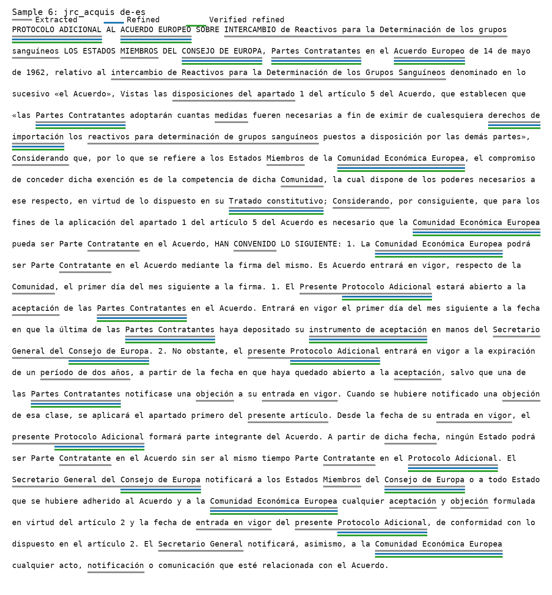
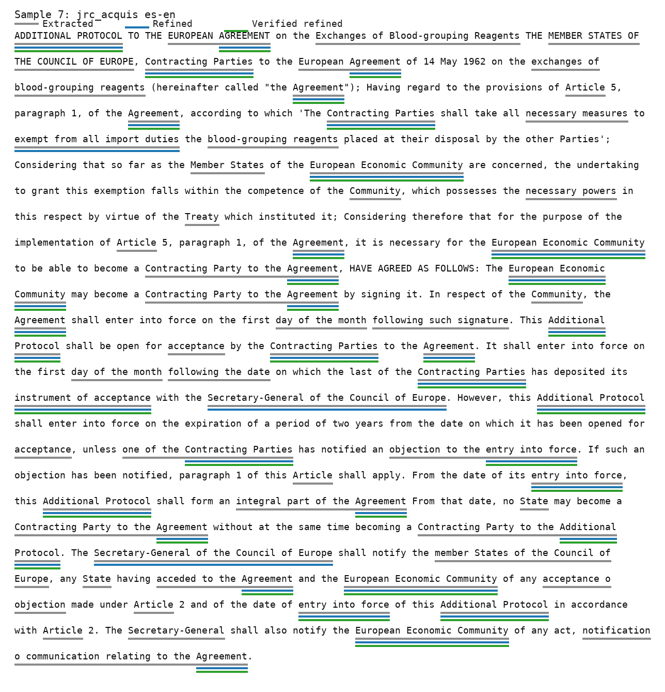
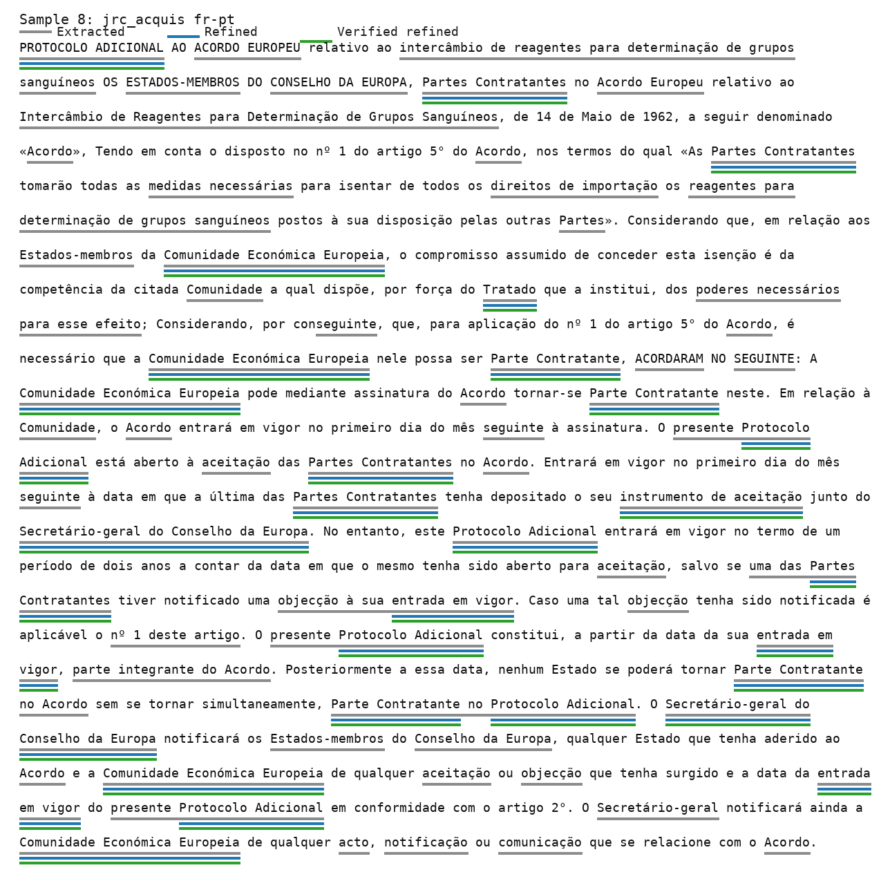
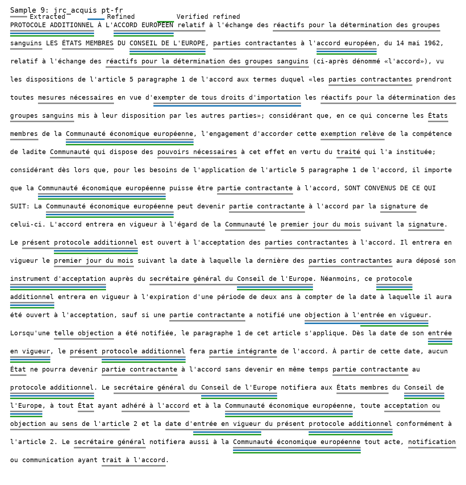
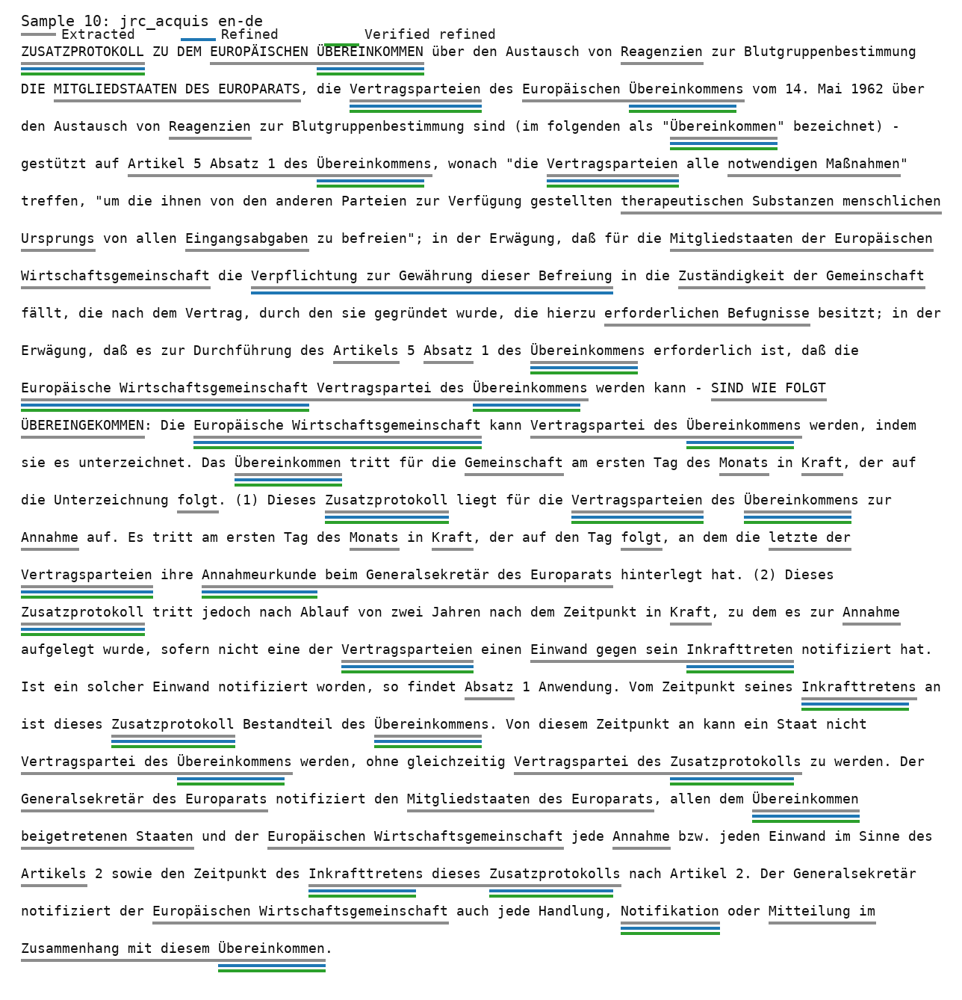

# Terminology Sample Audit

This audit shows candidate, refined, and verified-refined terminology spans for 10 multilingual samples. Underlines use three lanes: gray for all candidates, blue for refined terms, and green for verified refined terms.

## Summary

- Samples: 10
- Model: `gpt-4.1-mini`
- API mode: `responses`
- Total candidates: 262
- Total refined terms: 80
- Total verified refined terms: 51
- Total refiner time: 58.6s

## Sample 1: google_patents de-fr (French)

- Example: `EP-4634423-A1`
- Source language: German
- Target language: French
- Approx source tokens: 74
- Counts: 13 candidates, 8 refined, 4 verified refined
- Refiner time: 6.2s

### Source Text

Title: Hochtemperatur-formgedächtnislegierung und formgedächtniselement Abstract: Die Erfindung geht aus von einer Hochtemperatur-Formgedächtnislegierung, welche in einem ersten Temperaturbereich oberhalb einer Austenittemperatur einen Austenit ausbildet und welche in einem zweiten Temperaturbereich unterhalb der Austenittemperatur einen modulierten Martensit ausbildet. Es wird vorgeschlagen, dass die Hochtemperatur-Formgedächtnislegierung ein zumindest quarternäres NiMnGaFe-Legierungssystem mit einem Mn-Anteil von mehr als 27,5 At. %, mit einem Ni-Anteil von mehr als 49,4 At. % und mit einem Fe-Anteil von wenigstens 0,1 At % aufweist.

### Target Text

Title: Alliage à mémoire de forme à haute température et élément à mémoire de forme Abstract: L'invention se rapporte à un alliage à mémoire de forme à haute température qui forme une austénite dans une première plage de températures supérieures à une température d'austénite et qui forme une martensite modulée dans une seconde plage de températures inférieures à la température d'austénite. Selon l'invention, l'alliage à mémoire de forme à haute température présente un système d'alliage NiMnGaFe, au moins quaternaire présentant une teneur en Mn supérieure à 27,5. % at., une teneur en Ni supérieure à 49,4 % at., et une teneur en Fe supérieure ou égale à 0,1 % at.

### All Candidates

- `austénite` [material; verified by iate]
- `Mn` [identifier; verified by pubchem, iate]
- `Ni` [identifier; verified by pubchem, iate]
- `Fe` [identifier; verified by pubchem, iate]
- `système d'alliage NiMnGaFe` [material]
- `alliage à mémoire de forme à haute température` [material]
- `martensite modulée` [material]
- `27,5. % at` [unit]
- `49,4 % at` [unit]
- `0,1 % at` [unit]
- `NiMnGaFe` [identifier]
- `température d'austénite` [other]
- `au moins quaternaire` [other]

### Refined Terms

- `austénite` [material; verified by iate]
- `Mn` [identifier; verified by pubchem, iate]
- `Ni` [identifier; verified by pubchem, iate]
- `Fe` [identifier; verified by pubchem, iate]
- `système d'alliage NiMnGaFe` [material]
- `alliage à mémoire de forme à haute température` [material]
- `martensite modulée` [material]
- `température d'austénite` [other]

### Verified Refined Terms

- `austénite` [material; verified by iate]
- `Mn` [identifier; verified by pubchem, iate]
- `Ni` [identifier; verified by pubchem, iate]
- `Fe` [identifier; verified by pubchem, iate]

## Sample 2: google_patents fr-de (German)

- Example: `EP-4634433-A1`
- Source language: French
- Target language: German
- Approx source tokens: 85
- Counts: 9 candidates, 8 refined, 3 verified refined
- Refiner time: 6.6s

### Source Text

Title: Procédé d'hydrogénation électrocatalytique d'alcynes et cellule électrochimique pour la mise en oeuvre de ce procédé Abstract: L'invention concerne un procédé d'hydrogénation électrocatalytique d'alcynes dans une cellule électrochimique ainsi qu'une cellule électrochimique utilisable à cet effet. L'alcyne est introduit sous forme gazeuse, liquide ou au moins partiellement dissoute et est hydrogéné à la cathode, qui comprend de l'argent élémentaire comme catalyseur et/ou un composé d'argent qui est réduit en argent élémentaire pendant la réaction électrocatalytique. Ce procédé permet en particulier la production sélective d'alcènes (E).

### Target Text

Title: Verfahren zur elektrokatalytischen hydrierung von alkinen und elektrochemische zelle für dieses verfahren Abstract: Es wird ein Verfahren zur elektrokatalytischen Hydrierung von Alkinen in einer elektrochemischen Zelle und eine dafür verwendbare elektrochemische Zelle beschrieben. Das Alkin wird in gasförmiger, flüssiger oder in zumindest teilweise in gelöster Form vorgelegt und an der Kathode hydriert; die Kathode umfasst dabei elementares Silber als Katalysator und/oder eine Silberverbindung, welche während der elektrokatalytischen Reaktion zu elementarem Silber reduziert wird. Mit dem Verfahren ist insbesondere die selektive Herstellung von (E)-Alkenen möglich.

### All Candidates

- `elektrochemische Zelle` [method; verified by iate]
- `Silberverbindung` [chemical; verified by iate]
- `Kathode` [material; verified by iate]
- `E)-Alkenen` [chemical]
- `elektrokatalytischen Hydrierung` [process]
- `elementares Silber` [chemical]
- `Alkinen` [chemical]
- `elektrokatalytischen Reaktion` [process]
- `selektive Herstellung` [process]

### Refined Terms

- `elektrochemische Zelle` [method; verified by iate]
- `Silberverbindung` [chemical; verified by iate]
- `Kathode` [material; verified by iate]
- `E)-Alkenen` [chemical]
- `elektrokatalytischen Hydrierung` [process]
- `elementares Silber` [chemical]
- `Alkinen` [chemical]
- `elektrokatalytischen Reaktion` [process]

### Verified Refined Terms

- `elektrochemische Zelle` [method; verified by iate]
- `Silberverbindung` [chemical; verified by iate]
- `Kathode` [material; verified by iate]

## Sample 3: google_patents en-fr (French)

- Example: `EP-4634423-A1`
- Source language: English
- Target language: French
- Approx source tokens: 86
- Counts: 13 candidates, 8 refined, 4 verified refined
- Refiner time: 6.1s

### Source Text

Title: High-temperature shape-memory alloy, and shape-memory element Abstract: The invention relates to a high-temperature shape-memory alloy which forms an austenite in a first temperature range above an austenite temperature and which forms a modulated martensite in a second temperature range below the austenite temperature. According to the invention, the high-temperature shape-memory alloy has an at least quaternary NiMnGaFe alloy system with an Mn content of more than 27.5 at.%, an Ni content of more than 49.4 at.%, and an Fe content of at least 0.1 at.%.

### Target Text

Title: Alliage à mémoire de forme à haute température et élément à mémoire de forme Abstract: L'invention se rapporte à un alliage à mémoire de forme à haute température qui forme une austénite dans une première plage de températures supérieures à une température d'austénite et qui forme une martensite modulée dans une seconde plage de températures inférieures à la température d'austénite. Selon l'invention, l'alliage à mémoire de forme à haute température présente un système d'alliage NiMnGaFe, au moins quaternaire présentant une teneur en Mn supérieure à 27,5. % at., une teneur en Ni supérieure à 49,4 % at., et une teneur en Fe supérieure ou égale à 0,1 % at.

### All Candidates

- `austénite` [material; verified by iate]
- `Mn` [identifier; verified by pubchem, iate]
- `Ni` [identifier; verified by pubchem, iate]
- `Fe` [identifier; verified by pubchem, iate]
- `système d'alliage NiMnGaFe` [material]
- `alliage à mémoire de forme à haute température` [material]
- `martensite modulée` [material]
- `27,5. % at` [unit]
- `49,4 % at` [unit]
- `0,1 % at` [unit]
- `NiMnGaFe` [identifier]
- `température d'austénite` [other]
- `au moins quaternaire` [other]

### Refined Terms

- `austénite` [material; verified by iate]
- `Mn` [identifier; verified by pubchem, iate]
- `Ni` [identifier; verified by pubchem, iate]
- `Fe` [identifier; verified by pubchem, iate]
- `système d'alliage NiMnGaFe` [material]
- `alliage à mémoire de forme à haute température` [material]
- `martensite modulée` [material]
- `température d'austénite` [other]

### Verified Refined Terms

- `austénite` [material; verified by iate]
- `Mn` [identifier; verified by pubchem, iate]
- `Ni` [identifier; verified by pubchem, iate]
- `Fe` [identifier; verified by pubchem, iate]

## Sample 4: google_patents fr-en (English)

- Example: `EP-4634433-A1`
- Source language: French
- Target language: English
- Approx source tokens: 85
- Counts: 17 candidates, 8 refined, 4 verified refined
- Refiner time: 5.2s

### Source Text

Title: Procédé d'hydrogénation électrocatalytique d'alcynes et cellule électrochimique pour la mise en oeuvre de ce procédé Abstract: L'invention concerne un procédé d'hydrogénation électrocatalytique d'alcynes dans une cellule électrochimique ainsi qu'une cellule électrochimique utilisable à cet effet. L'alcyne est introduit sous forme gazeuse, liquide ou au moins partiellement dissoute et est hydrogéné à la cathode, qui comprend de l'argent élémentaire comme catalyseur et/ou un composé d'argent qui est réduit en argent élémentaire pendant la réaction électrocatalytique. Ce procédé permet en particulier la production sélective d'alcènes (E).

### Target Text

Title: Process for the electrocatalytic hydrogenation of alkynes, and electrochemical cell for said process Abstract: The invention relates to a process for the electrocatalytic hydrogenation of alkynes in an electrochemical cell and to an electrochemical cell that can be used for this purpose. The alkyne is provided in gaseous, liquid or at least partially dissolved form and hydrogenated on the cathode; the cathode comprises elementary silver as the catalyst and/or a silver compound that is reduced to elementary silver during the electrocatalytic reaction. In particular the selective production of (E)-alkenes is possible using the process.

### All Candidates

- `electrochemical cell` [method; verified by iate]
- `alkyne` [chemical; verified by iate]
- `cathode` [other; verified by iate]
- `electrocatalytic hydrogenation` [process]
- `silver compound` [material; verified by iate]
- `alkynes` [chemical]
- `E)-alkenes` [chemical]
- `elementary silver` [material]
- `electrocatalytic reaction` [process]
- `liquid` [other; verified by pubchem, iate]
- `selective production` [process]
- `dissolved` [other]
- `gaseous` [other]
- `compound that is reduced` [chemical]
- `catalyst and` [chemical]
- `cathode comprises elementary silver as the catalyst` [chemical]
- `or a silver compound` [chemical]

### Refined Terms

- `electrochemical cell` [method; verified by iate]
- `alkyne` [chemical; verified by iate]
- `cathode` [other; verified by iate]
- `electrocatalytic hydrogenation` [process]
- `silver compound` [material; verified by iate]
- `E)-alkenes` [chemical]
- `elementary silver` [material]
- `electrocatalytic reaction` [process]

### Verified Refined Terms

- `electrochemical cell` [method; verified by iate]
- `alkyne` [chemical; verified by iate]
- `cathode` [other; verified by iate]
- `silver compound` [material; verified by iate]

## Sample 5: google_patents en-de (German)

- Example: `EP-4634423-A1`
- Source language: English
- Target language: German
- Approx source tokens: 86
- Counts: 13 candidates, 8 refined, 1 verified refined
- Refiner time: 5.0s

### Source Text

Title: High-temperature shape-memory alloy, and shape-memory element Abstract: The invention relates to a high-temperature shape-memory alloy which forms an austenite in a first temperature range above an austenite temperature and which forms a modulated martensite in a second temperature range below the austenite temperature. According to the invention, the high-temperature shape-memory alloy has an at least quaternary NiMnGaFe alloy system with an Mn content of more than 27.5 at.%, an Ni content of more than 49.4 at.%, and an Fe content of at least 0.1 at.%.

### Target Text

Title: Hochtemperatur-formgedächtnislegierung und formgedächtniselement Abstract: Die Erfindung geht aus von einer Hochtemperatur-Formgedächtnislegierung, welche in einem ersten Temperaturbereich oberhalb einer Austenittemperatur einen Austenit ausbildet und welche in einem zweiten Temperaturbereich unterhalb der Austenittemperatur einen modulierten Martensit ausbildet. Es wird vorgeschlagen, dass die Hochtemperatur-Formgedächtnislegierung ein zumindest quarternäres NiMnGaFe-Legierungssystem mit einem Mn-Anteil von mehr als 27,5 At. %, mit einem Ni-Anteil von mehr als 49,4 At. % und mit einem Fe-Anteil von wenigstens 0,1 At % aufweist.

### All Candidates

- `Austenit` [material; verified by iate]
- `quarternäres NiMnGaFe-Legierungssystem` [material]
- `27,5 At. %` [unit]
- `49,4 At. %` [unit]
- `0,1 At %` [unit]
- `Hochtemperatur-Formgedächtnislegierung` [material]
- `NiMnGaFe` [material]
- `modulierten Martensit` [material]
- `Austenittemperatur` [other]
- `Mn-Anteil` [other]
- `Ni-Anteil` [other]
- `Fe-Anteil` [other]
- `formgedächtniselement` [material]

### Refined Terms

- `Austenit` [material; verified by iate]
- `quarternäres NiMnGaFe-Legierungssystem` [material]
- `Hochtemperatur-Formgedächtnislegierung` [material]
- `modulierten Martensit` [material]
- `Austenittemperatur` [other]
- `Mn-Anteil` [other]
- `Ni-Anteil` [other]
- `Fe-Anteil` [other]

### Verified Refined Terms

- `Austenit` [material; verified by iate]

## Sample 6: jrc_acquis de-es (Spanish)

- Example: `de-es:jrc21987A0207_06:chunk-0143`
- Source language: German
- Target language: Spanish
- Approx source tokens: 339
- Counts: 32 candidates, 8 refined, 8 verified refined
- Refiner time: 5.0s

### Source Text

ZUSATZPROTOKOLL ZU DEM EUROPÄISCHEN ÜBEREINKOMMEN über den Austausch von Reagenzien zur Blutgruppenbestimmung DIE MITGLIEDSTAATEN DES EUROPARATS, die Vertragsparteien des Europäischen Übereinkommens vom 14. Mai 1962 über den Austausch von Reagenzien zur Blutgruppenbestimmung sind (im folgenden als "Übereinkommen" bezeichnet) - gestützt auf Artikel 5 Absatz 1 des Übereinkommens, wonach "die Vertragsparteien alle notwendigen Maßnahmen" treffen, "um die ihnen von den anderen Parteien zur Verfügung gestellten therapeutischen Substanzen menschlichen Ursprungs von allen Eingangsabgaben zu befreien"; in der Erwägung, daß für die Mitgliedstaaten der Europäischen Wirtschaftsgemeinschaft die Verpflichtung zur Gewährung dieser Befreiung in die Zuständigkeit der Gemeinschaft fällt, die nach dem Vertrag, durch den sie gegründet wurde, die hierzu erforderlichen Befugnisse besitzt; in der Erwägung, daß es zur Durchführung des Artikels 5 Absatz 1 des Übereinkommens erforderlich ist, daß die Europäische Wirtschaftsgemeinschaft Vertragspartei des Übereinkommens werden kann - SIND WIE FOLGT ÜBEREINGEKOMMEN: Die Europäische Wirtschaftsgemeinschaft kann Vertragspartei des Übereinkommens werden, indem sie es unterzeichnet. Das Übereinkommen tritt für die Gemeinschaft am ersten Tag des Monats in Kraft, der auf die Unterzeichnung folgt. (1) Dieses Zusatzprotokoll liegt für die Vertragsparteien des Übereinkommens zur Annahme auf. Es tritt am ersten Tag des Monats in Kraft, der auf den Tag folgt, an dem die letzte der Vertragsparteien ihre Annahmeurkunde beim Generalsekretär des Europarats hinterlegt hat. (2) Dieses Zusatzprotokoll tritt jedoch nach Ablauf von zwei Jahren nach dem Zeitpunkt in Kraft, zu dem es zur Annahme aufgelegt wurde, sofern nicht eine der Vertragsparteien einen Einwand gegen sein Inkrafttreten notifiziert hat. Ist ein solcher Einwand notifiziert worden, so findet Absatz 1 Anwendung. Vom Zeitpunkt seines Inkrafttretens an ist dieses Zusatzprotokoll Bestandteil des Übereinkommens. Von diesem Zeitpunkt an kann ein Staat nicht Vertragspartei des Übereinkommens werden, ohne gleichzeitig Vertragspartei des Zusatzprotokolls zu werden. Der Generalsekretär des Europarats notifiziert den Mitgliedstaaten des Europarats, allen dem Übereinkommen beigetretenen Staaten und der Europäischen Wirtschaftsgemeinschaft jede Annahme bzw. jeden Einwand im Sinne des Artikels 2 sowie den Zeitpunkt des Inkrafttretens dieses Zusatzprotokolls nach Artikel 2. Der Generalsekretär notifiziert der Europäischen Wirtschaftsgemeinschaft auch jede Handlung, Notifikation oder Mitteilung im Zusammenhang mit diesem Übereinkommen.

### Target Text

PROTOCOLO ADICIONAL AL ACUERDO EUROPEO SOBRE INTERCAMBIO de Reactivos para la Determinación de los grupos sanguíneos LOS ESTADOS MIEMBROS DEL CONSEJO DE EUROPA, Partes Contratantes en el Acuerdo Europeo de 14 de mayo de 1962, relativo al intercambio de Reactivos para la Determinación de los Grupos Sanguíneos denominado en lo sucesivo «el Acuerdo», Vistas las disposiciones del apartado 1 del artículo 5 del Acuerdo, que establecen que «las Partes Contratantes adoptarán cuantas medidas fueren necesarias a fin de eximir de cualesquiera derechos de importación los reactivos para determinación de grupos sanguíneos puestos a disposición por las demás partes», Considerando que, por lo que se refiere a los Estados Miembros de la Comunidad Económica Europea, el compromiso de conceder dicha exención es de la competencia de dicha Comunidad, la cual dispone de los poderes necesarios a ese respecto, en virtud de lo dispuesto en su Tratado constitutivo; Considerando, por consiguiente, que para los fines de la aplicación del apartado 1 del artículo 5 del Acuerdo es necesario que la Comunidad Económica Europea pueda ser Parte Contratante en el Acuerdo, HAN CONVENIDO LO SIGUIENTE: 1. La Comunidad Económica Europea podrá ser Parte Contratante en el Acuerdo mediante la firma del mismo. Es Acuerdo entrará en vigor, respecto de la Comunidad, el primer día del mes siguiente a la firma. 1. El Presente Protocolo Adicional estará abierto a la aceptación de las Partes Contratantes en el Acuerdo. Entrará en vigor el primer día del mes siguiente a la fecha en que la última de las Partes Contratantes haya depositado su instrumento de aceptación en manos del Secretario General del Consejo de Europa. 2. No obstante, el presente Protocolo Adicional entrará en vigor a la expiración de un período de dos años, a partir de la fecha en que haya quedado abierto a la aceptación, salvo que una de las Partes Contratantes notificase una objeción a su entrada en vigor. Cuando se hubiere notificado una objeción de esa clase, se aplicará el apartado primero del presente artículo. Desde la fecha de su entrada en vigor, el presente Protocolo Adicional formará parte integrante del Acuerdo. A partir de dicha fecha, ningún Estado podrá ser Parte Contratante en el Acuerdo sin ser al mismo tiempo Parte Contratante en el Protocolo Adicional. El Secretario General del Consejo de Europa notificará a los Estados Miembros del Consejo de Europa o a todo Estado que se hubiere adherido al Acuerdo y a la Comunidad Económica Europea cualquier aceptación y objeción formulada en virtud del artículo 2 y la fecha de entrada en vigor del presente Protocolo Adicional, de conformidad con lo dispuesto en el artículo 2. El Secretario General notificará, asimismo, a la Comunidad Económica Europea cualquier acto, notificación o comunicación que esté relacionada con el Acuerdo.

### All Candidates

- `Comunidad Económica Europea` [other; verified by iate, wikipedia]
- `PROTOCOLO ADICIONAL` [legal_act; verified by iate]
- `Partes Contratantes` [defined_term; verified by iate]
- `Consejo de Europa` [other; verified by agrovoc, iate, wikipedia]
- `ACUERDO EUROPEO` [legal_act; verified by iate]
- `Adicional` [other; verified by agrovoc]
- `instrumento de aceptación` [procedure; verified by iate]
- `derechos de importación` [obligation; verified by iate]
- `Tratado constitutivo` [legal_act; verified by iate]
- `entrada en vigor` [legal_act; verified by iate]
- `notificación` [procedure; verified by iate]
- `aceptación` [procedure; verified by iate]
- `objeción` [remedy; verified by iate]
- `Secretario General del Consejo de Europa` [institution]
- `General` [other; verified by mesh, nci, agrovoc, wikipedia]
- `Contratante` [other; verified by agrovoc, iate]
- `Comunidad` [other; verified by agrovoc, iate]
- `MIEMBROS` [other; verified by agrovoc, iate]
- `Secretario General` [other; verified by iate]
- `medidas` [obligation; verified by iate]
- `Considerando` [other; verified by iate]
- `EUROPEO` [other; verified by agrovoc]
- `Determinación de los Grupos Sanguíneos` [other]
- `Presente Protocolo Adicional` [other]
- `disposiciones del apartado` [other]
- `INTERCAMBIO de Reactivos para la Determinación` [other]
- `reactivos para determinación de grupos sanguíneos` [other]
- `período de dos años` [restriction]
- `Reactivos` [other]
- `CONVENIDO` [other]
- `presente artículo` [other]
- `dicha fecha` [other]

### Refined Terms

- `Comunidad Económica Europea` [other; verified by iate, wikipedia]
- `PROTOCOLO ADICIONAL` [legal_act; verified by iate]
- `Partes Contratantes` [defined_term; verified by iate]
- `Consejo de Europa` [other; verified by agrovoc, iate, wikipedia]
- `ACUERDO EUROPEO` [legal_act; verified by iate]
- `instrumento de aceptación` [procedure; verified by iate]
- `derechos de importación` [obligation; verified by iate]
- `Tratado constitutivo` [legal_act; verified by iate]

### Verified Refined Terms

- `Comunidad Económica Europea` [other; verified by iate, wikipedia]
- `PROTOCOLO ADICIONAL` [legal_act; verified by iate]
- `Partes Contratantes` [defined_term; verified by iate]
- `Consejo de Europa` [other; verified by agrovoc, iate, wikipedia]
- `ACUERDO EUROPEO` [legal_act; verified by iate]
- `instrumento de aceptación` [procedure; verified by iate]
- `derechos de importación` [obligation; verified by iate]
- `Tratado constitutivo` [legal_act; verified by iate]

## Sample 7: jrc_acquis es-en (English)

- Example: `es-en:jrc21987A0207_06:chunk-0182`
- Source language: Spanish
- Target language: English
- Approx source tokens: 456
- Counts: 40 candidates, 8 refined, 6 verified refined
- Refiner time: 7.0s

### Source Text

PROTOCOLO ADICIONAL AL ACUERDO EUROPEO SOBRE INTERCAMBIO de Reactivos para la Determinación de los grupos sanguíneos LOS ESTADOS MIEMBROS DEL CONSEJO DE EUROPA, Partes Contratantes en el Acuerdo Europeo de 14 de mayo de 1962, relativo al intercambio de Reactivos para la Determinación de los Grupos Sanguíneos denominado en lo sucesivo «el Acuerdo», Vistas las disposiciones del apartado 1 del artículo 5 del Acuerdo, que establecen que «las Partes Contratantes adoptarán cuantas medidas fueren necesarias a fin de eximir de cualesquiera derechos de importación los reactivos para determinación de grupos sanguíneos puestos a disposición por las demás partes», Considerando que, por lo que se refiere a los Estados Miembros de la Comunidad Económica Europea, el compromiso de conceder dicha exención es de la competencia de dicha Comunidad, la cual dispone de los poderes necesarios a ese respecto, en virtud de lo dispuesto en su Tratado constitutivo; Considerando, por consiguiente, que para los fines de la aplicación del apartado 1 del artículo 5 del Acuerdo es necesario que la Comunidad Económica Europea pueda ser Parte Contratante en el Acuerdo, HAN CONVENIDO LO SIGUIENTE: 1. La Comunidad Económica Europea podrá ser Parte Contratante en el Acuerdo mediante la firma del mismo. Es Acuerdo entrará en vigor, respecto de la Comunidad, el primer día del mes siguiente a la firma. El Presente Protocolo Adicional estará abierto a la aceptación de las Partes Contratantes en el Acuerdo. Entrará en vigor el primer día del mes siguiente a la fecha en que la última de las Partes Contratantes haya depositado su instrumento de aceptación en manos del Secretario General del Consejo de Europa. No obstante, el presente Protocolo Adicional entrará en vigor a la expiración de un período de dos años, a partir de la fecha en que haya quedado abierto a la aceptación, salvo que una de las Partes Contratantes notificase una objeción a su entrada en vigor. Cuando se hubiere notificado una objeción de esa clase, se aplicará el apartado primero del presente artículo. Desde la fecha de su entrada en vigor, el presente Protocolo Adicional formará parte integrante del Acuerdo. A partir de dicha fecha, ningún Estado podrá ser Parte Contratante en el Acuerdo sin ser al mismo tiempo Parte Contratante en el Protocolo Adicional. El Secretario General del Consejo de Europa notificará a los Estados Miembros del Consejo de Europa o a todo Estado que se hubiere adherido al Acuerdo y a la Comunidad Económica Europea cualquier aceptación y objeción formulada en virtud del artículo 2 y la fecha de entrada en vigor del presente Protocolo Adicional, de conformidad con lo dispuesto en el artículo 2. El Secretario General notificará, asimismo, a la Comunidad Económica Europea cualquier acto, notificación o comunicación que esté relacionada con el Acuerdo.

### Target Text

ADDITIONAL PROTOCOL TO THE EUROPEAN AGREEMENT on the Exchanges of Blood-grouping Reagents THE MEMBER STATES OF THE COUNCIL OF EUROPE, Contracting Parties to the European Agreement of 14 May 1962 on the exchanges of blood-grouping reagents (hereinafter called "the Agreement"); Having regard to the provisions of Article 5, paragraph 1, of the Agreement, according to which 'The Contracting Parties shall take all necessary measures to exempt from all import duties the blood-grouping reagents placed at their disposal by the other Parties'; Considering that so far as the Member States of the European Economic Community are concerned, the undertaking to grant this exemption falls within the competence of the Community, which possesses the necessary powers in this respect by virtue of the Treaty which instituted it; Considering therefore that for the purpose of the implementation of Article 5, paragraph 1, of the Agreement, it is necessary for the European Economic Community to be able to become a Contracting Party to the Agreement, HAVE AGREED AS FOLLOWS: The European Economic Community may become a Contracting Party to the Agreement by signing it. In respect of the Community, the Agreement shall enter into force on the first day of the month following such signature. This Additional Protocol shall be open for acceptance by the Contracting Parties to the Agreement. It shall enter into force on the first day of the month following the date on which the last of the Contracting Parties has deposited its instrument of acceptance with the Secretary-General of the Council of Europe. However, this Additional Protocol shall enter into force on the expiration of a period of two years from the date on which it has been opened for acceptance, unless one of the Contracting Parties has notified an objection to the entry into force. If such an objection has been notified, paragraph 1 of this Article shall apply. From the date of its entry into force, this Additional Protocol shall form an integral part of the Agreement From that date, no State may become a Contracting Party to the Agreement without at the same time becoming a Contracting Party to the Additional Protocol. The Secretary-General of the Council of Europe shall notify the member States of the Council of Europe, any State having acceded to the Agreement and the European Economic Community of any acceptance o objection made under Article 2 and of the date of entry into force of this Additional Protocol in accordance with Article 2. The Secretary-General shall also notify the European Economic Community of any act, notification o communication relating to the Agreement.

### All Candidates

- `Secretary-General of the Council of Europe` [institution]
- `MEMBER STATES OF THE COUNCIL OF EUROPE` [institution]
- `European Economic Community` [other; verified by iate, wikipedia]
- `instrument of acceptance` [procedure; verified by iate]
- `Contracting Parties` [defined_term; verified by iate]
- `ADDITIONAL PROTOCOL` [legal_act; verified by iate]
- `EUROPEAN AGREEMENT` [legal_act]
- `Council of Europe` [other; verified by agrovoc, iate, wikipedia]
- `entry into force` [procedure; verified by iate]
- `Agreement` [legal_act; verified by iate, mesh, nci, agrovoc]
- `Protocol` [other; verified by mesh, nci, agrovoc, iate]
- `Community` [other; verified by mesh, nci, agrovoc, iate]
- `State` [other; verified by mesh, nci, agrovoc, iate]
- `Article` [other; verified by mesh, nci, agrovoc, iate]
- `notification` [procedure; verified by iate]
- `acceptance` [procedure; verified by iate]
- `Treaty` [legal_act; verified by iate]
- `States` [other; verified by mesh, agrovoc, iate]
- `objection to the entry into force` [restriction]
- `exempt from all import duties` [remedy]
- `acceded to the Agreement` [procedure]
- `import duties` [obligation]
- `blood-grouping reagents` [other]
- `Contracting Party` [other; verified by iate, wikipedia]
- `Member States` [other; verified by agrovoc]
- `Secretary-General` [other; verified by iate]
- `necessary measures` [other; verified by iate]
- `necessary powers` [other; verified by iate]
- `day of the month` [other]
- `communication relating to the Agreement` [procedure]
- `exchanges of blood-grouping reagents` [regulatory_domain]
- `notification o communication` [other]
- `acceptance o objection` [other]
- `Blood-grouping` [other; verified by iate]
- `following such signature` [other]
- `following the date` [other]
- `Contracting Party to the Agreement` [other]
- `one of the Contracting Parties` [other]
- `integral part of the Agreement` [other]
- `Contracting Party to the Additional Protocol` [other]

### Refined Terms

- `Secretary-General of the Council of Europe` [institution]
- `European Economic Community` [other; verified by iate, wikipedia]
- `instrument of acceptance` [procedure; verified by iate]
- `ADDITIONAL PROTOCOL` [legal_act; verified by iate]
- `Contracting Parties` [defined_term; verified by iate]
- `entry into force` [procedure; verified by iate]
- `Agreement` [legal_act; verified by iate, mesh, nci, agrovoc]
- `exempt from all import duties` [remedy]

### Verified Refined Terms

- `European Economic Community` [other; verified by iate, wikipedia]
- `instrument of acceptance` [procedure; verified by iate]
- `ADDITIONAL PROTOCOL` [legal_act; verified by iate]
- `Contracting Parties` [defined_term; verified by iate]
- `entry into force` [procedure; verified by iate]
- `Agreement` [legal_act; verified by iate, mesh, nci, agrovoc]

## Sample 8: jrc_acquis fr-pt (Portuguese)

- Example: `fr-pt:jrc21987A0207_06:chunk-0180`
- Source language: French
- Target language: Portuguese
- Approx source tokens: 405
- Counts: 41 candidates, 8 refined, 8 verified refined
- Refiner time: 4.9s

### Source Text

PROTOCOLE ADDITIONNEL À L'ACCORD EUROPÉEN relatif à l'échange des réactifs pour la détermination des groupes sanguins LES ÉTATS MEMBRES DU CONSEIL DE L'EUROPE, parties contractantes à l'accord européen, du 14 mai 1962, relatif à l'échange des réactifs pour la détermination des groupes sanguins (ci-après dénommé «l'accord»), vu les dispositions de l'article 5 paragraphe 1 de l'accord aux termes duquel «les parties contractantes prendront toutes mesures nécessaires en vue d'exempter de tous droits d'importation les réactifs pour la détermination des groupes sanguins mis à leur disposition par les autres parties»; considérant que, en ce qui concerne les États membres de la Communauté économique européenne, l'engagement d'accorder cette exemption relève de la compétence de ladite Communauté qui dispose des pouvoirs nécessaires à cet effet en vertu du traité qui l'a instituée; considérant dès lors que, pour les besoins de l'application de l'article 5 paragraphe 1 de l'accord, il importe que la Communauté économique européenne puisse être partie contractante à l'accord, SONT CONVENUS DE CE QUI SUIT: La Communauté économique européenne peut devenir partie contractante à l'accord par la signature de celui-ci. L'accord entrera en vigueur à l'égard de la Communauté le premier jour du mois suivant la signature. Le présent protocole additionnel est ouvert à l'acceptation des parties contractantes à l'accord. Il entrera en vigueur le premier jour du mois suivant la date à laquelle la dernière des parties contractantes aura déposé son instrument d'acceptation auprès du secrétaire général du Conseil de l'Europe. Néanmoins, ce protocole additionnel entrera en vigueur à l'expiration d'une période de deux ans à compter de la date à laquelle il aura été ouvert à l'acceptation, sauf si une partie contractante a notifié une objection à l'entrée en vigueur. Lorsqu'une telle objection a été notifiée, le paragraphe 1 de cet article s'applique. Dès la date de son entrée en vigueur, le présent protocole additionnel fera partie intégrante de l'accord. À partir de cette date, aucun État ne pourra devenir partie contractante à l'accord sans devenir en même temps partie contractante au protocole additionnel. Le secrétaire général du Conseil de l'Europe notifiera aux États membres du Conseil de l'Europe, à tout État ayant adhéré à l'accord et à la Communauté économique européenne, toute acceptation ou objection au sens de l'article 2 et la date d'entrée en vigueur du présent protocole additionnel conformément à l'article 2. Le secrétaire général notifiera aussi à la Communauté économique européenne tout acte, notification ou communication ayant trait à l'accord.

### Target Text

PROTOCOLO ADICIONAL AO ACORDO EUROPEU relativo ao intercâmbio de reagentes para determinação de grupos sanguíneos OS ESTADOS-MEMBROS DO CONSELHO DA EUROPA, Partes Contratantes no Acordo Europeu relativo ao Intercâmbio de Reagentes para Determinação de Grupos Sanguíneos, de 14 de Maio de 1962, a seguir denominado «Acordo», Tendo em conta o disposto no nº 1 do artigo 5° do Acordo, nos termos do qual «As Partes Contratantes tomarão todas as medidas necessárias para isentar de todos os direitos de importação os reagentes para determinação de grupos sanguíneos postos à sua disposição pelas outras Partes». Considerando que, em relação aos Estados-membros da Comunidade Económica Europeia, o compromisso assumido de conceder esta isenção é da competência da citada Comunidade a qual dispõe, por força do Tratado que a institui, dos poderes necessários para esse efeito; Considerando, por conseguinte, que, para aplicação do nº 1 do artigo 5° do Acordo, é necessário que a Comunidade Económica Europeia nele possa ser Parte Contratante, ACORDARAM NO SEGUINTE: A Comunidade Económica Europeia pode mediante assinatura do Acordo tornar-se Parte Contratante neste. Em relação à Comunidade, o Acordo entrará em vigor no primeiro dia do mês seguinte à assinatura. O presente Protocolo Adicional está aberto à aceitação das Partes Contratantes no Acordo. Entrará em vigor no primeiro dia do mês seguinte à data em que a última das Partes Contratantes tenha depositado o seu instrumento de aceitação junto do Secretário-geral do Conselho da Europa. No entanto, este Protocolo Adicional entrará em vigor no termo de um período de dois anos a contar da data em que o mesmo tenha sido aberto para aceitação, salvo se uma das Partes Contratantes tiver notificado uma objecção à sua entrada em vigor. Caso uma tal objecção tenha sido notificada é aplicável o nº 1 deste artigo. O presente Protocolo Adicional constitui, a partir da data da sua entrada em vigor, parte integrante do Acordo. Posteriormente a essa data, nenhum Estado se poderá tornar Parte Contratante no Acordo sem se tornar simultaneamente, Parte Contratante no Protocolo Adicional. O Secretário-geral do Conselho da Europa notificará os Estados-membros do Conselho da Europa, qualquer Estado que tenha aderido ao Acordo e a Comunidade Económica Europeia de qualquer aceitação ou objecção que tenha surgido e a data da entrada em vigor do presente Protocolo Adicional em conformidade com o artigo 2°. O Secretário-geral notificará ainda a Comunidade Económica Europeia de qualquer acto, notificação ou comunicação que se relacione com o Acordo.

### All Candidates

- `Comunidade Económica Europeia` [other; verified by agrovoc, iate, wikipedia]
- `Partes Contratantes` [defined_term; verified by iate]
- `PROTOCOLO ADICIONAL` [legal_act; verified by iate]
- `CONSELHO DA EUROPA` [other; verified by agrovoc, iate, wikipedia]
- `Parte Contratante` [defined_term; verified by iate]
- `entrada em vigor` [legal_effect; verified by iate]
- `Secretário-geral` [other; verified by iate]
- `instrumento de aceitação` [procedure; verified by iate]
- `notificação` [procedure; verified by iate]
- `aceitação` [procedure; verified by iate]
- `objecção` [procedure; verified by iate]
- `Tratado` [legal_act; verified by iate, agrovoc]
- `Secretário-geral do Conselho da Europa` [institution; verified by wikipedia]
- `ACORDO EUROPEU` [legal_act]
- `EUROPA` [other; verified by mesh, agrovoc, iate]
- `direitos de importação` [right]
- `Adicional` [other; verified by agrovoc, iate]
- `Comunidade` [other; verified by agrovoc, iate]
- `Acordo` [other; verified by agrovoc, iate]
- `comunicação` [procedure; verified by iate]
- `acto` [other; verified by iate]
- `Contratante` [other; verified by iate]
- `SEGUINTE` [other; verified by iate]
- `PROTOCOLO` [other; verified by agrovoc, iate]
- `Contratante no Protocolo Adicional` [other]
- `Determinação de Grupos Sanguíneos` [other]
- `Intercâmbio de Reagentes` [other]
- `presente Protocolo Adicional` [other]
- `Grupos Sanguíneos` [other; verified by iate]
- `ACORDARAM` [other]
- `Partes` [other]
- `poderes necessários para esse efeito` [other]
- `Estados-membros` [other]
- `Contratante no Acordo` [other]
- `medidas necessárias` [other]
- `uma das Partes Contratantes` [other]
- `reagentes para determinação de grupos` [other]
- `objecção à sua entrada em vigor` [other]
- `parte integrante do Acordo` [other]
- `nº 1 deste artigo` [other]
- `Parte Contratante no Protocolo Adicional` [other]

### Refined Terms

- `Comunidade Económica Europeia` [other; verified by agrovoc, iate, wikipedia]
- `PROTOCOLO ADICIONAL` [legal_act; verified by iate]
- `Partes Contratantes` [defined_term; verified by iate]
- `Parte Contratante` [defined_term; verified by iate]
- `entrada em vigor` [legal_effect; verified by iate]
- `instrumento de aceitação` [procedure; verified by iate]
- `Tratado` [legal_act; verified by iate, agrovoc]
- `Secretário-geral do Conselho da Europa` [institution; verified by wikipedia]

### Verified Refined Terms

- `Comunidade Económica Europeia` [other; verified by agrovoc, iate, wikipedia]
- `PROTOCOLO ADICIONAL` [legal_act; verified by iate]
- `Partes Contratantes` [defined_term; verified by iate]
- `Parte Contratante` [defined_term; verified by iate]
- `entrada em vigor` [legal_effect; verified by iate]
- `instrumento de aceitação` [procedure; verified by iate]
- `Tratado` [legal_act; verified by iate, agrovoc]
- `Secretário-geral do Conselho da Europa` [institution; verified by wikipedia]

## Sample 9: jrc_acquis pt-fr (French)

- Example: `pt-fr:jrc21987A0207_06:chunk-0180`
- Source language: Portuguese
- Target language: French
- Approx source tokens: 404
- Counts: 40 candidates, 8 refined, 6 verified refined
- Refiner time: 6.9s

### Source Text

PROTOCOLO ADICIONAL AO ACORDO EUROPEU relativo ao intercâmbio de reagentes para determinação de grupos sanguíneos OS ESTADOS-MEMBROS DO CONSELHO DA EUROPA, Partes Contratantes no Acordo Europeu relativo ao Intercâmbio de Reagentes para Determinação de Grupos Sanguíneos, de 14 de Maio de 1962, a seguir denominado «Acordo», Tendo em conta o disposto no nº 1 do artigo 5° do Acordo, nos termos do qual «As Partes Contratantes tomarão todas as medidas necessárias para isentar de todos os direitos de importação os reagentes para determinação de grupos sanguíneos postos à sua disposição pelas outras Partes». Considerando que, em relação aos Estados-membros da Comunidade Económica Europeia, o compromisso assumido de conceder esta isenção é da competência da citada Comunidade a qual dispõe, por força do Tratado que a institui, dos poderes necessários para esse efeito; Considerando, por conseguinte, que, para aplicação do nº 1 do artigo 5° do Acordo, é necessário que a Comunidade Económica Europeia nele possa ser Parte Contratante, ACORDARAM NO SEGUINTE: A Comunidade Económica Europeia pode mediante assinatura do Acordo tornar-se Parte Contratante neste. Em relação à Comunidade, o Acordo entrará em vigor no primeiro dia do mês seguinte à assinatura. O presente Protocolo Adicional está aberto à aceitação das Partes Contratantes no Acordo. Entrará em vigor no primeiro dia do mês seguinte à data em que a última das Partes Contratantes tenha depositado o seu instrumento de aceitação junto do Secretário-geral do Conselho da Europa. No entanto, este Protocolo Adicional entrará em vigor no termo de um período de dois anos a contar da data em que o mesmo tenha sido aberto para aceitação, salvo se uma das Partes Contratantes tiver notificado uma objecção à sua entrada em vigor. Caso uma tal objecção tenha sido notificada é aplicável o nº 1 deste artigo. O presente Protocolo Adicional constitui, a partir da data da sua entrada em vigor, parte integrante do Acordo. Posteriormente a essa data, nenhum Estado se poderá tornar Parte Contratante no Acordo sem se tornar simultaneamente, Parte Contratante no Protocolo Adicional. O Secretário-geral do Conselho da Europa notificará os Estados-membros do Conselho da Europa, qualquer Estado que tenha aderido ao Acordo e a Comunidade Económica Europeia de qualquer aceitação ou objecção que tenha surgido e a data da entrada em vigor do presente Protocolo Adicional em conformidade com o artigo 2°. O Secretário-geral notificará ainda a Comunidade Económica Europeia de qualquer acto, notificação ou comunicação que se relacione com o Acordo.

### Target Text

PROTOCOLE ADDITIONNEL À L'ACCORD EUROPÉEN relatif à l'échange des réactifs pour la détermination des groupes sanguins LES ÉTATS MEMBRES DU CONSEIL DE L'EUROPE, parties contractantes à l'accord européen, du 14 mai 1962, relatif à l'échange des réactifs pour la détermination des groupes sanguins (ci-après dénommé «l'accord»), vu les dispositions de l'article 5 paragraphe 1 de l'accord aux termes duquel «les parties contractantes prendront toutes mesures nécessaires en vue d'exempter de tous droits d'importation les réactifs pour la détermination des groupes sanguins mis à leur disposition par les autres parties»; considérant que, en ce qui concerne les États membres de la Communauté économique européenne, l'engagement d'accorder cette exemption relève de la compétence de ladite Communauté qui dispose des pouvoirs nécessaires à cet effet en vertu du traité qui l'a instituée; considérant dès lors que, pour les besoins de l'application de l'article 5 paragraphe 1 de l'accord, il importe que la Communauté économique européenne puisse être partie contractante à l'accord, SONT CONVENUS DE CE QUI SUIT: La Communauté économique européenne peut devenir partie contractante à l'accord par la signature de celui-ci. L'accord entrera en vigueur à l'égard de la Communauté le premier jour du mois suivant la signature. Le présent protocole additionnel est ouvert à l'acceptation des parties contractantes à l'accord. Il entrera en vigueur le premier jour du mois suivant la date à laquelle la dernière des parties contractantes aura déposé son instrument d'acceptation auprès du secrétaire général du Conseil de l'Europe. Néanmoins, ce protocole additionnel entrera en vigueur à l'expiration d'une période de deux ans à compter de la date à laquelle il aura été ouvert à l'acceptation, sauf si une partie contractante a notifié une objection à l'entrée en vigueur. Lorsqu'une telle objection a été notifiée, le paragraphe 1 de cet article s'applique. Dès la date de son entrée en vigueur, le présent protocole additionnel fera partie intégrante de l'accord. À partir de cette date, aucun État ne pourra devenir partie contractante à l'accord sans devenir en même temps partie contractante au protocole additionnel. Le secrétaire général du Conseil de l'Europe notifiera aux États membres du Conseil de l'Europe, à tout État ayant adhéré à l'accord et à la Communauté économique européenne, toute acceptation ou objection au sens de l'article 2 et la date d'entrée en vigueur du présent protocole additionnel conformément à l'article 2. Le secrétaire général notifiera aussi à la Communauté économique européenne tout acte, notification ou communication ayant trait à l'accord.

### All Candidates

- `Communauté économique européenne` [other; verified by iate, wikipedia]
- `parties contractantes` [defined_term; verified by iate]
- `PROTOCOLE ADDITIONNEL` [legal_act; verified by iate]
- `Conseil de l'Europe` [other; verified by agrovoc, iate, wikipedia]
- `entrée en vigueur` [legal_effect; verified by iate]
- `ACCORD EUROPÉEN` [legal_act; verified by iate]
- `EUROPE` [other; verified by chembl, mesh, nci, agrovoc, iate]
- `instrument d'acceptation` [procedure; verified by iate]
- `partie intégrante` [legal_effect; verified by iate]
- `notification` [procedure; verified by iate]
- `signature` [procedure; verified by iate]
- `traité` [legal_act; verified by iate]
- `secrétaire général du Conseil de l'Europe` [institution]
- `exempter de tous droits d'importation` [obligation]
- `objection à l'entrée en vigueur` [restriction]
- `droits d'importation` [obligation]
- `ÉTATS MEMBRES` [other; verified by agrovoc]
- `Communauté` [other; verified by agrovoc, iate]
- `CONSEIL` [other; verified by agrovoc, iate]
- `État` [other; verified by agrovoc, iate]
- `général` [other; verified by agrovoc, iate, wikipedia]
- `adhéré à l'accord` [procedure]
- `droits d` [other; verified by agrovoc]
- `partie contractante` [other; verified by iate]
- `secrétaire général` [other; verified by iate]
- `groupes sanguins` [other; verified by iate]
- `États` [other; verified by agrovoc]
- `présent protocole additionnel` [other]
- `Communauté économique` [other]
- `pouvoirs nécessaires` [other]
- `mesures nécessaires` [other]
- `exemption relève` [other]
- `ACCORD EUROPÉEN relatif` [other]
- `objection à l'entrée` [other]
- `trait à l'accord` [other]
- `telle objection` [other]
- `acceptation ou objection au sens de l'article` [other]
- `date d'entrée en vigueur du présent protocole` [other]
- `réactifs pour la détermination des groupes` [other]
- `premier jour du mois` [other]

### Refined Terms

- `Communauté économique européenne` [other; verified by iate, wikipedia]
- `PROTOCOLE ADDITIONNEL` [legal_act; verified by iate]
- `Conseil de l'Europe` [other; verified by agrovoc, iate, wikipedia]
- `entrée en vigueur` [legal_effect; verified by iate]
- `ACCORD EUROPÉEN` [legal_act; verified by iate]
- `instrument d'acceptation` [procedure; verified by iate]
- `exempter de tous droits d'importation` [obligation]
- `objection à l'entrée en vigueur` [restriction]

### Verified Refined Terms

- `Communauté économique européenne` [other; verified by iate, wikipedia]
- `PROTOCOLE ADDITIONNEL` [legal_act; verified by iate]
- `Conseil de l'Europe` [other; verified by agrovoc, iate, wikipedia]
- `entrée en vigueur` [legal_effect; verified by iate]
- `ACCORD EUROPÉEN` [legal_act; verified by iate]
- `instrument d'acceptation` [procedure; verified by iate]

## Sample 10: jrc_acquis en-de (German)

- Example: `en-de:jrc21987A0207_06:chunk-0135`
- Source language: English
- Target language: German
- Approx source tokens: 431
- Counts: 44 candidates, 8 refined, 7 verified refined
- Refiner time: 5.7s

### Source Text

ADDITIONAL PROTOCOL TO THE EUROPEAN AGREEMENT on the Exchanges of Blood-grouping Reagents THE MEMBER STATES OF THE COUNCIL OF EUROPE, Contracting Parties to the European Agreement of 14 May 1962 on the exchanges of blood-grouping reagents (hereinafter called "the Agreement"); Having regard to the provisions of Article 5, paragraph 1, of the Agreement, according to which 'The Contracting Parties shall take all necessary measures to exempt from all import duties the blood-grouping reagents placed at their disposal by the other Parties'; Considering that so far as the Member States of the European Economic Community are concerned, the undertaking to grant this exemption falls within the competence of the Community, which possesses the necessary powers in this respect by virtue of the Treaty which instituted it; Considering therefore that for the purpose of the implementation of Article 5, paragraph 1, of the Agreement, it is necessary for the European Economic Community to be able to become a Contracting Party to the Agreement, HAVE AGREED AS FOLLOWS: The European Economic Community may become a Contracting Party to the Agreement by signing it. In respect of the Community, the Agreement shall enter into force on the first day of the month following such signature. 1. This Additional Protocol shall be open for acceptance by the Contracting Parties to the Agreement. It shall enter into force on the first day of the month following the date on which the last of the Contracting Parties has deposited its instrument of acceptance with the Secretary-General of the Council of Europe. 2. However, this Additional Protocol shall enter into force on the expiration of a period of two years from the date on which it has been opened for acceptance, unless one of the Contracting Parties has notified an objection to the entry into force. If such an objection has been notified, paragraph 1 of this Article shall apply. From the date of its entry into force, this Additional Protocol shall form an integral part of the Agreement From that date, no State may become a Contracting Party to the Agreement without at the same time becoming a Contracting Party to the Additional Protocol. The Secretary-General of the Council of Europe shall notify the member States of the Council of Europe, any State having acceded to the Agreement and the European Economic Community of any acceptance o objection made under Article 2 and of the date of entry into force of this Additional Protocol in accordance with Article 2. The Secretary-General shall also notify the European Economic Community of any act, notification o communication relating to the Agreement.

### Target Text

ZUSATZPROTOKOLL ZU DEM EUROPÄISCHEN ÜBEREINKOMMEN über den Austausch von Reagenzien zur Blutgruppenbestimmung DIE MITGLIEDSTAATEN DES EUROPARATS, die Vertragsparteien des Europäischen Übereinkommens vom 14. Mai 1962 über den Austausch von Reagenzien zur Blutgruppenbestimmung sind (im folgenden als "Übereinkommen" bezeichnet) - gestützt auf Artikel 5 Absatz 1 des Übereinkommens, wonach "die Vertragsparteien alle notwendigen Maßnahmen" treffen, "um die ihnen von den anderen Parteien zur Verfügung gestellten therapeutischen Substanzen menschlichen Ursprungs von allen Eingangsabgaben zu befreien"; in der Erwägung, daß für die Mitgliedstaaten der Europäischen Wirtschaftsgemeinschaft die Verpflichtung zur Gewährung dieser Befreiung in die Zuständigkeit der Gemeinschaft fällt, die nach dem Vertrag, durch den sie gegründet wurde, die hierzu erforderlichen Befugnisse besitzt; in der Erwägung, daß es zur Durchführung des Artikels 5 Absatz 1 des Übereinkommens erforderlich ist, daß die Europäische Wirtschaftsgemeinschaft Vertragspartei des Übereinkommens werden kann - SIND WIE FOLGT ÜBEREINGEKOMMEN: Die Europäische Wirtschaftsgemeinschaft kann Vertragspartei des Übereinkommens werden, indem sie es unterzeichnet. Das Übereinkommen tritt für die Gemeinschaft am ersten Tag des Monats in Kraft, der auf die Unterzeichnung folgt. (1) Dieses Zusatzprotokoll liegt für die Vertragsparteien des Übereinkommens zur Annahme auf. Es tritt am ersten Tag des Monats in Kraft, der auf den Tag folgt, an dem die letzte der Vertragsparteien ihre Annahmeurkunde beim Generalsekretär des Europarats hinterlegt hat. (2) Dieses Zusatzprotokoll tritt jedoch nach Ablauf von zwei Jahren nach dem Zeitpunkt in Kraft, zu dem es zur Annahme aufgelegt wurde, sofern nicht eine der Vertragsparteien einen Einwand gegen sein Inkrafttreten notifiziert hat. Ist ein solcher Einwand notifiziert worden, so findet Absatz 1 Anwendung. Vom Zeitpunkt seines Inkrafttretens an ist dieses Zusatzprotokoll Bestandteil des Übereinkommens. Von diesem Zeitpunkt an kann ein Staat nicht Vertragspartei des Übereinkommens werden, ohne gleichzeitig Vertragspartei des Zusatzprotokolls zu werden. Der Generalsekretär des Europarats notifiziert den Mitgliedstaaten des Europarats, allen dem Übereinkommen beigetretenen Staaten und der Europäischen Wirtschaftsgemeinschaft jede Annahme bzw. jeden Einwand im Sinne des Artikels 2 sowie den Zeitpunkt des Inkrafttretens dieses Zusatzprotokolls nach Artikel 2. Der Generalsekretär notifiziert der Europäischen Wirtschaftsgemeinschaft auch jede Handlung, Notifikation oder Mitteilung im Zusammenhang mit diesem Übereinkommen.

### All Candidates

- `Europäische Wirtschaftsgemeinschaft` [other; verified by agrovoc, iate, wikipedia]
- `ZUSATZPROTOKOLL` [legal_act; verified by iate]
- `Übereinkommen` [legal_act; verified by iate]
- `Europarats` [other]
- `Europäischen Wirtschaftsgemeinschaft` [other]
- `Vertragsparteien` [defined_term; verified by iate]
- `Inkrafttreten` [procedure; verified by iate]
- `Notifikation` [procedure; verified by iate]
- `Mitgliedstaaten der Europäischen Wirtschaftsgemeinschaft` [institution]
- `Mitgliedstaaten des Europarats` [institution]
- `Generalsekretär des Europarats` [institution]
- `EUROPÄISCHEN ÜBEREINKOMMEN` [legal_act]
- `Vertragspartei des Übereinkommens` [defined_term]
- `Annahmeurkunde` [procedure; verified by iate]
- `Annahme` [procedure; verified by iate]
- `Gemeinschaft` [other; verified by agrovoc, iate]
- `Absatz` [other; verified by agrovoc, iate]
- `Kraft` [other; verified by agrovoc, iate]
- `Zuständigkeit der Gemeinschaft` [institution; verified by iate]
- `Verpflichtung zur Gewährung dieser Befreiung` [obligation]
- `Artikel 5 Absatz 1 des Übereinkommens` [legal_act]
- `Europäische Wirtschaftsgemeinschaft Vertragspartei des Übereinkommens` [other]
- `Staaten` [other; verified by agrovoc]
- `therapeutischen Substanzen menschlichen Ursprungs` [defined_term]
- `Einwand gegen sein Inkrafttreten` [obligation]
- `Eingangsabgaben` [legal_act]
- `EUROPÄISCHEN` [other; verified by agrovoc]
- `Reagenzien` [other; verified by agrovoc]
- `Europäischen Übereinkommens` [other]
- `erforderlichen Befugnisse` [other]
- `menschlichen Ursprungs` [other]
- `notwendigen Maßnahmen` [other]
- `Inkrafttretens` [other]
- `Artikels` [other]
- `Monats` [other]
- `Europäische Wirtschaftsgemeinschaft Vertragspartei` [other]
- `FOLGT` [other]
- `Inkrafttretens dieses Zusatzprotokolls` [other]
- `Vertragspartei des Zusatzprotokolls` [other]
- `letzte der Vertragsparteien` [other]
- `beigetretenen Staaten` [other]
- `SIND WIE FOLGT ÜBEREINGEKOMMEN` [other]
- `Mitteilung im Zusammenhang mit diesem Übereinkommen` [other]
- `Annahmeurkunde beim Generalsekretär des Europarats` [other]

### Refined Terms

- `Europäische Wirtschaftsgemeinschaft` [other; verified by agrovoc, iate, wikipedia]
- `ZUSATZPROTOKOLL` [legal_act; verified by iate]
- `Übereinkommen` [legal_act; verified by iate]
- `Vertragsparteien` [defined_term; verified by iate]
- `Inkrafttreten` [procedure; verified by iate]
- `Notifikation` [procedure; verified by iate]
- `Annahmeurkunde` [procedure; verified by iate]
- `Verpflichtung zur Gewährung dieser Befreiung` [obligation]

### Verified Refined Terms

- `Europäische Wirtschaftsgemeinschaft` [other; verified by agrovoc, iate, wikipedia]
- `ZUSATZPROTOKOLL` [legal_act; verified by iate]
- `Übereinkommen` [legal_act; verified by iate]
- `Vertragsparteien` [defined_term; verified by iate]
- `Inkrafttreten` [procedure; verified by iate]
- `Notifikation` [procedure; verified by iate]
- `Annahmeurkunde` [procedure; verified by iate]

